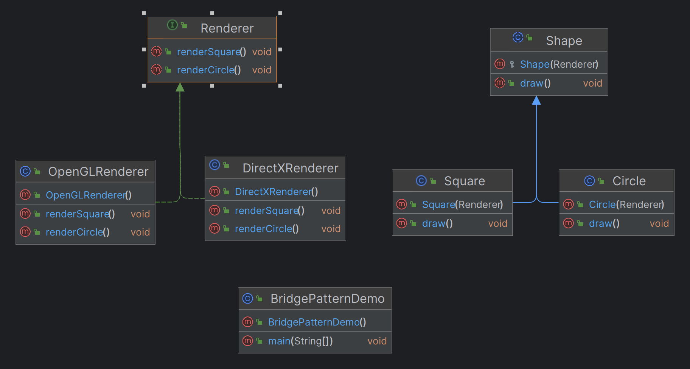

# Bridge Design Pattern

### What is Bridge Pattern
1. The Bridge design pattern is a structural design pattern that allows the splitting of a large class or a set of closely related classes into two separate hierarchies: abstraction and implementation.
2. This enables the development of these hierarchies independently of each other.
3. The pattern is particularly useful when there are interface hierarchies in both interfaces and implementations, as it helps decouple the interfaces from the implementation and hides the implementation details from client programs.

### How to Implement
1. Abstraction: Defines the abstraction's interface and maintains a reference to an object of type Implementor.
2. Refined Abstraction: Extends the interface defined by Abstraction. 
3. Implementor: Defines the interface for implementation classes.
4. Concrete Implementor: Implements the Implementor interface.

### Bridge Pattern Example: Drawing Shapes with Different Rendering APIs

This repository demonstrates the Bridge design pattern by separating the abstraction (shapes) from their implementation (rendering APIs). This allows both shapes and rendering APIs to vary independently.

### Structure

- **Renderer (Implementor)**: Defines the interface for rendering shapes.
- **OpenGLRenderer, DirectXRenderer (Concrete Implementors)**: Implement the rendering interface for specific graphic libraries.
- **Shape (Abstraction)**: Contains a reference to a Renderer and defines the interface for shapes.
- **Circle, Square (Refined Abstractions)**: Implement the Shape interface for specific shapes.

## Usage

### Renderer Interface

The `Renderer` interface defines methods for rendering shapes.

```java
    public interface Renderer {
        void renderCircle();
        void renderSquare();
    }
```
### Concrete Implementations of Renderer
```java
public class OpenGLRenderer implements Renderer {
    @Override
    public void renderCircle() {
        System.out.println("Drawing Circle using OpenGL");
    }

    @Override
    public void renderSquare() {
        System.out.println("Drawing Square using OpenGL");
    }
}

public class DirectXRenderer implements Renderer {
    @Override
    public void renderCircle() {
        System.out.println("Drawing Circle using DirectX");
    }

    @Override
    public void renderSquare() {
        System.out.println("Drawing Square using DirectX");
    }
}

```
### Shape Abstract Class
```java
public abstract class Shape {
    protected Renderer renderer;

    protected Shape(Renderer renderer) {
        this.renderer = renderer;
    }

    public abstract void draw();
}

```
### Concrete Implementations of Shape
```java
public class Circle extends Shape {
    public Circle(Renderer renderer) {
        super(renderer);
    }

    @Override
    public void draw() {
        renderer.renderCircle();
    }
}

public class Square extends Shape {
    public Square(Renderer renderer) {
        super(renderer);
    }

    @Override
    public void draw() {
        renderer.renderSquare();
    }
}

```
### Main
```java
public class Circle extends Shape {
    public Circle(Renderer renderer) {
        super(renderer);
    }

    @Override
    public void draw() {
        renderer.renderCircle();
    }
}

public class Square extends Shape {
    public Square(Renderer renderer) {
        super(renderer);
    }

    @Override
    public void draw() {
        renderer.renderSquare();
    }
}

```
### UML



### Benefits

1. **Decoupling Abstraction and Implementation**: The Bridge pattern separates the abstraction (shape) from the implementation (rendering). This allows changes to be made to either the abstraction or the implementation independently without affecting the other.

    ```plaintext
    For example, you can add a new shape or a new rendering API without modifying existing classes.
    ```

2. **Reduced Class Explosion**: Without the Bridge pattern, each combination of shape and rendering API would require a new class. The Bridge pattern reduces the number of classes needed by allowing shapes and renderers to be combined dynamically.

    ```plaintext
    For example, instead of creating `CircleOpenGL`, `CircleDirectX`, `SquareOpenGL`, and `SquareDirectX` classes, you only need `Circle`, `Square`, `OpenGLRenderer`, and `DirectXRenderer`.
    ```

3. **Flexibility and Extensibility**: The Bridge pattern makes it easy to extend the system with new shapes or rendering APIs. Adding a new shape or renderer involves creating a single new class without changing existing code.

    ```plaintext
    For example, you can add a `Triangle` shape or a `VulkanRenderer` without modifying the `Circle`, `Square`, `OpenGLRenderer`, or `DirectXRenderer` classes.
    ```

4. **Improved Maintainability**: By decoupling the abstraction and implementation, the Bridge pattern simplifies maintenance. Changes in the rendering logic are confined to the renderer classes, and changes in shape behavior are confined to the shape classes.

    ```plaintext
    For example, if the OpenGL rendering logic changes, only the `OpenGLRenderer` class needs to be updated.
    ```

### Keywords and Phrases to look from Bridge Pattern Example Problem Statements

### Independent Variation

1. **Graphics Rendering**:
    - "The system should allow **independent variation** of the shape and the rendering API."
    - "We need to be able to change the **rendering API** without affecting the **shape classes**."

2. **Document Processing**:
    - "The system should enable the **independent evolution** of document structure and its **rendering**."

### Decoupling

3. **Document Formatting**:
    - "We want to **decouple** the document formatting from the actual **rendering engine**."
    - "Separate the vehicle control logic from the actual **vehicle implementation**."

4. **UI Components**:
    - "Decouple the **UI logic** from the **rendering mechanism** to support multiple **rendering engines**."

### Extendability

5. **Payment Systems**:
    - "We need to easily **extend** the payment methods and the **payment processors**."
    - "Adding new **notification types** should not affect the existing **notification system**."

6. **Notification System**:
    - "The system should support easy **extension** for new **notification channels** and **message formats**."

### Multiple Implementations

7. **Graphics Libraries**:
    - "There are **multiple ways** to render graphics: **OpenGL** and **DirectX**."
    - "Different **logging strategies** are needed based on different **environments**."

8. **Data Storage**:
    - "Support multiple **data storage** mechanisms: **SQL** and **NoSQL** databases."

### Abstraction and Implementation

9. **Data Access**:
    - "There are multiple **data sources** (SQL, NoSQL) that need to be accessed via the same **interface**."
    - "The file parsing logic should be separated from the specific **file format implementations**."

10. **Device Control**:
    - "The **abstraction** of device control should be independent of the specific **device implementations**."

### Hierarchy

11. **UI Controls**:
    - "We have a **hierarchy** of UI controls that share the same **interface** but have different **renderers**."
    - "We want to create a class hierarchy that separates **user input handling** and the actual **input methods**."

12. **Shape Drawing**:
    - "Separate the **shape abstraction** from its **rendering implementation** to support a **hierarchy** of shapes and renderers."

### Platform Independence

13. **Multimedia Application**:
    - "The multimedia application should support both **Windows** and **macOS** without changing the core logic."
    - "The system should work with both **REST** and **SOAP APIs**."

14. **File System**:
    - "Support multiple **file systems** (e.g., **local**, **cloud**) with a single **abstraction layer**."

### Client Independence

15. **Database Clients**:
    - "Clients should be independent of the **database** used."
    - "Clients should use an abstract **printer interface** and not be concerned with the specific **printer model**."

16. **Service Integration**:
    - "Clients should integrate with various **payment services** without depending on their **concrete implementations**."

## Conclusion

The Bridge pattern is particularly useful in scenarios where you need to decouple an abstraction from its implementation to achieve greater flexibility and scalability. By identifying keywords and phrases like **independent variation**, **decoupling**, **extendability**, **multiple implementations**, **abstraction and implementation**, **hierarchy**, **platform independence**, and **client independence**, you can determine whether the Bridge pattern is appropriate for solving a particular design problem.

