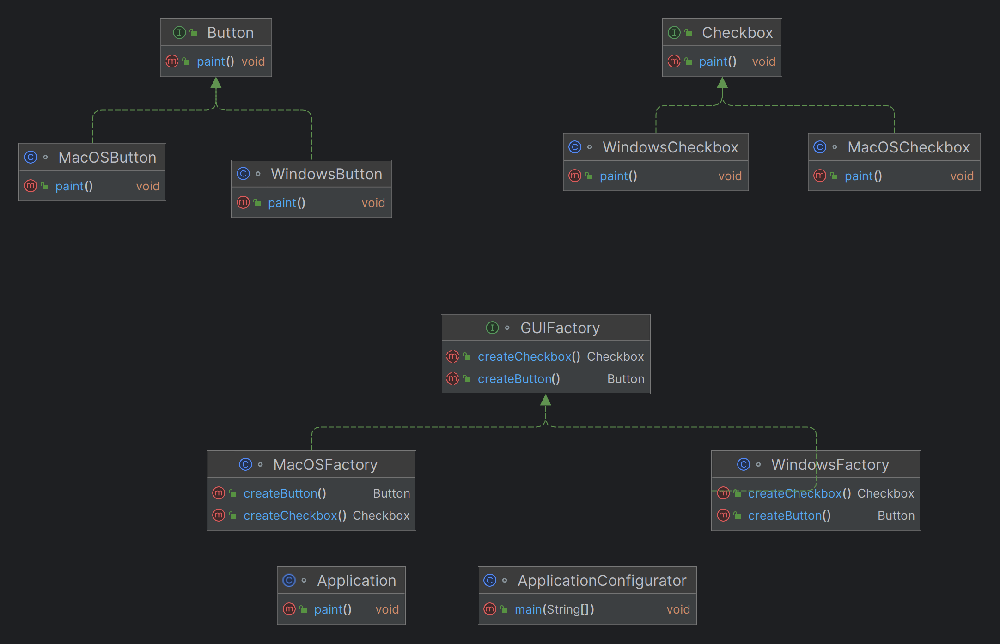

# Abstract Factory

A detailed guide on understanding and implementing the Abstract Factory Pattern in Java.

## Table of Contents

- [What is the Abstract Factory Pattern?](#what-is-the-abstract-factory-pattern)
- [When to Use the Abstract Factory Pattern?](#when-to-use-the-abstract-factory-pattern)
- [Why Use the Abstract Factory Pattern?](#why-use-the-abstract-factory-pattern)
- [How to Implement the Abstract Factory Pattern in Java](#how-to-implement-the-abstract-factory-pattern-in-java)
    - [Define Abstract Products](#define-abstract-products)
    - [Create Concrete Products](#create-concrete-products)
    - [Define the Abstract Factory](#define-the-abstract-factory)
    - [Create Concrete Factories](#create-concrete-factories)
    - [Client Code](#client-code)
    - [UML Diagram](#UML-Diagram)
- [Keywords and Phrases ](#keywords-and-phrases)
- [Problem Statements for Abstract Factory Pattern](#problem-statements-for-abstract-factory-pattern)

## What is the Abstract Factory Pattern?

The **Abstract Factory Pattern** is a creational design pattern that provides an interface for creating families of related or dependent objects without specifying their concrete classes.

## When to Use the Abstract Factory Pattern?

The Abstract Factory Pattern is particularly useful in the following scenarios:
- When a system needs to be independent of how its products are created, composed, and represented.
- When a system should be configured with one of multiple families of products.
- When you want to ensure that a family of related products is used together.
- When you want to do a group set of actions for each variety 

## Why Use the Abstract Factory Pattern?

The primary reasons for using the Abstract Factory Pattern include:
- **Encapsulation of object creation**: Isolates the client code from the concrete classes of the objects it needs to create.
- **Consistency among products**: Ensures that products created by different factories are compatible with each other.
- **Flexibility in adding new products**: New families of products can be introduced without changing the existing client code.

## How to Implement the Abstract Factory Pattern in Java

### Define Abstract Products

Create interfaces or abstract classes for each type of product.
```java
interface Button {
    void paint();
}

interface Checkbox {
    void paint();
}
```
### Create Concrete Products
Implement the abstract products for each variant.
```java
class WindowsButton implements Button {
    public void paint() {
        System.out.println("Rendering a button in a Windows style.");
    }
}

class MacOSButton implements Button {
    public void paint() {
        System.out.println("Rendering a button in a MacOS style.");
    }
}

class WindowsCheckbox implements Checkbox {
    public void paint() {
        System.out.println("Rendering a checkbox in a Windows style.");
    }
}

class MacOSCheckbox implements Checkbox {
    public void paint() {
        System.out.println("Rendering a checkbox in a MacOS style.");
    }
}
```

### Define the Abstract Factory
Create an interface for the factory that will create the abstract products.
```java
interface GUIFactory {
    Button createButton();
    Checkbox createCheckbox();
}
```

### Create Concrete Factories
Implement the factory interface for each variant.
```java
class WindowsFactory implements GUIFactory {
    public Button createButton() {
        return new WindowsButton();
    }

    public Checkbox createCheckbox() {
        return new WindowsCheckbox();
    }
}

class MacOSFactory implements GUIFactory {
    public Button createButton() {
        return new MacOSButton();
    }

    public Checkbox createCheckbox() {
        return new MacOSCheckbox();
    }
}

```

### Client Code
Use the abstract factory to create families of related objects.
```java
class Application {
    private Button button;
    private Checkbox checkbox;

    public Application(GUIFactory factory) {
        button = factory.createButton();
        checkbox = factory.createCheckbox();
    }

    public void paint() {
        button.paint();
        checkbox.paint();
    }
}

class ApplicationConfigurator {
    public static void main(String[] args) {
        GUIFactory factory;
        String osName = System.getProperty("os.name").toLowerCase();
        if (osName.contains("mac")) {
            factory = new MacOSFactory();
        } else {
            factory = new WindowsFactory();
        }
        Application app = new Application(factory);
        app.paint();
    }
}

```
### UML Diagram



## Breaking Down Problem Statements for Abstract Factory Pattern

To break down a problem statement and come up with interfaces and classes, you can follow a systematic approach. This involves identifying key entities, actions, and relationships within the problem statement. Here’s a step-by-step guide with examples for the eCommerce and Healthcare domains.

## Step-by-Step Guide

1. **Read the Problem Statement Carefully**: Understand the context, requirements, and constraints.
2. **Identify Key Entities (Nouns)**: Look for nouns in the problem statement that represent objects or concepts.
3. **Identify Actions (Verbs)**: Look for verbs that represent actions or behaviors related to the entities.
4. **Group Related Entities and Actions**: Group entities and actions that are related or interact with each other.
5. **Define Abstract Products (Interfaces)**: Create interfaces for the key entities and actions.
6. **Create Concrete Products (Classes)**: Implement the interfaces with concrete classes for each variant.
7. **Define the Abstract Factory**: Create an interface for the factory that will create the abstract products.
8. **Create Concrete Factories**: Implement the factory interface for each variant.

### Example: eCommerce

**Problem Statement**: Design an eCommerce platform that can create different types of product listings (e.g., electronics, clothing, groceries) and their respective UI components (e.g., product cards, filters, sorting options) without changing the client code.

#### Step-by-Step Breakdown

1. **Identify Key Entities (Nouns)**:
    - Product listings
    - Electronics, Clothing, Groceries
    - UI components
    - Product cards, Filters, Sorting options

2. **Identify Actions (Verbs)**:
    - Create product listings
    - Display product cards
    - Apply filters
    - Sort products

3. **Group Related Entities and Actions**:
    - Product listings: Electronics, Clothing, Groceries
    - UI components: Product cards, Filters, Sorting options

4. **Define Abstract Products (Interfaces)**:
   ```java
   interface ProductListing {
       void display();
   }

   interface Filter {
       void apply();
   }

   interface SortingOption {
       void sort();
   }
   ```
5. **Create Concrete Products (Classes)**:
    ```java
    class ElectronicsListing implements ProductListing {
    public void display() {
        System.out.println("Displaying electronics products.");
    }
    }
    
    class ClothingListing implements ProductListing {
    public void display() {
    System.out.println("Displaying clothing products.");
    }
    }
    
    class GroceryListing implements ProductListing {
    public void display() {
    System.out.println("Displaying grocery products.");
    }
    }
    
    class ElectronicsFilter implements Filter {
    public void apply() {
    System.out.println("Applying filter for electronics.");
    }
    }
    
    class ClothingFilter implements Filter {
    public void apply() {
    System.out.println("Applying filter for clothing.");
    }
    }
    
    class GroceryFilter implements Filter {
    public void apply() {
    System.out.println("Applying filter for groceries.");
    }
    }
    
    class ElectronicsSorting implements SortingOption {
    public void sort() {
    System.out.println("Sorting electronics products.");
    }
    }
    
    class ClothingSorting implements SortingOption {
    public void sort() {
    System.out.println("Sorting clothing products.");
    }
    }
    
    class GrocerySorting implements SortingOption {
    public void sort() {
    System.out.println("Sorting grocery products.");
    }
    }


    ```
   6. Define the Abstract Factory
       ```java
           interface eCommerceFactory {
       ProductListing createProductListing();
       Filter createFilter();
       SortingOption createSortingOption();
       }

         ```
   
      7. Create Concrete Factories
          ```java
                  class ElectronicsFactory implements eCommerceFactory {
                  public ProductListing createProductListing() {
                      return new ElectronicsListing();
                  }
        
                  public Filter createFilter() {
                      return new ElectronicsFilter();
                  }
        
                  public SortingOption createSortingOption() {
                      return new ElectronicsSorting();
                  }
           }
        
           class ClothingFactory implements eCommerceFactory {
           public ProductListing createProductListing() {
           return new ClothingListing();
           }
        
               public Filter createFilter() {
                   return new ClothingFilter();
               }
        
               public SortingOption createSortingOption() {
                   return new ClothingSorting();
               }
           }
        
               class GroceryFactory implements eCommerceFactory {
               public ProductListing createProductListing() {
               return new GroceryListing();
               }
        
               public Filter createFilter() {
                   return new GroceryFilter();
               }
        
               public SortingOption createSortingOption() {
                   return new GrocerySorting();
               }
           }

       ```
6. Client
    ```java
    class eCommerceApplication {
    private ProductListing productListing;
    private Filter filter;
    private SortingOption sortingOption;

        public eCommerceApplication(eCommerceFactory factory) {
            productListing = factory.createProductListing();
            filter = factory.createFilter();
            sortingOption = factory.createSortingOption();
        }
    
        public void displayProducts() {
            productListing.display();
            filter.apply();
            sortingOption.sort();
        }
    }

    class eCommerceConfigurator {
    public static void main(String[] args) {
    eCommerceFactory factory;
    String category = "electronics"; // This could be dynamically determined

        if (category.equals("electronics")) {
            factory = new ElectronicsFactory();
        } else {
            factory = new ClothingFactory();
        }

        eCommerceApplication app = new eCommerceApplication(factory);
        app.displayProducts();
    }
    }
   ```

## Keywords and Phrases
To identify the Abstract Factory Pattern in a problem statement, look for specific keywords and phrases that indicate the need for creating families of related or dependent objects without specifying their concrete classes. Here are some keywords and phrases to look for
### Families of Related Objects
- "Creating families of related objects"
- "Groups of related objects"
- "Set of related objects"

### Encapsulation of Object Creation
- "Encapsulate a group of individual factories"
- "Encapsulate object creation"
- "Factory of factories"

### Independence from Concrete Classes
- "Without specifying their concrete classes"
- "Abstract interface for creating objects"
- "Decoupling object creation from usage"

### Multiple Factories
- "Multiple factories"
- "Super factory"
- "Factory of factories"

### Consistency Among Products
- "Ensure consistency among products"
- "Compatible products"
- "Consistent product family"

### Configuration with Multiple Families
- "Configured with one of multiple families of products"
- "Different families of products"
- "Switch between product families"

### Abstract Interfaces
- "Abstract interfaces for products"
- "Generic interfaces"
- "Abstract product interfaces"

### Interchangeable Implementations
- "Interchangeable concrete implementations"
- "Switchable implementations"
- "Runtime selection of product families"

## Example Problem Statements

### Creating UI Elements
- "Design an application that can create UI elements like buttons and checkboxes for different operating systems without changing the client code."
    - **Keywords**: "UI elements," "different operating systems," "without changing the client code."

### Cross-Platform Support
- "Develop a system that supports multiple platforms by creating platform-specific components without modifying the core logic."
    - **Keywords**: "multiple platforms," "platform-specific components," "without modifying the core logic".

### Product Families
- "Implement a solution that can produce different types of products (e.g., cars, trucks) that belong to the same family and ensure they are compatible with each other."
    - **Keywords**: "different types of products," "same family," "compatible with each other."

### Look and Feel Standards
- "Design an application that can adapt to different look and feel standards by creating appropriate UI components dynamically."
    - **Keywords**: "different look and feel standards," "appropriate UI components," "dynamically."

By identifying these keywords and phrases in a problem statement, you can determine whether the Abstract Factory Pattern is an appropriate solution. This pattern is particularly useful when you need to create families of related objects that are designed to work together and when you want to ensure that the client code is independent of the concrete classes of the objects it needs to create.


## Problem Statements for Abstract Factory Pattern
The Abstract Factory Pattern is useful in various domains where creating families of related or dependent objects without specifying their concrete classes is necessary. Below are problem statements for different domains along with class and interface hierarchies.

## eCommerce

**Problem Statement**: Design an eCommerce platform that can create different types of product listings (e.g., electronics, clothing, groceries) and their respective UI components (e.g., product cards, filters, sorting options) without changing the client code.

### Define Abstract Products
- **ProductListing** (interface)
- **Filter** (interface)
- **SortingOption** (interface)

### Create Concrete Products
- `ElectronicsListing` implements `ProductListing`
- `ClothingListing` implements `ProductListing`
- `GroceryListing` implements `ProductListing`
- `ElectronicsFilter` implements `Filter`
- `ClothingFilter` implements `Filter`
- `GroceryFilter` implements `Filter`
- `ElectronicsSorting` implements `SortingOption`
- `ClothingSorting` implements `SortingOption`
- `GrocerySorting` implements `SortingOption`

### Define the Abstract Factory
- **eCommerceFactory** (interface)

### Create Concrete Factories
- `ElectronicsFactory` implements `eCommerceFactory`
- `ClothingFactory` implements `eCommerceFactory`
- `GroceryFactory` implements `eCommerceFactory`

## Healthcare

**Problem Statement**: Develop a healthcare management system that supports multiple types of medical records (e.g., patient records, doctor notes, prescriptions) and ensures that these records are compatible with various healthcare standards (e.g., HL7, FHIR).

### Define Abstract Products
- **MedicalRecord** (interface)
- **HealthcareStandard** (interface)

### Create Concrete Products
- `PatientRecord` implements `MedicalRecord`
- `DoctorNote` implements `MedicalRecord`
- `Prescription` implements `MedicalRecord`
- `HL7Standard` implements `HealthcareStandard`
- `FHIRStandard` implements `HealthcareStandard`

### Define the Abstract Factory
- **HealthcareFactory** (interface)

### Create Concrete Factories
- `HL7Factory` implements `HealthcareFactory`
- `FHIRFactory` implements `HealthcareFactory`

## Banking

**Problem Statement**: Create a banking application that can generate different types of financial reports (e.g., account statements, transaction summaries, loan reports) for various banking products (e.g., savings accounts, credit cards, loans) without modifying the core logic.

### Define Abstract Products
- **FinancialReport** (interface)
- **BankingProduct** (interface)

### Create Concrete Products
- `AccountStatement` implements `FinancialReport`
- `TransactionSummary` implements `FinancialReport`
- `LoanReport` implements `FinancialReport`
- `SavingsAccount` implements `BankingProduct`
- `CreditCard` implements `BankingProduct`
- `Loan` implements `BankingProduct`

### Define the Abstract Factory
- **BankingFactory** (interface)

### Create Concrete Factories
- `SavingsAccountFactory` implements `BankingFactory`
- `CreditCardFactory` implements `BankingFactory`
- `LoanFactory` implements `BankingFactory`

## Payment Systems

**Problem Statement**: Design a payment processing system that can handle multiple payment methods (e.g., credit cards, digital wallets, bank transfers) and ensure that the payment processing logic is independent of the specific payment method used.

### Define Abstract Products
- **PaymentMethod** (interface)
- **PaymentGateway** (interface)

### Create Concrete Products
- `CreditCardPayment` implements `PaymentMethod`
- `DigitalWalletPayment` implements `PaymentMethod`
- `BankTransferPayment` implements `PaymentMethod`
- `CreditCardGateway` implements `PaymentGateway`
- `DigitalWalletGateway` implements `PaymentGateway`
- `BankTransferGateway` implements `PaymentGateway`

### Define the Abstract Factory
- **PaymentFactory** (interface)

### Create Concrete Factories
- `CreditCardFactory` implements `PaymentFactory`
- `DigitalWalletFactory` implements `PaymentFactory`
- `BankTransferFactory` implements `PaymentFactory`

## Booking and Reservation Systems

**Problem Statement**: Develop a booking system that can manage different types of reservations (e.g., hotel rooms, flight tickets, car rentals) and ensure that the reservation process is consistent across all types of bookings.

### Define Abstract Products
- **Reservation** (interface)

### Create Concrete Products
- `HotelRoomReservation` implements `Reservation`
- `FlightTicketReservation` implements `Reservation`
- `CarRentalReservation` implements `Reservation`

### Define the Abstract Factory
- **BookingFactory** (interface)

### Create Concrete Factories
- `HotelBookingFactory` implements `BookingFactory`
- `FlightBookingFactory` implements `BookingFactory`
- `CarRentalBookingFactory` implements `BookingFactory`

## Insurance

**Problem Statement**: Create an insurance management system that can generate various insurance policies (e.g., health insurance, car insurance, home insurance) and their respective documents (e.g., policy contracts, claim forms) without altering the client code.

### Define Abstract Products
- **InsurancePolicy** (interface)
- **InsuranceDocument** (interface)

### Create Concrete Products
- `HealthInsurancePolicy` implements `InsurancePolicy`
- `CarInsurancePolicy` implements `InsurancePolicy`
- `HomeInsurancePolicy` implements `InsurancePolicy`
- `PolicyContract` implements `InsuranceDocument`
- `ClaimForm` implements `InsuranceDocument`

### Define the Abstract Factory
- **InsuranceFactory** (interface)

### Create Concrete Factories
- `HealthInsuranceFactory` implements `InsuranceFactory`
- `CarInsuranceFactory` implements `InsuranceFactory`
- `HomeInsuranceFactory` implements `InsuranceFactory`

## Retail

**Problem Statement**: Design a retail management system that can create different types of inventory items (e.g., perishable goods, electronics, clothing) and their respective management interfaces (e.g., stock levels, pricing, discounts) without changing the core system.

### Define Abstract Products
- **InventoryItem** (interface)
- **ManagementInterface** (interface)

### Create Concrete Products
- `PerishableGoods` implements `InventoryItem`
- `Electronics` implements `InventoryItem`
- `Clothing` implements `InventoryItem`
- `StockLevel` implements `ManagementInterface`
- `Pricing` implements `ManagementInterface`
- `Discount` implements `ManagementInterface`

### Define the Abstract Factory
- **RetailFactory** (interface)

### Create Concrete Factories
- `PerishableGoodsFactory` implements `RetailFactory`
- `ElectronicsFactory` implements `RetailFactory`
- `ClothingFactory` implements `RetailFactory`

## Travel and Hospitality

**Problem Statement**: Develop a travel booking platform that can handle various travel services (e.g., flights, hotels, tours) and ensure that the booking process is seamless and consistent across all services.

### Define Abstract Products
- **TravelService** (interface)
- **BookingProcess** (interface)

### Create Concrete Products
- `FlightService` implements `TravelService`
- `HotelService` implements `TravelService`
- `TourService` implements `TravelService`
- `FlightBooking` implements `BookingProcess`
- `HotelBooking` implements `BookingProcess`
- `TourBooking` implements `BookingProcess`

### Define the Abstract Factory
- **TravelFactory** (interface)

### Create Concrete Factories
- `FlightFactory` implements `TravelFactory`
- `HotelFactory` implements `TravelFactory`
- `TourFactory` implements `TravelFactory`

## Telecommunications

**Problem Statement**: Create a telecommunications management system that can generate different types of service plans (e.g., mobile plans, internet plans, TV packages) and their respective billing statements without modifying the client code.

### Define Abstract Products
- **ServicePlan** (interface)
- **BillingStatement** (interface)

### Create Concrete Products
- `MobilePlan` implements `ServicePlan`
- `InternetPlan` implements `ServicePlan`
- `TVPackage` implements `ServicePlan`
- `MobileBilling` implements `BillingStatement`
- `InternetBilling` implements `BillingStatement`
- `TVBilling` implements `BillingStatement`

### Define the Abstract Factory
- **TelecomFactory** (interface)

### Create Concrete Factories
- `MobilePlanFactory` implements `TelecomFactory`
- `InternetPlanFactory` implements `TelecomFactory`
- `TVPackageFactory` implements `TelecomFactory`

## Education

**Problem Statement**: Design an education management system that can create various types of educational content (e.g., courses, assignments, exams) and ensure that the content creation process is independent of the specific educational format.

### Define Abstract Products
- **EducationalContent** (interface)
- **ContentFormat** (interface)

### Create Concrete Products
- `Course` implements `EducationalContent`
- `Assignment` implements `EducationalContent`
- `Exam` implements `EducationalContent`
- `OnlineFormat` implements `ContentFormat`
- `OfflineFormat` implements `ContentFormat`

### Define the Abstract Factory
- **EducationFactory** (interface)

### Create Concrete Factories
- `OnlineEducationFactory` implements `EducationFactory`
- `OfflineEducationFactory` implements `EducationFactory`

