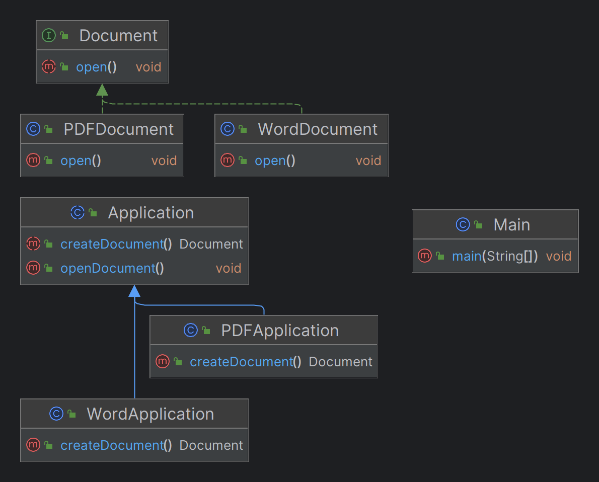

# Factory

## Factory Method

What
---
1. The Factory Method pattern suggests replacing direct object construction calls (using the new operator) with calls to a special factory method. This method is defined in a superclass and can be overridden by subclasses to create specific types of objects. The objects returned by a factory method are often referred to as products.

Template
------
```markdown
# Factory Method Pattern

## Key Concepts

- **Creator:** The interface or abstract class that declares the factory method.
- **ConcreteCreator:** The subclass that implements the factory method to create instances of Product.
- **Product:** The interface or abstract class that defines the type of objects the factory method creates.
- **ConcreteProduct:** The subclass of Product that is created by ConcreteCreator.
```

## Example
1. Define the Product Interface - Interface Object returned by factory method - [Document](https://github.com/raghunathreddymustur/DesignPatterns/blob/65d35f287587d037ceb14589ed475c637630c7c4/src/com/company/Factory/FactoryMethod/Document.java)
2. Create Concrete Products—Concrete Object returned by factory method - [PDFDocument](https://github.com/raghunathreddymustur/DesignPatterns/blob/65d35f287587d037ceb14589ed475c637630c7c4/src/com/company/Factory/FactoryMethod/PDFDocument.java), [WordDocument](https://github.com/raghunathreddymustur/DesignPatterns/blob/65d35f287587d037ceb14589ed475c637630c7c4/src/com/company/Factory/FactoryMethod/WordDocument.java)
3. Define the Creator Abstract Class - factory method in superclass - [Application](https://github.com/raghunathreddymustur/DesignPatterns/blob/65d35f287587d037ceb14589ed475c637630c7c4/src/com/company/Factory/FactoryMethod/Application.java)
4. Create Concrete creators—concrete implementation factory method - [PDFApplication](https://github.com/raghunathreddymustur/DesignPatterns/blob/65d35f287587d037ceb14589ed475c637630c7c4/src/com/company/Factory/FactoryMethod/PDFApplication.java), [WordApplication](https://github.com/raghunathreddymustur/DesignPatterns/blob/65d35f287587d037ceb14589ed475c637630c7c4/src/com/company/Factory/FactoryMethod/WordApplication.java)
5. Client Code - [Main](https://github.com/raghunathreddymustur/DesignPatterns/blob/65d35f287587d037ceb14589ed475c637630c7c4/src/com/company/Factory/FactoryMethod/Main.java)



When to Use the Factory Method Pattern
--------------

Consider using the Factory Method pattern in the following scenarios:

1. **When the exact type of object to be created is not known until runtime:**
    - This allows for dynamic object creation based on runtime conditions.

2. **When a class wants its subclasses to specify the objects it creates:**
    - This promotes flexibility and extensibility.

3. **When you want to avoid tight coupling between the creator and the concrete products:**
    - This enhances maintainability and scalability.

4. **When you have a complex object creation process that needs to be centralized:**
    - This simplifies the client code and adheres to the Single Responsibility Principle.

## Advantages

- **Flexibility:** The pattern allows for creating families of related objects without specifying their concrete classes.
- **Extensibility:** New products can be added without changing the existing code.
- **Reusability:** Common logic can be reused by subclassing and extending the factory method.


## Keywords and Phrases to Look For

When analyzing problem statements to determine if the Factory Method pattern is appropriate, look for the following keywords and phrases:

- **Dynamic object creation**: Indicates that the type of object to be created is determined at runtime.
- **Subclass responsibility**: Suggests that subclasses should specify the objects to be created.
- **Decoupling**: Refers to reducing tight coupling between the creator and the concrete products.
- **Centralized object creation**: Implies a need to centralize the complex object creation process.
- **Abstract class or interface**: Mentions the use of an abstract class or interface to define the type of objects.
- **Flexibility and extensibility**: Highlights the need for a flexible and extensible design.
- **Encapsulation of instantiation logic**: Indicates that the object creation logic should be encapsulated in a separate method.
- **Factory method**: Directly mentions the use of a factory method for object creation.
- **Product family**: Refers to creating families of related objects without specifying their concrete classes.
- **Runtime conditions**: Points to the need for object creation based on conditions evaluated at runtime.
- **Loose coupling**: Emphasizes the importance of loose coupling between the creator and the created objects.
- **Single Responsibility Principle**: Suggests adhering to the Single Responsibility Principle by centralizing the creation logic.

These keywords and phrases can help identify scenarios where the Factory Method pattern is beneficial, as they align with the core principles and advantages of the pattern.


## Real-Time Problem Statements

### E-commerce

1. **Dynamic Product Creation:**
   - An e-commerce platform needs to dynamically create different types of product listings (e.g., electronics, clothing, groceries) based on user input and preferences at runtime.

2. **Flexible Payment Methods:**
   - The platform should allow the addition of new payment methods (e.g., credit card, PayPal, cryptocurrency) without modifying the existing payment processing code.

### Healthcare

1. **Patient Record Management:**
   - A healthcare system needs to create different types of patient records (e.g., outpatient, inpatient, emergency) based on the type of visit and medical requirements.

2. **Medical Equipment Allocation:**
   - The system should dynamically allocate different types of medical equipment (e.g., MRI machines, X-ray machines, ventilators) based on the patient's condition and treatment plan.

### Banking

1. **Account Creation:**
   - A banking application needs to create different types of bank accounts (e.g., savings, checking, business) based on customer requirements and eligibility criteria.

2. **Loan Processing:**
   - The system should handle the creation of various loan products (e.g., personal loans, home loans, auto loans) based on customer profiles and financial data.

### Payment

1. **Transaction Processing:**
   - A payment gateway needs to process different types of transactions (e.g., one-time payments, recurring payments, refunds) based on the transaction type and user preferences.

2. **Fraud Detection:**
   - The system should dynamically create different fraud detection algorithms (e.g., rule-based, machine learning-based) based on transaction patterns and risk levels.

### Booking Apps

1. **Travel Booking:**
   - A travel booking app needs to create different types of bookings (e.g., flights, hotels, car rentals) based on user preferences and availability.

2. **Event Ticketing:**
   - The app should handle the creation of various event tickets (e.g., concerts, sports events, theater) based on event type and seating arrangements.

These problem statements illustrate scenarios where the Factory Method pattern can be effectively applied to manage dynamic object creation, promote flexibility, and reduce tight coupling in various domains.


## Banking - Code

### Problem Statement
A banking application needs to create different types of bank accounts (e.g., savings, checking, business) based on customer requirements and eligibility criteria.

### Code Example
```java
// Bank Account Interface
interface BankAccount {
    String getAccountType();
}

// Concrete Bank Accounts
class SavingsAccount implements BankAccount {
    public String getAccountType() {
        return "Savings Account";
    }
}

class CheckingAccount implements BankAccount {
    public String getAccountType() {
        return "Checking Account";
    }
}

class BusinessAccount implements BankAccount {
    public String getAccountType() {
        return "Business Account";
    }
}

// Creator
abstract class AccountFactory {
    public abstract BankAccount createAccount();
}

// Concrete Creators
class SavingsFactory extends AccountFactory {
    public BankAccount createAccount() {
        return new SavingsAccount();
    }
}

class CheckingFactory extends AccountFactory {
    public BankAccount createAccount() {
        return new CheckingAccount();
    }
}

class BusinessFactory extends AccountFactory {
    public BankAccount createAccount() {
        return new BusinessAccount();
    }
}

// Client Code
public class Main {
    public static void main(String[] args) {
        AccountFactory factory = new SavingsFactory();
        BankAccount account = factory.createAccount();
        System.out.println(account.getAccountType());

        factory = new CheckingFactory();
        account = factory.createAccount();
        System.out.println(account.getAccountType());

        factory = new BusinessFactory();
        account = factory.createAccount();
        System.out.println(account.getAccountType());
    }
}
```
## Payment

### Problem Statement
A payment gateway needs to process different types of transactions (e.g., one-time payments, recurring payments, refunds) based on the transaction type and user preferences.

### Code Example
```java
// Transaction Interface
interface Transaction {
    String process();
}

// Concrete Transactions
class OneTimePayment implements Transaction {
    public String process() {
        return "Processing One-Time Payment";
    }
}

class RecurringPayment implements Transaction {
    public String process() {
        return "Processing Recurring Payment";
    }
}

class Refund implements Transaction {
    public String process() {
        return "Processing Refund";
    }
}

// Creator
abstract class TransactionFactory {
    public abstract Transaction createTransaction();
}

// Concrete Creators
class OneTimePaymentFactory extends TransactionFactory {
    public Transaction createTransaction() {
        return new OneTimePayment();
    }
}

class RecurringPaymentFactory extends TransactionFactory {
    public Transaction createTransaction() {
        return new RecurringPayment();
    }
}

class RefundFactory extends TransactionFactory {
    public Transaction createTransaction() {
        return new Refund();
    }
}

// Client Code
public class Main {
    public static void main(String[] args) {
        TransactionFactory factory = new OneTimePaymentFactory();
        Transaction transaction = factory.createTransaction();
        System.out.println(transaction.process());

        factory = new RecurringPaymentFactory();
        transaction = factory.createTransaction();
        System.out.println(transaction.process());

        factory = new RefundFactory();
        transaction = factory.createTransaction();
        System.out.println(transaction.process());
    }
}
```
