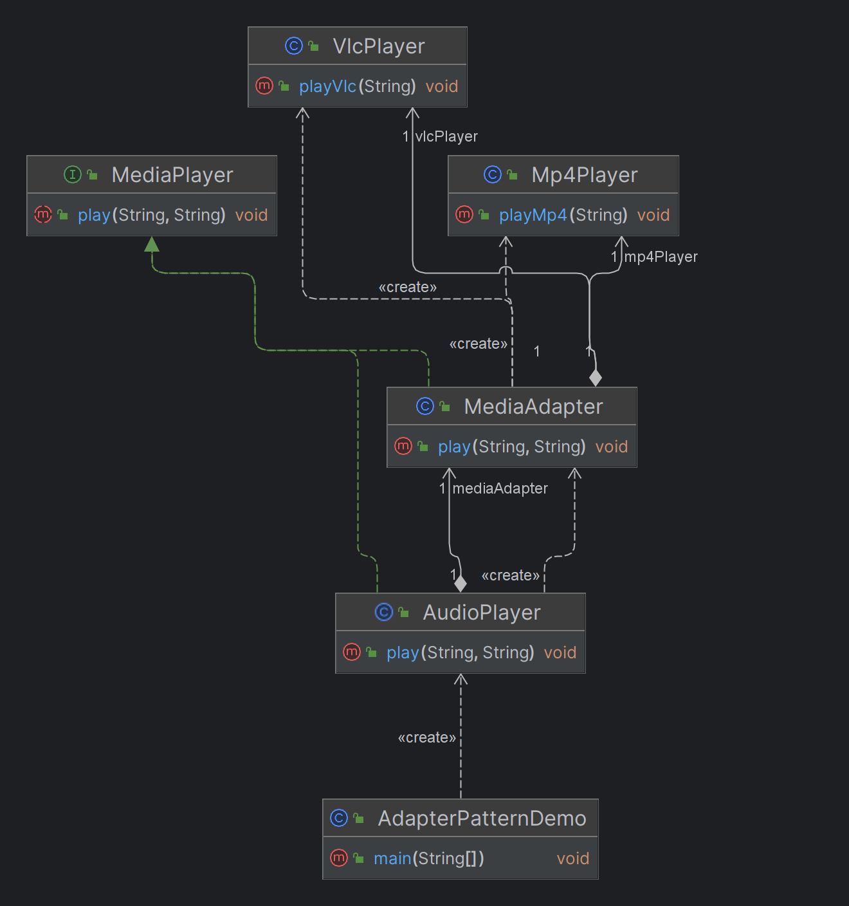

# Adapter Design Pattern

## Overview

The Adapter Design Pattern is a structural design pattern that allows incompatible interfaces to work together. It acts as a bridge between two objects, enabling them to interact without modifying their existing code.

## Purpose

- **Incompatibility**: The Adapter pattern is used when you have two or more classes that need to work together, but their interfaces are incompatible.
- **Integration**: It is particularly useful for integrating with legacy systems, third-party libraries, or external APIs without altering the existing codebase.
- **Reusability**: Helps in reusing existing classes or components with different interfaces.

# Adapter Design Pattern

## Overview

The Adapter Design Pattern is a structural design pattern that allows incompatible interfaces to work together. It acts as a bridge between two objects, enabling them to interact without modifying their existing code.

## Media Player Example

### Scenario

Imagine you are building a media player application that can play different types of media files such as MP3, MP4, and VLC. The media player has a common interface for playing files, but different media formats have different APIs or methods for playing them.

### Problem

The media player can play MP3 files directly, but the APIs for MP4 and VLC files are different. You need a way to integrate these different file types into your media player without changing the existing codebase.

### Solution

Use the Adapter pattern to create adapters for MP4 and VLC file types. These adapters will implement the common media player interface and internally handle the specifics of playing MP4 and VLC files.

### Structure

- **Target Interface**: The interface that the client (media player) expects. In this case, it's the `MediaPlayer` interface.
- **Adaptee**: The existing classes with different interfaces, such as `VlcPlayer` and `Mp4Player`.
- **Adapter**: The adapter classes that implement the `MediaPlayer` interface and wrap the adaptee classes to make them compatible.
- **Client**: The media player application that uses the `MediaPlayer` interface to play different media types.

### Code Example

```java
// Target interface
public interface MediaPlayer {
    void play(String audioType, String fileName);
}

// Adaptee for VLC files
public class VlcPlayer {
    public void playVlc(String fileName) {
        System.out.println("Playing vlc file. Name: " + fileName);
    }
}

// Adaptee for MP4 files
public class Mp4Player {
    public void playMp4(String fileName) {
        System.out.println("Playing mp4 file. Name: " + fileName);
    }
}

// Adapter class
public class MediaAdapter implements MediaPlayer {
    VlcPlayer vlcPlayer;
    Mp4Player mp4Player;

    public MediaAdapter(String audioType){
        if(audioType.equalsIgnoreCase("vlc")) {
            vlcPlayer = new VlcPlayer();            
        } else if (audioType.equalsIgnoreCase("mp4")) {
            mp4Player = new Mp4Player();
        }
    }

    @Override
    public void play(String audioType, String fileName) {
        if(audioType.equalsIgnoreCase("vlc")) {
            vlcPlayer.playVlc(fileName);
        } else if(audioType.equalsIgnoreCase("mp4")) {
            mp4Player.playMp4(fileName);
        }
    }
}

// Client class
public class AudioPlayer implements MediaPlayer {
    MediaAdapter mediaAdapter;

    @Override
    public void play(String audioType, String fileName) {
        if(audioType.equalsIgnoreCase("mp3")) {
            System.out.println("Playing mp3 file. Name: " + fileName);
        } else if(audioType.equalsIgnoreCase("vlc") || audioType.equalsIgnoreCase("mp4")) {
            mediaAdapter = new MediaAdapter(audioType);
            mediaAdapter.play(audioType, fileName);
        } else {
            System.out.println("Invalid media. " + audioType + " format not supported");
        }
    }
}

// Usage
public class AdapterPatternDemo {
    public static void main(String[] args) {
        AudioPlayer audioPlayer = new AudioPlayer();

        audioPlayer.play("mp3", "song.mp3");
        audioPlayer.play("mp4", "video.mp4");
        audioPlayer.play("vlc", "movie.vlc");
        audioPlayer.play("avi", "movie.avi");
    }
}
```

## Class Diagram


## When to Use the Adapter Pattern

- **Integrating Legacy Systems**: When you need to integrate a legacy system with a new system, but their interfaces don't match.
- **Third-Party Library Integration**: When using third-party libraries or APIs that have interfaces different from what your system expects.
- **Reusing Existing Code**: When you have existing classes that perform the required functionality but have different interfaces.

## Identifying the Adapter Pattern in Problem Statements

- **Incompatibility**: Look for situations where there are multiple interfaces that need to interact, but are currently incompatible.
- **Unchangeable Interfaces**: Identify if there is an existing class whose interface cannot be changed but needs to be used in the system.
- **Legacy System Integration**: Consider if there's a need to integrate legacy systems with new systems without modifying the legacy code.
- **Third-Party Integration**: Determine if there's a need to adapt third-party code to fit the required interface in your application.

## How to Implement the Adapter Pattern

1. **Define a Common Interface**: Create a target interface that your system expects. This interface should define the methods needed to interact with external components.

2. **Create Adapters**: Implement adapter classes that wrap the incompatible class and translate the interface methods to match the target interface.

3. **Use Adapters in Client Code**: Integrate the adapters into your client code, allowing it to interact with external systems or components through the defined interface.

## Benefits of Using the Adapter Pattern

- **Flexibility**: Enables easy integration of new components or systems without changing the existing codebase.
- **Decoupling**: Keeps the system modular by decoupling the client code from the specifics of external components or libraries.
- **Reusability**: Promotes the reuse of existing functionality across different interfaces.
- **Testability**: Enhances testability by allowing the use of mocks or stubs for external components during testing.

## Considerations

- **Overuse**: Be cautious of overusing the Adapter pattern, as it can introduce unnecessary complexity.
- **Performance**: Wrapping classes with adapters can sometimes add a small performance overhead, though it is usually negligible.

## Conclusion

The Adapter pattern is a powerful tool for making incompatible interfaces work together, particularly when dealing with legacy systems, third-party libraries, or integrating different components. By following the guidelines outlined here, you can effectively use the Adapter pattern to build flexible, maintainable, and reusable software systems.
