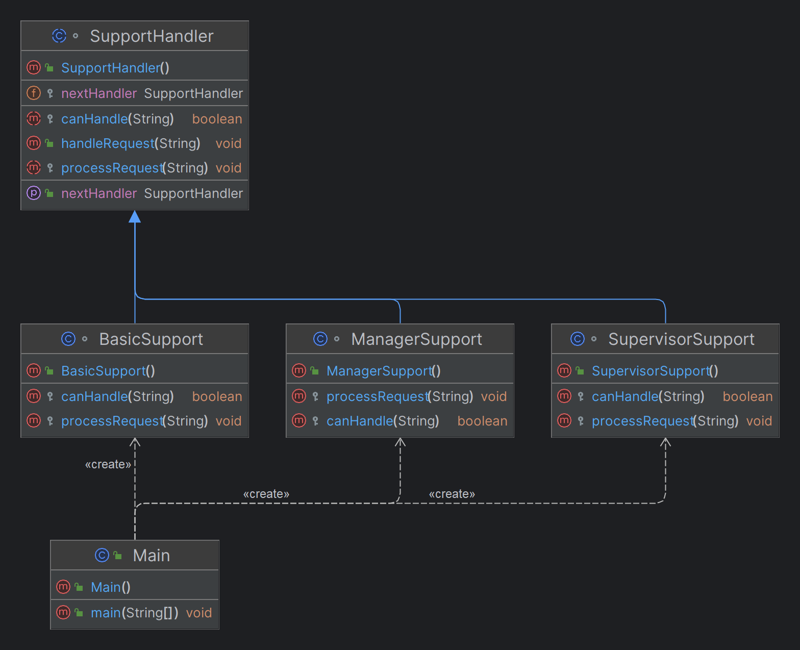

# Chain of Responsibility Design Pattern

## What is the Chain of Responsibility Pattern?

The Chain of Responsibility is a behavioral design pattern that allows a request to be passed along a chain of handlers. Each handler in the chain has the opportunity to process the request or pass it to the next handler. This pattern decouples the sender of a request from its receivers, allowing multiple objects the chance to handle the request.

## Why Use the Chain of Responsibility Pattern?

- **Decoupling of Request Senders and Receivers**: This pattern decouples the sender of a request from the receivers, meaning the sender does not need to know which specific object will handle the request.
- **Flexibility in Request Processing**: Handlers can be added, removed, or reordered in the chain without affecting the client code, offering great flexibility in how requests are processed.
- **Responsibility Separation**: Each handler in the chain is responsible for processing a specific type of request, leading to a clear separation of concerns.
- **Scalability**: New handlers can be easily added to the chain to accommodate new types of requests, making the system scalable.
- **Improved Maintainability**: By breaking down the processing logic into separate handlers, the code becomes easier to maintain and extend.

## When to Use the Chain of Responsibility Pattern?

- **When multiple objects can handle a request but the exact handler is not known in advance**.
- **When you want to issue a request to one of several objects without specifying the receiver explicitly**.
- **When you need a way to handle requests that might be processed by different handlers in different situations**.
- **When you want to keep the client from knowing which part of the system handles a request**.

## Benefits of the Chain of Responsibility Pattern

1. **Flexibility in Request Processing**:
    - Handlers can be added, removed, or reordered without changing the client code, making the system highly adaptable.

2. **Decoupling Sender and Receiver**:
    - The client does not need to know the specific handler that processes the request, leading to a cleaner and more modular codebase.

3. **Responsibility Separation**:
    - Each handler is responsible for a specific type of request, improving code organization and maintainability.

4. **Improved Scalability**:
    - The system can easily scale by adding new handlers to manage additional types of requests.

5. **Ease of Extension**:
    - New types of handlers can be introduced seamlessly, enhancing the system's ability to evolve over time.

6. **Avoiding Overload at Higher Levels**:
    - Simple requests are handled by lower-level handlers, preventing overload at higher levels in the chain.

7. **Error Handling and Fail-Safe Mechanism**:
    - If no handler in the chain can process a request, the system can provide a default response, ensuring that every request is addressed.

## Real-Time Examples


# Chain of Responsibility Design Pattern: SupportHandler Example

## What is the Chain of Responsibility Pattern?

The Chain of Responsibility is a behavioral design pattern that allows a request to be passed along a chain of handlers. Each handler in the chain has the opportunity to process the request or pass it to the next handler. This pattern decouples the sender of a request from its receivers, allowing multiple objects the chance to handle the request.

## Why Use the Chain of Responsibility Pattern?

- **Decoupling of Request Senders and Receivers**: This pattern decouples the sender of a request from the receivers, meaning the sender does not need to know which specific object will handle the request.
- **Flexibility in Request Processing**: Handlers can be added, removed, or reordered in the chain without affecting the client code, offering great flexibility in how requests are processed.
- **Responsibility Separation**: Each handler in the chain is responsible for processing a specific type of request, leading to a clear separation of concerns.
- **Scalability**: New handlers can be easily added to the chain to accommodate new types of requests, making the system scalable.
- **Improved Maintainability**: By breaking down the processing logic into separate handlers, the code becomes easier to maintain and extend.

## When to Use the Chain of Responsibility Pattern?

- **When multiple objects can handle a request but the exact handler is not known in advance**.
- **When you want to issue a request to one of several objects without specifying the receiver explicitly**.
- **When you need a way to handle requests that might be processed by different handlers in different situations**.
- **When you want to keep the client from knowing which part of the system handles a request**.

## Real-Time Example: Customer Support System

### Scenario:

Imagine a customer support system where customer queries or complaints are handled by different levels of support staff.
```java
// Abstract Handler
abstract class SupportHandler {
    protected SupportHandler nextHandler;

    public void setNextHandler(SupportHandler nextHandler) {
        this.nextHandler = nextHandler;
    }

    public void handleRequest(String request) {
        if (canHandle(request)) {
            processRequest(request);
        } else if (nextHandler != null) {
            nextHandler.handleRequest(request);
        } else {
            System.out.println("Request could not be handled");
        }
    }

    protected abstract boolean canHandle(String request);
    protected abstract void processRequest(String request);
}

// Concrete Handler: BasicSupport
class BasicSupport extends SupportHandler {
    @Override
    protected boolean canHandle(String request) {
        return request.contains("basic");
    }

    @Override
    protected void processRequest(String request) {
        System.out.println("Basic support handling request: " + request);
    }
}

// Concrete Handler: SupervisorSupport
class SupervisorSupport extends SupportHandler {
    @Override
    protected boolean canHandle(String request) {
        return request.contains("supervisor");
    }

    @Override
    protected void processRequest(String request) {
        System.out.println("Supervisor handling request: " + request);
    }
}

// Concrete Handler: ManagerSupport
class ManagerSupport extends SupportHandler {
    @Override
    protected boolean canHandle(String request) {
        return request.contains("manager");
    }

    @Override
    protected void processRequest(String request) {
        System.out.println("Manager handling request: " + request);
    }
}

// Client Code
public class Main {
    public static void main(String[] args) {
        // Create Handlers
        SupportHandler basic = new BasicSupport();
        SupportHandler supervisor = new SupervisorSupport();
        SupportHandler manager = new ManagerSupport();

        // Set the chain of responsibility
        basic.setNextHandler(supervisor);
        supervisor.setNextHandler(manager);

        // Example requests
        basic.handleRequest("basic request");
        basic.handleRequest("supervisor request");
        basic.handleRequest("manager request");
        basic.handleRequest("unhandled request");
    }
}
```
## UML Diagram



### 1. Customer Support System

- **Scenario**: A customer support system where customer queries or complaints are handled by different levels of support staff.
- **How It Works**:
    - **Basic Support**: Handles simple, common issues.
    - **Supervisor Support**: Handles more complex issues that Basic Support can't resolve.
    - **Manager Support**: Handles escalated issues that require higher authority or decision-making.
- **Benefits**: Ensures that each query is handled at the appropriate level, improving efficiency and preventing overload at higher levels.

### 2. Event Logging System

- **Scenario**: In an application, logs can be generated at various levels like INFO, DEBUG, and ERROR.
- **How It Works**:
    - **INFO Level**: Logs basic information and outputs it to the console.
    - **DEBUG Level**: Handles more detailed logging, storing it in a file for future analysis.
    - **ERROR Level**: Captures critical issues and sends alerts to a monitoring system.
- **Benefits**: Allows logs to be processed differently depending on their severity, ensuring that critical issues are addressed promptly.

### 3. Payment Processing System

- **Scenario**: An e-commerce platform with multiple payment methods like Credit Card, PayPal, and Cryptocurrency.
- **How It Works**:
    - **Credit Card Processor**: Attempts to process payments through credit cards.
    - **PayPal Processor**: If the credit card processor fails, PayPal is tried next.
    - **Cryptocurrency Processor**: If both previous methods fail, the system attempts to process payment via cryptocurrency.
- **Benefits**: Offers flexibility in payment processing, increasing the chances of successful transactions.

### 4. Spam Email Filter

- **Scenario**: An email system with multiple layers of spam filtering.
- **How It Works**:
    - **Basic Spam Filter**: Checks for obvious spam keywords and blocks them.
    - **Advanced Spam Filter**: Analyzes links and sender reputation to identify more sophisticated spam.
    - **Quarantine Filter**: Suspicious emails that pass both filters are moved to quarantine for manual review.
- **Benefits**: Ensures that only legitimate emails reach the inbox, while suspicious ones are handled appropriately.

### 5. Request Validation in Web Applications

- **Scenario**: A web application that needs to validate user input before processing it.
- **How It Works**:
    - **Syntax Validator**: First checks the syntax of the input (e.g., correct email format).
    - **Authentication Validator**: Ensures that the user is authenticated before proceeding.
    - **Authorization Validator**: Checks if the user has the necessary permissions to perform the requested action.
- **Benefits**: Ensures that only valid and authorized requests are processed, improving security and user experience.

## Keywords and Phrases Indicating Chain of Responsibility Pattern

## 1. "Pass along" / "Pass through"
- **Example**: "The request should pass through multiple processing stages until it's handled appropriately."

## 2. "Chain" / "Pipeline"
- **Example**: "The data needs to be processed through a chain of validators before saving."

## 3. "Multiple handlers" / "Various handlers"
- **Example**: "Different handlers should process the input based on specific conditions."

## 4. "Escalate" / "Escalation"
- **Example**: "If the issue cannot be resolved at this level, it should be escalated to a higher authority."

## 5. "Fallback mechanism" / "Fallback processing"
- **Example**: "There should be a fallback mechanism if the primary process fails to handle the request."

## 6. "Sequential processing"
- **Example**: "The system should process the requests sequentially through different stages."

## 7. "Next in line" / "Next processor"
- **Example**: "If the current processor can't handle the task, it should forward it to the next processor."

## 8. "Conditional handling"
- **Example**: "Requests should be handled based on certain conditions or criteria."

## 9. "Dynamic handler assignment"
- **Example**: "The appropriate handler for each request should be determined dynamically at runtime."

## 10. "Responsibility delegation"
- **Example**: "Tasks should delegate responsibilities to appropriate modules until completion."

## 11. "Processing stages" / "Processing layers"
- **Example**: "Data validation should occur across multiple processing stages."

## 12. "Filter and process"
- **Example**: "The input data needs to be filtered and processed by several components."

## 13. "Handling hierarchy"
- **Example**: "There should be a hierarchy of handlers to process different levels of requests."

## 14. "Attempt to handle"
- **Example**: "Each module should attempt to handle the request before passing it on."

## 15. "Flexible processing flow"
- **Example**: "The system requires a flexible processing flow that can adapt based on the request type."

## 16. "Unknown number of handlers"
- **Example**: "The system should support an unknown number of handlers that can process requests."

## 17. "Decoupled request handling"
- **Example**: "The request handling mechanism should be decoupled from the request sender."

## 18. "Successive processing"
- **Example**: "The input should undergo successive processing steps until completion."

## 19. "First appropriate handler"
- **Example**: "The request should be processed by the first appropriate handler it encounters."

## 20. "Modify and forward"
- **Example**: "Each processor may modify the request before forwarding it to the next."
