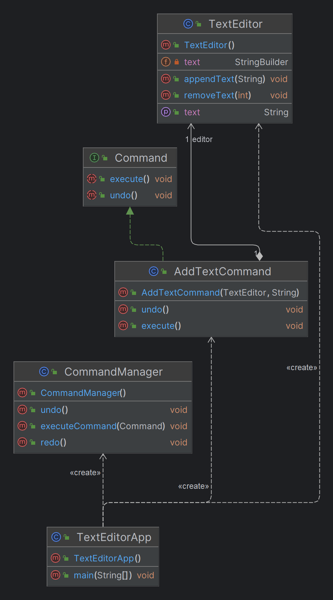

# Command Design Pattern

## What is the Command Design Pattern?

The Command Design Pattern is a behavioral design pattern that encapsulates a request as an object, thereby allowing for the parameterization of clients with queues, requests, and operations. It also provides support for undoable operations.

## Why Use the Command Design Pattern?

- **Decoupling:** The pattern decouples the object that invokes the operation from the one that knows how to perform it, enabling a more flexible and maintainable design.
- **Undo/Redo Operations:** By encapsulating requests as objects, it becomes easier to implement features like undo/redo.
- **Command Queuing and Logging:** Commands can be queued for later execution, stored for history, or even logged for auditing purposes.
- **Macro Commands:** It allows grouping of commands into a composite command, enabling the execution of multiple commands in sequence.

## When to Use the Command Design Pattern?

- **When actions need to be recorded:** For example, when you need to implement undo/redo functionality in an application.
- **When you need to decouple objects:** If the client that triggers the operation shouldn't directly know the details of how the operation is performed.
- **When actions need to be queued:** For instance, in systems where you may want to queue requests and execute them in sequence later.
- **When you want to support macro commands:** For scenarios where a series of operations should be executed as a single unit.

## Benefits of the Command Design Pattern

- **Flexibility:** Since commands are objects, they can be passed as parameters, stored in collections, or logged.
- **Extensibility:** New commands can be easily added without changing existing code.
- **Reusability:** The same command can be used in different contexts.
- **Supports Undo/Redo:** Simplifies the implementation of undo and redo functionalities.
- **Macro Commands:** Allows grouping multiple commands into a single command to be executed together.

## Real-Time Examples

### 1. Undo/Redo Functionality in Text Editors
Text editors often allow users to undo or redo their actions, like typing, deleting, or formatting. Each action is encapsulated as a command object, which can be stored in a stack to manage undo and redo operations.

### 2. Smart Home System
In a smart home setup, commands like turning on lights, locking doors, or adjusting the thermostat can be encapsulated as command objects. These commands can be queued, executed in sequence, or undone.

### 3. Transactional Systems in Banking
In banking applications, complex transactions (like transferring funds between accounts) can be broken down into steps, each encapsulated as a command. If any step fails, previously executed commands can be undone, ensuring atomicity.

### 4. Game Development
In games, player actions such as moving or attacking can be encapsulated as command objects. This allows for features like undoing a move or replaying a sequence of actions.

# Text Editor Example with Command Design Pattern

This example demonstrates how to implement undo and redo functionality in a text editor using the Command Design Pattern in Java.

## What is the Command Design Pattern?

The Command Design Pattern is a behavioral pattern that encapsulates a request as an object, allowing you to parameterize clients with different requests, queue or log requests, and support undoable operations.

## Why Use the Command Design Pattern?

- **Decoupling:** Separates the object that invokes the operation from the one that knows how to perform it.
- **Undo/Redo Functionality:** Makes it easy to implement undo and redo features by storing commands in stacks.
- **Command Queuing:** Enables queuing commands for execution in sequence or at a later time.
- **Macro Commands:** Allows grouping multiple commands into a single command to execute them together.

## Text Editor Example

### 1. Command Interface

```java
// Command Interface
public interface Command {
    void execute();
    void undo();
}

//Concrete Command for Adding Text
// Concrete Command for Adding Text
public class AddTextCommand implements Command {
    private TextEditor editor;
    private String textToAdd;

    public AddTextCommand(TextEditor editor, String textToAdd) {
        this.editor = editor;
        this.textToAdd = textToAdd;
    }

    @Override
    public void execute() {
        editor.appendText(textToAdd);
    }

    @Override
    public void undo() {
        editor.removeText(textToAdd.length());
    }
}

//TextEditor (Receiver)
// Receiver: TextEditor
public class TextEditor {
    private StringBuilder text = new StringBuilder();

    public void appendText(String newText) {
        text.append(newText);
        System.out.println("Current Text: " + text.toString());
    }

    public void removeText(int length) {
        int start = text.length() - length;
        if (start >= 0 && start < text.length()) {
            text.delete(start, start + length);
        }
        System.out.println("Current Text: " + text.toString());
    }

    public String getText() {
        return text.toString();
    }
}

//CommandManager (Invoker)
// Invoker: CommandManager
import java.util.Stack;

public class CommandManager {
    private Stack<Command> undoStack = new Stack<>();
    private Stack<Command> redoStack = new Stack<>();

    public void executeCommand(Command command) {
        command.execute();
        undoStack.push(command);
        redoStack.clear(); // Clear redo stack when new command is executed
    }

    public void undo() {
        if (!undoStack.isEmpty()) {
            Command command = undoStack.pop();
            command.undo();
            redoStack.push(command);
        }
    }

    public void redo() {
        if (!redoStack.isEmpty()) {
            Command command = redoStack.pop();
            command.execute();
            undoStack.push(command);
        }
    }
}

//Main

// Client: Main Application
public class TextEditorApp {
    public static void main(String[] args) {
        TextEditor editor = new TextEditor();
        CommandManager commandManager = new CommandManager();

        // Adding "Hello"
        Command addHello = new AddTextCommand(editor, "Hello");
        commandManager.executeCommand(addHello);

        // Adding " World"
        Command addWorld = new AddTextCommand(editor, " World");
        commandManager.executeCommand(addWorld);

        // Undo last command (" World")
        commandManager.undo();

        // Redo last undone command (" World")
        commandManager.redo();

        // Adding "!!!"
        Command addExclamations = new AddTextCommand(editor, "!!!");
        commandManager.executeCommand(addExclamations);

        // Undo "!!!"
        commandManager.undo();
    }
}

```

## Class Diagram


## Keywords and Phrases to Identify the Command Design Pattern

- **Undo/Redo**: "Undo", "Redo", "Revert", "History of actions", "Track changes"
- **Action Logging**: "Log actions", "Track operations", "Audit trail", "Record actions"
- **Macro Commands**: "Batch execution", "Group of commands", "Composite operation", "Sequence of actions"
- **Command Queuing**: "Queue commands", "Delayed execution", "Schedule operations", "Execute in order"
- **Decoupling**: "Separate request", "Decouple invocation", "Encapsulate requests", "Parameterize operations"
- **Flexibility**: "Reconfigure commands", "Change execution order", "Modify operations", "Delegate operations"
