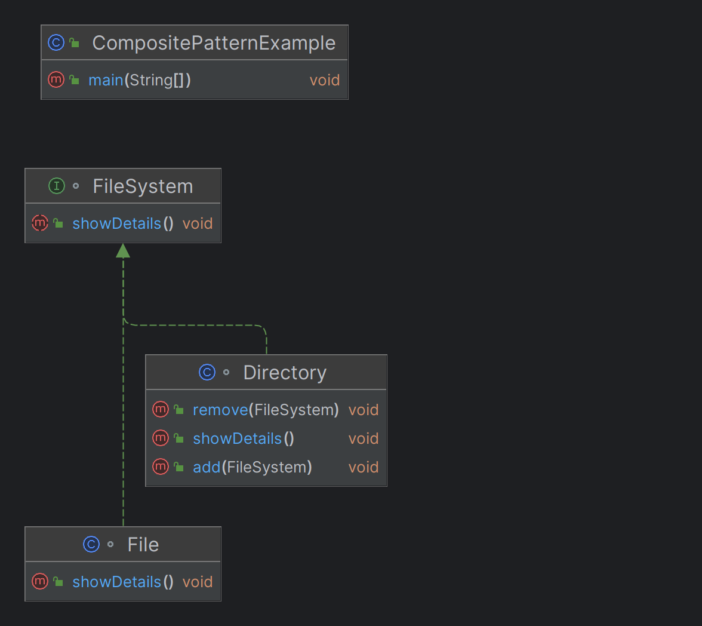

# Composite Structural Design Pattern

## Overview

The Composite Structural Design Pattern is a structural pattern that allows you to compose objects into tree-like structures to represent part-whole hierarchies. This pattern lets clients treat individual objects and compositions of objects uniformly, making it easier to work with complex structures.

In the context of the Composite Structural Design Pattern, "uniformly" means that the client code can treat both individual objects (leaves) and composite objects (composites that contain other objects) in the same way. This means you can perform the same operations on both types of objects without needing to know whether you're dealing with a single object or a group of objects

For example, in a file system, both files (individual objects) and directories (composite objects that can contain files and other directories) can be treated uniformly. You can call the same display() method on a file or a directory, and the system will handle them appropriately.

## Key Concepts

- **Component**: The common interface for all objects in the composition, whether they are simple or complex. It declares the common operations that can be performed on the objects.

- **Leaf**: Represents the simplest elements in the hierarchy that do not have any children. They implement the Component interface.

- **Composite**: Represents complex elements that can have children, which can be either leaves or other composites. It implements the Component interface and manages its child components.

## Example
```java
// Component
interface FileSystem {
    void showDetails();
}


// Leaf
class File implements FileSystem {
    private String name;

    public File(String name) {
        this.name = name;
    }

    @Override
    public void showDetails() {
        System.out.println("File: " + name);
    }
}

// Composite
class Directory implements FileSystem {
    private String name;
    private List<FileSystem> contents = new ArrayList<>();

    public Directory(String name) {
        this.name = name;
    }

    public void add(FileSystem component) {
        contents.add(component);
    }

    public void remove(FileSystem component) {
        contents.remove(component);
    }

    @Override
    public void showDetails() {
        System.out.println("Directory: " + name);
        for (FileSystem component : contents) {
            component.showDetails();
        }
    }
}
// Client
public class CompositePatternExample {
    public static void main(String[] args) {
        FileSystem file1 = new File("File1.txt");
        FileSystem file2 = new File("File2.txt");
        FileSystem file3 = new File("File3.txt");

        Directory dir1 = new Directory("Dir1");
        Directory dir2 = new Directory("Dir2");

        dir1.add(file1);
        dir1.add(file2);
        dir2.add(file3);

        Directory rootDir = new Directory("Root");
        rootDir.add(dir1);
        rootDir.add(dir2);

        // Show details of the root directory
        rootDir.showDetails();
    }
}
```
## Class Diagram


## Permission Systems Example
```java
import java.util.ArrayList;
import java.util.List;

// Component
interface Permission {
    void describe();
}

// Leaf
class SimplePermission implements Permission {
    private String name;
    
    public SimplePermission(String name) {
        this.name = name;
    }
    
    @Override
    public void describe() {
        System.out.println("Permission: " + name);
    }
}

// Composite
class Role implements Permission {
    private String roleName;
    private List<Permission> permissions = new ArrayList<>();
    
    public Role(String roleName) {
        this.roleName = roleName;
    }
    
    public void addPermission(Permission permission) {
        permissions.add(permission);
    }
    
    public void removePermission(Permission permission) {
        permissions.remove(permission);
    }
    
    @Override
    public void describe() {
        System.out.println("Role: " + roleName);
        for (Permission permission : permissions) {
            permission.describe();
        }
    }
}

// Client
public class PermissionSystem {
    public static void main(String[] args) {
        Permission readPermission = new SimplePermission("READ");
        Permission writePermission = new SimplePermission("WRITE");
        Permission executePermission = new SimplePermission("EXECUTE");
        
        Role adminRole = new Role("Admin");
        adminRole.addPermission(readPermission);
        adminRole.addPermission(writePermission);
        adminRole.addPermission(executePermission);
        
        Role userRole = new Role("User");
        userRole.addPermission(readPermission);
        
        Role superAdminRole = new Role("SuperAdmin");
        superAdminRole.addPermission(adminRole);
        superAdminRole.addPermission(userRole);
        
        // Describing the SuperAdmin role and its permissions
        superAdminRole.describe();
    }
}

```

## Use Cases

The Composite pattern is widely applicable across different domains. Below are some real-world examples:

### 1. E-commerce Platform

#### Scenario: Product Categories and Subcategories
In an e-commerce platform, product categories can contain both individual products and other subcategories, forming a hierarchical structure.

### 2. Payment Applications

#### Scenario: Payment Methods
In payment apps, users may have different payment methods such as credit cards, bank accounts, and digital wallets, organized under various categories.

### 3. Travel Booking Systems

#### Scenario: Travel Packages
A travel package can consist of multiple components like flights, hotels, and activities, which can be treated uniformly for booking purposes.

### 4. Media Libraries

#### Scenario: Media Collections
Media items like songs, movies, and podcasts can be grouped into playlists or collections, allowing users to manage and play them as a group or individually.

### 5. Project Management Software

#### Scenario: Task and Subtasks Management
In project management, tasks can be broken down into subtasks, and each task or subtask can be treated uniformly in terms of assignment and tracking.

## Advantages

- **Simplicity**: Treats individual and composite objects uniformly, simplifying client code.
- **Flexibility**: Allows the creation of complex tree structures that can be managed easily.
- **Extensibility**: New component types can be added without affecting existing code.

# Composite Structural Design Pattern: Filesystem Example

## Overview

The Composite Structural Design Pattern allows you to treat individual objects and compositions of objects uniformly. This is particularly useful in a filesystem context, where files and directories form a hierarchical structure.

## Filesystem Example

In a typical filesystem:
- **File**: Represents a leaf node in the hierarchy, containing data but no children.
- **Directory**: Represents a composite node that can contain files and other directories, organizing the structure hierarchically.

## Advantages

### 1. Simplified Client Code

- **Uniform Treatment**: The client code can interact with both files and directories using the same interface, simplifying operations and reducing the need for special handling of different types.
- **Example**: Whether dealing with a single file or an entire directory tree, you can call methods like `display()` or `getSize()` uniformly.

### 2. Hierarchical Structures

- **Easily Manageable Tree Structures**: The Composite pattern allows you to build and manage complex tree structures. Adding, removing, or modifying elements in this hierarchy is straightforward, and operations like traversing or modifying the structure are easily implemented.
- **Example**: You can create a directory that contains other directories and files, and treat the entire structure as a single entity for operations like displaying contents.

### 3. Flexibility in Adding New Components

- **Extensibility**: The pattern makes it easy to add new types of components, such as symbolic links or special files, without modifying existing code. This enhances the flexibility and scalability of the filesystem.
- **Example**: You can introduce a new `SymbolicLink` class that behaves differently from files and directories, yet integrates seamlessly with the existing structure.

### 4. Composite Operations

- **Recursive Operations**: Operations like calculating the total size of a directory or searching for a file are naturally handled by the Composite pattern. Directories delegate tasks to their children, recursively processing the entire structure.
- **Example**: To get the total size of a directory, simply call `getSize()` on the directory, which will aggregate the sizes of all contained files and subdirectories.

### 5. Decoupling Client Code from Specific Implementations

- **Loose Coupling**: The client code is decoupled from the specific implementations of files and directories, interacting through a common interface. This reduces dependencies and enhances maintainability.
- **Example**: Client code can process components generically, whether they are files or directories, without needing to know their specific type.

## Disadvantages

- **Complexity**: Can introduce complexity, especially when dealing with a large number of objects.
- **Overhead**: May lead to excessive memory usage if not carefully managed, especially in large structures.

## When to Use

- When you have a hierarchical structure of objects and need to treat individual objects and compositions of objects uniformly.
- When you need to simplify client code by allowing uniform access to a group of objects.

### Identifying Keywords and Phrases

Look for the following keywords and phrases in requirements to determine if the Composite Pattern is applicable:

- **Hierarchical Structure**: "Tree structure", "Hierarchy of objects", "Nested objects"
- **Part-Whole Relationship**: "Part-whole", "Composition", "Aggregation", "Composite objects"
- **Uniform Treatment**: "Uniform interface", "Treat objects and groups uniformly", "Common operations across objects"
- **Recursive Operations**: "Recursive processing", "Nested operations", "Operations on all elements"
- **Composite Operations**: "Aggregate operations", "Composite actions", "Perform operations on groups"
- **Group and Individual Treatment**: "Individual and group handling", "Operate on single and multiple objects the same way"
- **Flexibility in Adding Components**: "Easily extendable", "Add new components", "Flexible structure"
- **Complex Structures**: "Complex object graph", "Manage complex structures", "Organize objects"

## Requirement Examples Across Different Domains

### 1. **E-commerce Platform**

**Requirement**:  
"We need to manage a product catalog where categories can contain individual products as well as other subcategories."

**Keywords and Phrases**:
- "Product catalog"
- "Categories and subcategories"
- "Nested categories"
- "Manage hierarchy of products"
- "Uniformly handle categories and products"

### 2. **File System Management**

**Requirement**:  
"The application should allow users to manage files and directories. A directory can contain multiple files and other directories. Users should be able to perform operations like 'delete', 'copy', or 'move' on both individual files and entire directories."

**Keywords and Phrases**:
- "Files and directories"
- "Directory structure"
- "Nested directories"
- "Perform operations on both files and directories"
- "Uniform operations on files and directories"
- "Recursive file operations"

### 3. **Organization Structure in HR Systems**

**Requirement**:  
"The system needs to represent an organization's structure, where departments can contain both employees and sub-departments. The system should allow operations like 'get total salary' or 'generate report' on any department."

**Keywords and Phrases**:
- "Organization structure"
- "Departments and sub-departments"
- "Employees within departments"
- "Hierarchical organization"
- "Calculate total salary across departments"
- "Recursive department operations"

### 4. **GUI Components in Graphic Applications**

**Requirement**:  
"The GUI framework should support creating complex user interfaces where a container can hold individual components like buttons, text fields, and other containers. Users should be able to apply styles and handle events uniformly across all components."

**Keywords and Phrases**:
- "GUI components"
- "Containers and individual components"
- "Nested containers"
- "Hierarchical user interface"
- "Apply styles uniformly"
- "Handle events across components"
- "Composite GUI elements"

### 5. **Document Management System**

**Requirement**:  
"The system should allow users to organize documents and folders. A folder can contain multiple documents and subfolders. Users should be able to perform actions like 'rename' or 'move' on both individual documents and entire folders."

**Keywords and Phrases**:
- "Documents and folders"
- "Folder structure"
- "Nested folders"
- "Organize documents hierarchically"
- "Uniformly handle documents and folders"
- "Perform actions on both documents and folders"

### 6. **Travel Booking System**

**Requirement**:  
"Customers should be able to book travel packages that may include flights, hotels, and activities. Packages can contain individual components or other packages, and should be processed as a whole."

**Keywords and Phrases**:
- "Travel packages"
- "Flights, hotels, and activities"
- "Nested packages"
- "Composite travel components"
- "Book entire packages or individual items"
- "Handle components uniformly"

### 7. **Product Manufacturing**

**Requirement**:  
"The system needs to manage product assemblies where an assembly can contain individual parts as well as sub-assemblies. The system should allow operations like 'calculate cost' or 'generate bill of materials' on any assembly."

**Keywords and Phrases**:
- "Product assemblies"
- "Parts and subassemblies"
- "Hierarchical product structure"
- "Calculate the total cost of assembly"
- "Generate bill of materials"
- "Composite product structure"
- "Uniformly handle parts and assemblies"

## Conclusion

The Composite Structural Design Pattern is an ideal solution for managing hierarchical structures and ensuring uniform treatment of both individual objects and their compositions. By recognizing the relevant keywords and phrases in requirements, you can identify when to apply this pattern effectively across various domains.


