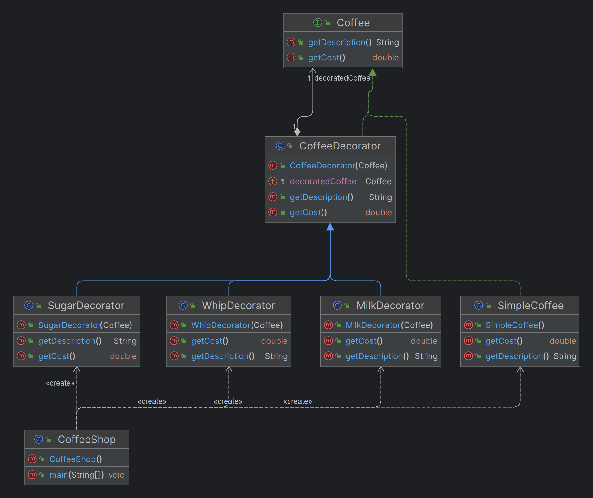

# Decorator Design Pattern

## Overview

The **Decorator Pattern** is a structural design pattern that allows you to add behavior or responsibilities to individual objects dynamically, without affecting the behavior of other objects from the same class. It provides a flexible alternative to subclassing for extending functionality.

## Key Concepts

- **Component Interface**: Defines the interface for objects that can have responsibilities added to them dynamically.
- **Concrete Component**: The core object that can have additional responsibilities added to it.
- **Decorator**: Abstract class that implements the component interface and contains a reference to a component object. This class forwards requests to the component object but can also add new behavior.
- **Concrete Decorators**: Extend the decorator class to add specific behavior to the component.

## Advantages

- **Flexibility**: Multiple decorators can be combined in various orders to create different configurations of the base object.
- **Adherence to Open/Closed Principle**: The pattern allows behavior to be added to objects without modifying their code, keeping the base class closed for modification but open for extension.
- **Avoids Class Explosion**: By using decorators instead of subclassing, you avoid the need for a large number of subclasses to cover all possible combinations of behavior.

## Use Cases

- When you need to add responsibilities to objects dynamically and transparently, without affecting other objects.
- When extending functionality by subclassing would result in an explosion of subclasses.
- When you need to be able to remove responsibilities from an object dynamically.

## Comparison with Builder Pattern

- **Decorator Pattern**: Focuses on adding behavior to an existing object dynamically. It is used for object modification.
- **Builder Pattern**: Focuses on constructing complex objects step by step. It is used for controlled object creation.

## Real-World Example: Coffee Ordering System

Imagine a coffee ordering system where you start with a simple coffee and can dynamically add condiments like milk, sugar, and whip. Each condiment is added as a decorator, which wraps the original coffee object and adds its own behavior (e.g., additional cost or description). The final cost and description are composed of the base coffee and all added decorators.
# Coffee Ordering System using Decorator Pattern

## Overview

This example demonstrates the use of the Decorator Pattern to create a flexible coffee ordering system. In this system, you can start with a basic coffee and dynamically add various condiments like milk, sugar, and whip. Each condiment is a decorator that adds its own behavior to the coffee object.

## Coffee Interface

The `Coffee` interface defines the methods that all coffee types will implement:

```java
public interface Coffee {
    String getDescription();
    double getCost();
}

public class SimpleCoffee implements Coffee {
    @Override
    public String getDescription() {
        return "Simple Coffee";
    }

    @Override
    public double getCost() {
        return 5.0; // Base price of the coffee
    }
}

//Coffee Decorator
public abstract class CoffeeDecorator implements Coffee {
    protected Coffee decoratedCoffee;

    public CoffeeDecorator(Coffee coffee) {
        this.decoratedCoffee = coffee;
    }

    @Override
    public String getDescription() {
        return decoratedCoffee.getDescription();
    }

    @Override
    public double getCost() {
        return decoratedCoffee.getCost();
    }
}

//Concrete Decorators
public class MilkDecorator extends CoffeeDecorator {
    public MilkDecorator(Coffee coffee) {
        super(coffee);
    }

    @Override
    public String getDescription() {
        return decoratedCoffee.getDescription() + ", Milk";
    }

    @Override
    public double getCost() {
        return decoratedCoffee.getCost() + 1.5;
    }
}

//SugarDecorator
public class SugarDecorator extends CoffeeDecorator {
    public SugarDecorator(Coffee coffee) {
        super(coffee);
    }

    @Override
    public String getDescription() {
        return decoratedCoffee.getDescription() + ", Sugar";
    }

    @Override
    public double getCost() {
        return decoratedCoffee.getCost() + 0.5;
    }
}

public class WhipDecorator extends CoffeeDecorator {
    public WhipDecorator(Coffee coffee) {
        super(coffee);
    }

    @Override
    public String getDescription() {
        return decoratedCoffee.getDescription() + ", Whip";
    }

    @Override
    public double getCost() {
        return decoratedCoffee.getCost() + 2.0;
    }
}

//Client
public class CoffeeShop {
    public static void main(String[] args) {
        // Start with a simple coffee
        Coffee coffee = new SimpleCoffee();
        System.out.println(coffee.getDescription() + " $" + coffee.getCost());

        // Add milk to the coffee
        coffee = new MilkDecorator(coffee);
        System.out.println(coffee.getDescription() + " $" + coffee.getCost());

        // Add sugar to the coffee with milk
        coffee = new SugarDecorator(coffee);
        System.out.println(coffee.getDescription() + " $" + coffee.getCost());

        // Add whip to the coffee with milk and sugar
        coffee = new WhipDecorator(coffee);
        System.out.println(coffee.getDescription() + " $" + coffee.getCost());
    }
}

```

## Class Diagram


## Keywords and Phrases - Identifying the Need for the Decorator Pattern

When analyzing requirements, look for the following keywords and phrases that may indicate the need for the Decorator Pattern:

- **"Add functionality dynamically"**: The need to add features or behaviors to an object at runtime without modifying the object's class.
- **"Flexible combination of features"**: When the system requires the ability to combine different features or functionalities in various orders.
- **"Optional features"**: Features that are not always needed but should be available when required.
- **"Avoid subclass explosion"**: If the system has many subclasses for different combinations of features, the Decorator Pattern can help reduce the number of subclasses.
- **"Transparent to the user"**: The added functionalities should not alter the interface or basic behavior of the object.
- **"Single Responsibility Principle"**: Keeping the core functionality and additional responsibilities separate by using decorators.

## Examples from Different Domains

### 1. **UI Design (Software Development)**
- **Requirement**: "We need to add scrollbars, borders, and shadows to a window object, but these features should be optional and combinable."
- **Explanation**: This scenario requires a flexible approach where a basic window can be decorated with scrollbars, borders, or shadows as needed. Using the Decorator Pattern allows adding these features dynamically without creating a separate subclass for each combination.

### 2. **E-Commerce Platform**
- **Requirement**: "Products should have optional add-ons like gift wrapping, express delivery, and warranty. Customers should be able to choose any combination of these add-ons."
- **Explanation**: Each product can be decorated with different add-ons like gift wrapping, express delivery, or warranty. The Decorator Pattern enables the system to handle any combination of these add-ons without modifying the core product class.

### 3. **Streaming Service (Media Domain)**
- **Requirement**: "Users should be able to enhance their streaming experience by adding subtitles, commentary tracks, or different audio languages."
- **Explanation**: The base streaming content can be dynamically decorated with subtitles, commentary tracks, or different audio languages. This avoids creating separate versions of the content for each feature.

### 4. **Banking and Financial Services**
- **Requirement**: "Accounts should support additional features like overdraft protection, fraud alerts, and cashback offers. These features should be added based on customer preferences."
- **Explanation**: A basic account object can be decorated with additional features like overdraft protection, fraud alerts, or cashback offers. The Decorator Pattern allows these features to be added or removed dynamically based on customer needs.

### 5. **Game Development**
- **Requirement**: "Characters in the game should be able to equip different items like armor, weapons, or magic rings that add new abilities or powers."
- **Explanation**: A game character can be decorated with different items (armor, weapons, magic rings) that dynamically add new abilities or powers. The Decorator Pattern allows these items to be equipped or unequipped without modifying the character's class.

---

By looking for these keywords and phrases in your requirements, you can identify situations where the Decorator Pattern can be effectively applied to add functionality in a flexible and dynamic manner.

This document provides an overview of the Decorator Pattern and how it can be applied in real-world scenarios, such as a coffee ordering system.
