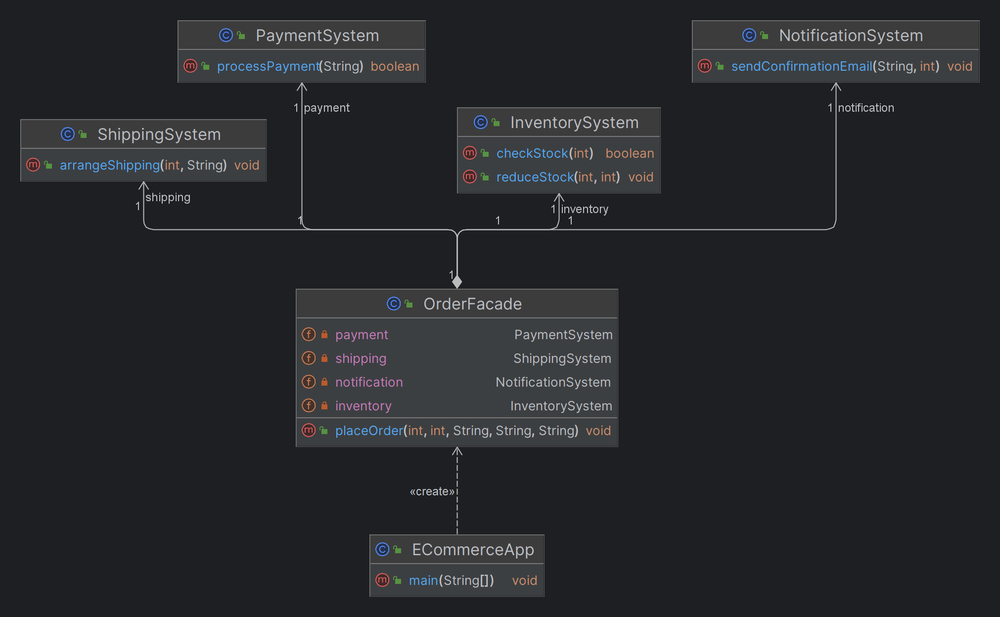

# Facade Design Pattern

## What is the Facade Design Pattern?

The **Facade Design Pattern** is a structural design pattern that provides a simplified, unified interface to a complex subsystem. The facade acts as a gateway for clients to interact with the subsystem without exposing the intricate details of its components. This pattern helps in reducing dependencies between the client code and the subsystem, making the system easier to use and maintain.

## When to Use the Facade Design Pattern

- **Complex Subsystems**: When dealing with a system composed of multiple interrelated classes and components that are difficult to manage and understand individually.
- **Simplified Interface**: When you want to provide a simpler way to interact with a set of complex classes, reducing the learning curve for new developers or users.
- **Decoupling**: When you want to decouple the client code from the underlying subsystem to make the system more flexible and easier to modify.
- **Layered Architectures**: When organizing your system into different layers and you want to provide a unified interface for each layer.

## Benefits of Using Facade Design Pattern

- **Reduces Complexity**: Simplifies interactions with complex subsystems.
- **Improves Maintainability**: Encapsulates subsystem logic, making the system easier to manage and update.
- **Promotes Loose Coupling**: Decouples the client code from intricate details of the subsystems, enhancing flexibility.

# ECommerceApp: Facade Design Pattern Example

## Overview

This example illustrates the use of the Facade Design Pattern in an e-commerce application. The pattern is used to create a unified interface (`OrderFacade`) that simplifies interactions with various subsystems (Inventory, Payment, Shipping, Notification).

## Subsystems

### InventorySystem.java

```java
public class InventorySystem {
    public boolean checkStock(int productId) {
        System.out.println("Checking stock for product: " + productId);
        // Simplified stock check logic
        return true; // Assume the product is in stock
    }

    public void reduceStock(int productId, int quantity) {
        System.out.println("Reducing stock for product: " + productId + " by quantity: " + quantity);
    }
}


public class OrderFacade {
    private InventorySystem inventory;
    private PaymentSystem payment;
    private ShippingSystem shipping;
    private NotificationSystem notification;

    public OrderFacade() {
        this.inventory = new InventorySystem();
        this.payment = new PaymentSystem();
        this.shipping = new ShippingSystem();
        this.notification = new NotificationSystem();
    }

    public void placeOrder(int productId, int quantity, String paymentDetails, String shippingAddress, String email) {
        System.out.println("Placing order for product: " + productId);

        // Step 1: Check Inventory
        if (!inventory.checkStock(productId)) {
            System.out.println("Product out of stock.");
            return;
        }

        // Step 2: Process Payment
        if (!payment.processPayment(paymentDetails)) {
            System.out.println("Payment failed.");
            return;
        }

        // Step 3: Reduce Stock
        inventory.reduceStock(productId, quantity);

        // Step 4: Arrange Shipping
        shipping.arrangeShipping(productId, shippingAddress);

        // Step 5: Send Notification
        int orderId = 123; // Assume order ID is generated
        notification.sendConfirmationEmail(email, orderId);

        System.out.println("Order placed successfully!");
    }
}

public class NotificationSystem {
    public void sendConfirmationEmail(String email, int orderId) {
        System.out.println("Sending confirmation email to: " + email + " for order: " + orderId);
    }
}
public class ShippingSystem {
    public void arrangeShipping(int productId, String address) {
        System.out.println("Arranging shipping for product: " + productId + " to address: " + address);
    }
}
public class PaymentSystem {
    public boolean processPayment(String paymentDetails) {
        System.out.println("Processing payment with details: " + paymentDetails);
        // Simplified payment processing logic
        return true; // Assume the payment is successful
    }
}

public class ECommerceApp {
    public static void main(String[] args) {
        // Creating the facade
        OrderFacade orderFacade = new OrderFacade();

        // Placing an order
        int productId = 101;
        int quantity = 2;
        String paymentDetails = "Card Payment";
        String shippingAddress = "123 Street, City, Country";
        String email = "customer@example.com";

        orderFacade.placeOrder(productId, quantity, paymentDetails, shippingAddress, email);
    }
}
```
### Class Diagram

## Use Cases

1. **E-commerce Systems**: Simplifying the order processing workflow that involves inventory management, payment processing, and shipping logistics.
2. **Database Operations**: Providing a unified interface for managing complex database operations like connections, transactions, and queries.
3. **Multimedia Applications**: Managing multiple media components (audio, video, controls) through a single interface in applications like media players.
4. **Networking Libraries**: Wrapping complex networking protocols and connections into a single interface for ease of use in client applications.
5. **UI Frameworks**: Simplifying the interaction with complex UI components by providing a straightforward API for developers.

## Real-Time Examples

1. **Payment Gateway Integration**: In an e-commerce application, integrating a payment gateway involves interacting with multiple APIs to handle payments, refunds, and transaction history. A facade can simplify these interactions, providing a single interface for the client to manage all payment-related activities without dealing with the complexities of each API.

2. **Microservices Communication**: In a microservices architecture, different services may require complex communication protocols, data formats, and authentication mechanisms. A facade can abstract these details, offering a simple interface for other services or client applications to interact with the microservices.

3. **Home Automation Systems**: Managing multiple smart devices (lights, thermostats, security cameras) in a home automation system can be complex. A facade can simplify this by providing a single interface to control all devices, making the system easier to use and integrate with other applications.

4. **Content Management Systems (CMS)**: In a CMS, various subsystems handle content creation, storage, retrieval, and publishing. A facade can unify these operations, allowing content creators and administrators to interact with the system more efficiently without understanding the underlying complexity.

5. **Game Development**: In game development, managing different subsystems like graphics rendering, physics engines, audio, and input handling can be complex. A facade can provide a single interface for the game engine, allowing developers to focus on game logic without worrying about the intricacies of each subsystem.

## Identifying When to Use the Facade Design Pattern

## Keywords and Phrases

When analyzing requirements, the following keywords and phrases can indicate that the Facade Design Pattern might be appropriate:

### Simplify
- "We need to **simplify** the interface..."
- "The process should be made simpler for the user..."

### Unified Interface
- "Provide a **unified interface** to access multiple subsystems..."
- "Create a unified interface for interacting with different modules..."

### Hide Complexity
- "We want to **hide the complexity** of the underlying system..."
- "Users should not have to deal with the complex details..."

### Reduce Dependencies
- "The client should not be directly dependent on the underlying systems..."
- "Reduce the dependencies between the client code and various subsystems..."

### Encapsulate Subsystems
- "Encapsulate the functionality of several systems behind a single interface..."
- "Wrap multiple systems into a single module for easier access..."

### Streamline Interactions
- "Streamline the interactions between different components..."
- "Provide a streamlined process for accessing multiple services..."

### Layered Architecture
- "We need to manage communication between different layers of the system..."
- "Provide a façade for interacting with a specific layer of the architecture..."

### Single Point of Access
- "All access to these services should go through a **single point**..."
- "Use a single point of access for managing operations across multiple systems..."

### Abstraction
- "Abstract the underlying complexity from the user..."
- "Use an abstraction layer to interact with complex systems..."

### Orchestrate Multiple Services
- "Orchestrate the interaction between multiple services..."
- "Coordinate actions across various systems through a single interface..."

## Real-Time Examples

### Example 1: E-commerce System
- **Requirement**: "We need to **simplify** the order processing workflow by providing a **unified interface** for managing inventory, payment processing, and shipping logistics."
- **Application**: Use an `OrderFacade` to wrap these subsystems and provide a single method to handle order placement, reducing the complexity for the client code.

### Example 2: Home Automation System
- **Requirement**: "The smart home system should provide a **single point of access** for controlling lights, thermostat, and security cameras, making the system easier to use for the end-user."
- **Application**: Implement a `HomeAutomationFacade` that interacts with the various subsystems, allowing users to control their smart home devices through one interface.

### Example 3: Enterprise Resource Planning (ERP) System
- **Requirement**: "We want to **hide the complexity** of the financial, inventory, and human resources modules by **encapsulating subsystems** behind a common interface."
- **Application**: Create a `ManagementFacade` that provides access to different ERP modules, making it easier for users to interact with the system without understanding the internal workings.

### Example 4: Microservices Architecture
- **Requirement**: "We need to **orchestrate multiple services** within our microservices architecture and provide a **streamlined interface** for clients to interact with these services."
- **Application**: Develop a `ServiceFacade` that aggregates calls to various microservices, presenting a cohesive API to the clients, and managing the underlying communication.

### Example 5: Multimedia Application
- **Requirement**: "Create a **unified interface** to manage video playback, audio controls, and subtitle synchronization in the media player, so that users can easily control all aspects of media playback."
- **Application**: Use a `MediaFacade` to wrap video, audio, and subtitle systems, providing a simplified control interface to users.

### Example 6: Networking Library
- **Requirement**: "Developers should interact with a **single point of access** to handle all network connections, including different protocols and authentication mechanisms."
- **Application**: Implement a `NetworkFacade` that abstracts the details of various networking operations, providing developers with a single interface to work with.

### Example 7: Content Management System (CMS)
- **Requirement**: "The CMS should **simplify** the management of content creation, storage, retrieval, and publishing by offering a **streamlined process** for content administrators."
- **Application**: Create a `CMSFacade` to manage interactions with content storage, retrieval, and publishing subsystems, making the system more user-friendly.

## Conclusion

The Facade Design Pattern is a powerful tool for managing complexity in software systems. By providing a simplified interface to complex subsystems, it enhances code readability, maintainability, and flexibility. This pattern is widely applicable in scenarios where ease of use and decoupling are essential for the overall design and architecture of the system.
