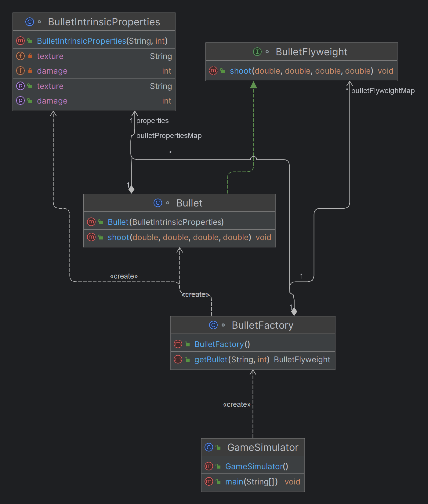

# Flyweight Design Pattern

## What is the Flyweight Pattern?

The Flyweight pattern is a structural design pattern that allows the efficient sharing of objects to reduce memory usage. It is particularly useful when a large number of similar objects are needed, but creating an object for each instance would be too costly in terms of memory.

## When to Use the Flyweight Pattern

- **Large Number of Objects**: When your application needs to create a large number of similar objects, and you want to minimize memory usage.
- **Shared State**: When objects share common intrinsic state (e.g., properties that are the same across many instances), and only a few extrinsic properties vary.
- **Performance Constraints**: When optimizing memory usage is crucial for application performance, such as in real-time applications or systems with limited resources.

## Why Use the Flyweight Pattern

- **Memory Efficiency**: Reduces memory consumption by sharing common parts of object states among multiple instances.
- **Improved Performance**: Decreases the overhead of creating and managing a large number of objects, leading to faster and more scalable applications.
- **Simplified Object Management**: Makes it easier to manage a large number of similar objects by centralizing shared properties.

## Examples of the Flyweight Pattern

## Flyweight Pattern: PUBG Bullet Example

## Context

In a game like PUBG, players fire bullets frequently. Each bullet has properties like:
- **Texture**: The appearance or model of the bullet.
- **Damage**: The amount of damage it can inflict.
- **Position**: The current position of the bullet in the game world.
- **Direction**: The direction in which the bullet is traveling.
- **Speed**: The velocity at which the bullet moves.

If every bullet were represented by a unique object with all these properties, it would consume a significant amount of memory, especially when hundreds or thousands of bullets are in play at any given moment.

## Problem

Creating individual objects for each bullet can lead to:
- **High memory usage**, due to the large number of bullet instances.
- **Performance bottlenecks**, as the system struggles to manage and render so many objects.

## Solution: Flyweight Pattern

The Flyweight pattern is used to minimize memory usage by sharing common, intrinsic properties of bullets across all instances, while allowing extrinsic properties to vary for each bullet.

### Key Concepts

- **Intrinsic State**: Shared state among multiple objects. For bullets, this could be the texture and damage.
- **Extrinsic State**: Unique state for each object, passed to the object externally. For bullets, this could be position, direction, and speed.

### Flyweight Pattern: Modularized PUBG Bullet Example

## Context

In a game like PUBG, players fire bullets frequently. Each bullet has properties like:
- **Texture**: The appearance or model of the bullet.
- **Damage**: The amount of damage it can inflict.
- **Position**: The current position of the bullet in the game world.
- **Direction**: The direction in which the bullet is traveling.
- **Speed**: The velocity at which the bullet moves.

The Flyweight pattern can be applied to optimize memory usage by sharing common intrinsic properties of bullets across all instances.

## Implementation

### Intrinsic Properties Class

This class holds the intrinsic properties that are shared across multiple bullet instances.

```java
class BulletIntrinsicProperties {
    private final String texture;
    private final int damage;

    public BulletIntrinsicProperties(String texture, int damage) {
        this.texture = texture;
        this.damage = damage;
    }

    public String getTexture() {
        return texture;
    }

    public int getDamage() {
        return damage;
    }
}

//Defines the methods for objects that will be shared, incorporating intrinsic and extrinsic state.
interface BulletFlyweight {
    void shoot(double positionX, double positionY, double direction, double speed);
}

//The Concrete Flyweight class implements the Flyweight interface and uses the intrinsic properties class.
class Bullet implements BulletFlyweight {
    private final BulletIntrinsicProperties properties;

    public Bullet(BulletIntrinsicProperties properties) {
        this.properties = properties;
    }

    @Override
    public void shoot(double positionX, double positionY, double direction, double speed) {
        System.out.println("Shooting bullet with texture: " + properties.getTexture() +
                ", damage: " + properties.getDamage() +
                " at position (" + positionX + ", " + positionY +
                ") in direction " + direction + " with speed " + speed);
    }
}


//The Flyweight Factory class manages the creation and sharing of BulletFlyweight objects by utilizing the //BulletIntrinsicProperties.import java.util.HashMap;
import java.util.Map;

class BulletFactory {
    private final Map<String, BulletIntrinsicProperties> bulletPropertiesMap = new HashMap<>();
    private final Map<String, BulletFlyweight> bulletFlyweightMap = new HashMap<>();

    public BulletFlyweight getBullet(String texture, int damage) {
        String propertiesKey = texture + damage;
        BulletIntrinsicProperties properties = bulletPropertiesMap.computeIfAbsent(propertiesKey,
                key -> new BulletIntrinsicProperties(texture, damage));

        return bulletFlyweightMap.computeIfAbsent(propertiesKey,
                key -> new Bullet(properties));
    }
}


//Client
public class GameSimulator {
    public static void main(String[] args) {
        BulletFactory factory = new BulletFactory();

        // Simulate firing bullets
        BulletFlyweight bullet1 = factory.getBullet("BasicBullet.png", 10);
        bullet1.shoot(100, 200, 45, 300); // Position (100, 200), Direction 45 degrees, Speed 300

        BulletFlyweight bullet2 = factory.getBullet("BasicBullet.png", 10);
        bullet2.shoot(120, 210, 60, 300); // Different position and direction

        BulletFlyweight bullet3 = factory.getBullet("ArmorPiercingBullet.png", 20);
        bullet3.shoot(130, 220, 30, 350); // Position (130, 220), Direction 30 degrees, Speed 350

        // Since bullet1 and bullet2 share the same intrinsic properties, they are the same instance
        // Bullet3 is a different instance because it has different intrinsic properties (texture, damage)
    }
}


```
### Class Diagram



### Example 2: Text Rendering (Characters in a Document)
In a text editor, each character can have properties like font, size, and color. The Flyweight pattern allows the editor to share common character properties across multiple occurrences of the same character, significantly reducing memory usage when rendering large documents.

### Example 3: Terrain Tiles in a Strategy Game
In a strategy game, the map is made up of terrain tiles like grass, water, and mountains. Instead of creating a separate object for each tile, the Flyweight pattern allows sharing of common properties like texture and color, while each tile maintains its unique position and other dynamic attributes.

## Benefits of the Flyweight Pattern

- **Reduced Memory Usage**: By sharing common object state, the pattern significantly lowers memory consumption.
- **Better Performance**: Reducing the number of objects and their memory footprint can improve application performance, particularly in memory-intensive applications.
- **Increased Scalability**: The pattern allows your application to handle a larger number of objects without a corresponding increase in memory usage.
- **Simplified Code Maintenance**: Centralizing shared properties makes the code easier to maintain and reduces redundancy.

## Keywords and Phrases to Identify the Use of Flyweight Pattern

## Keywords:
- **Large number of objects**
- **Memory constraints**
- **Shared properties**
- **Common state**
- **High object count**
- **Efficient memory usage**
- **Reusability**
- **Intrinsic state**
- **Object pooling**
- **Lightweight objects**

## Phrases:
- "There are many similar objects with common properties."
- "Memory usage needs to be minimized."
- "The application needs to manage a large number of similar objects efficiently."
- "Objects have shared characteristics with only a few differences."
- "Performance is impacted by creating many similar instances."
- "We need to reduce the memory footprint."
- "Objects should share common data to save resources."
- "There’s a need to optimize memory in a resource-constrained environment."
- "Frequent creation and destruction of similar objects lead to performance bottlenecks."
- "Objects can share the same data, with only a few unique attributes."


