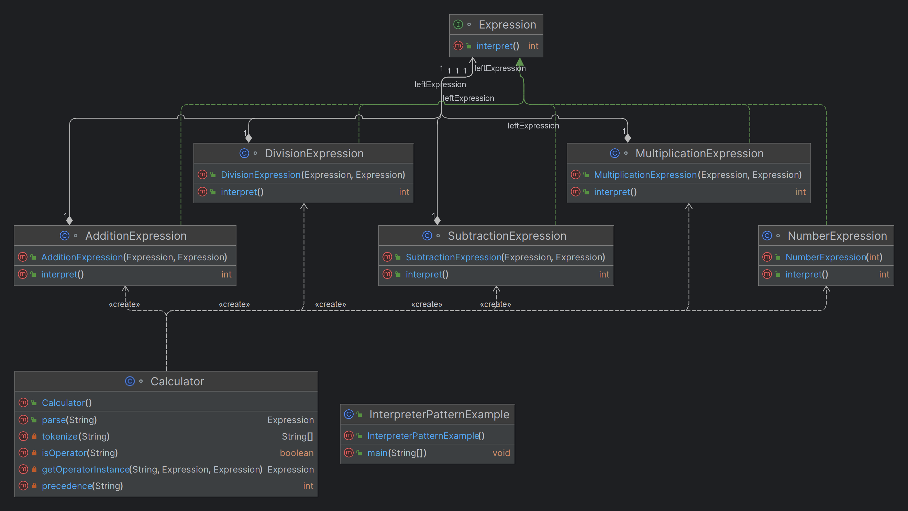

# Interpreter Design Pattern

## What is the Interpreter Design Pattern?

The **Interpreter Design Pattern** is a behavioral design pattern used to interpret and evaluate sentences or expressions defined in a specific language. The pattern provides a way to define a grammar for a language and an interpreter that uses this grammar to interpret or evaluate expressions in the language.

## Why Use the Interpreter Design Pattern?

### 1. **Evaluating Expressions:**
- The pattern is particularly useful when you need to interpret or evaluate complex expressions in a structured and consistent manner.

### 2. **Defining a Language:**
- If your application requires a specialized language or grammar for processing instructions, the Interpreter pattern can help define and evaluate that language efficiently.

### 3. **Maintaining Flexibility:**
- The pattern makes it easy to add new expressions or modify existing ones, making your language extensible and adaptable to changing requirements.

## When to Use the Interpreter Design Pattern?

### 1. **When the Language is Simple:**
- The pattern works best with simple languages and grammars. It's suitable when the complexity of the language is not high, and performance is not a critical concern.

### 2. **When Grammar is Stable:**
- Use this pattern when the grammar of the language is stable and not expected to change frequently. The pattern's structure relies on the grammar being well-defined and consistent.

### 3. **When Evaluating Expressions Repeatedly:**
- If your application needs to evaluate similar expressions repeatedly, the Interpreter pattern can simplify and optimize the evaluation process.

## Real-Time Examples

### 1. **Calculator Applications:**
- A calculator that interprets and evaluates arithmetic expressions (e.g., `5 + 3 * 2`) using an interpreter to process each operation based on the defined grammar.

### 2. **SQL Query Interpreters:**
- Interpreting and executing SQL queries by breaking down the query into individual components (e.g., `SELECT`, `FROM`, `WHERE`) and processing them according to the SQL grammar.

### 3. **Configuration File Parsers:**
- Interpreting configuration files written in a specific format, where the parser reads and processes the configuration rules to apply settings to an application.

### 4. **Scripting Languages:**
- Implementing simple scripting languages for automation tasks, where commands in the script are interpreted and executed according to predefined rules.

## Benefits of the Interpreter Design Pattern

### 1. **Simplicity in Expression Evaluation:**
- The pattern provides a clear structure for evaluating complex expressions by breaking them down into smaller, manageable parts.

### 2. **Flexibility in Grammar Expansion:**
- It's easy to add new expressions or modify existing ones, making the language or grammar extensible and adaptable to new requirements.

### 3. **Improved Maintainability:**
- By encapsulating each expression in its own class, the code is easier to maintain, debug, and extend over time.

### 4. **Reusability:**
- The classes representing different expressions can be reused across different parts of the system or in different projects.

### 5. **Decoupling of Grammar from Implementation:**
- The pattern decouples the grammar definition from the implementation, making it easier to manage and evolve the language.

### 6. **Recursive and Hierarchical Structure Handling:**
- The pattern naturally supports recursive and hierarchical structures, making it ideal for interpreting nested or complex expressions.

## Interpreter Design Pattern: Calculator Example


## Problem Statement

Create a calculator that can evaluate arithmetic expressions such as:

- `5 + 3`
- `10 - 2 * 3`
- `( 5 + 3 ) * 2`

The calculator should correctly handle operator precedence and parentheses.
```java
package com.company.interpreter;

public class InterpreterPatternExample {
    public static void main(String[] args) {
        // Example: (5 + 3) * (8 - 2) should evaluate to 48
        String expression = "( 5 + 3 ) * ( 8 - 2 )";

        Expression result = Calculator.parse(expression);
        int output = result.interpret();

        System.out.println("Result: " + output); // Output should be 48
    }
}

package com.company.interpreter;

import javafx.beans.binding.NumberExpression;

import java.util.Stack;

class Calculator {
    public static Expression parse(String expression) {
        Stack<Expression> stack = new Stack<>();
        Stack<String> operatorStack = new Stack<>();

        String[] tokens = tokenize(expression);
        for (String token : tokens) {
            if (isOperator(token)) {
                while (!operatorStack.isEmpty() && precedence(token) <= precedence(operatorStack.peek())) {
                    Expression rightExpression = stack.pop();
                    Expression leftExpression = stack.pop();
                    String operator = operatorStack.pop();
                    stack.push(getOperatorInstance(operator, leftExpression, rightExpression));
                }
                operatorStack.push(token);
            } else if (token.equals("(")) {
                operatorStack.push(token);
            } else if (token.equals(")")) {
                while (!operatorStack.peek().equals("(")) {
                    Expression rightExpression = stack.pop();
                    Expression leftExpression = stack.pop();
                    String operator = operatorStack.pop();
                    stack.push(getOperatorInstance(operator, leftExpression, rightExpression));
                }
                operatorStack.pop(); // Remove the "(" from the stack
            } else {
                stack.push(new NumberExpression(Integer.parseInt(token)));
            }
        }

        while (!operatorStack.isEmpty()) {
            Expression rightExpression = stack.pop();
            Expression leftExpression = stack.pop();
            String operator = operatorStack.pop();
            stack.push(getOperatorInstance(operator, leftExpression, rightExpression));
        }

        return stack.pop();
    }

    private static String[] tokenize(String expression) {
        // Simple tokenizer that handles spaces, numbers, operators, and parentheses
        return expression.split("(?<=[-+*/()])|(?=[-+*/()])");
    }

    private static boolean isOperator(String token) {
        return token.equals("+") || token.equals("-") || token.equals("*") || token.equals("/");
    }

    private static int precedence(String operator) {
        switch (operator) {
            case "+":
            case "-":
                return 1;
            case "*":
            case "/":
                return 2;
            default:
                return 0;
        }
    }

    private static Expression getOperatorInstance(String operator, Expression left, Expression right) {
        switch (operator) {
            case "+":
                return new AdditionExpression(left, right);
            case "-":
                return new SubtractionExpression(left, right);
            case "*":
                return new MultiplicationExpression(left, right);
            case "/":
                return new DivisionExpression(left, right);
            default:
                throw new IllegalArgumentException("Unknown operator: " + operator);
        }
    }
}
interface Expression {
    int interpret();
}
class SubtractionExpression implements Expression {
    private Expression leftExpression;
    private Expression rightExpression;

    public SubtractionExpression(Expression leftExpression, Expression rightExpression) {
        this.leftExpression = leftExpression;
        this.rightExpression = rightExpression;
    }

    @Override
    public int interpret() {
        return leftExpression.interpret() - rightExpression.interpret();
    }
}


class AdditionExpression implements Expression {
    private Expression leftExpression;
    private Expression rightExpression;

    public AdditionExpression(Expression leftExpression, Expression rightExpression) {
        this.leftExpression = leftExpression;
        this.rightExpression = rightExpression;
    }

    @Override
    public int interpret() {
        return leftExpression.interpret() + rightExpression.interpret();
    }
}
public class MultiplicationExpression extends OperatorExpression {
    public MultiplicationExpression(Expression left, Expression right) {
        super(left, right);
    }

    @Override
    public int interpret() {
        return leftExpression.interpret() * rightExpression.interpret();
    }
}

public class DivisionExpression extends OperatorExpression {
    public DivisionExpression(Expression left, Expression right) {
        super(left, right);
    }

    @Override
    public int interpret() {
        return leftExpression.interpret() / rightExpression.interpret();
    }
}
```
## Class Diagram


