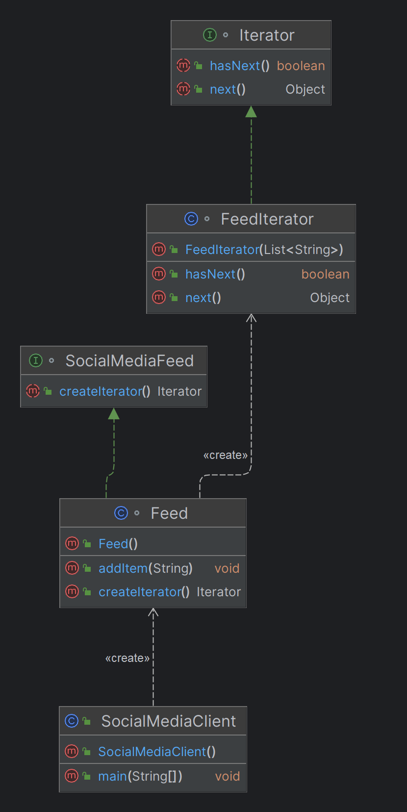

# Iterator Design Pattern

## What is the Iterator Design Pattern?

The **Iterator Design Pattern** is a behavioral design pattern that provides a way to access the elements of a collection (like a list or an array) sequentially without exposing the underlying representation. It allows you to traverse a collection one element at a time while keeping the logic of iteration separate from the collection itself.

## Why Use the Iterator Pattern?

- **Encapsulation:** The pattern allows you to hide the internal structure of a collection, providing a uniform interface for iterating over different types of collections.
- **Single Responsibility:** It separates the logic of iterating over a collection from the collection itself, adhering to the single responsibility principle.
- **Consistency:** The pattern provides a consistent way to traverse different kinds of collections without needing to know how the collection is structured internally.

## When to Use the Iterator Pattern?

- **Traversal Without Exposing Internals:** When you need to traverse a complex data structure without exposing its underlying details.
- **Uniform Interface for Different Collections:** When you want to provide a common interface for iterating over various types of collections (e.g., arrays, lists, trees).
- **Custom Traversal Logic:** When you want to implement custom traversal algorithms without modifying the collection itself.

## Real-time Use Case: Social Media Feed

Imagine a social media platform like Twitter, where users can scroll through their feed, which contains posts, images, videos, and advertisements. The feed is a complex collection of different types of content. The Iterator Design Pattern can be used to create an iterator that allows users to traverse this feed item by item.

- **Collection:** The feed is the collection containing posts, images, videos, etc.
- **Iterator:** The iterator object provides a way to traverse through each item in the feed, regardless of the type of content.
- **Benefits:** Users can scroll through the feed uniformly, while the internal details of how the feed is stored (e.g., as a list, array, or a combination) remain hidden.

## Benefits of the Iterator Pattern

1. **Simplified Access to Collections:** You can access elements in a collection without needing to understand the underlying data structure.
2. **Multiple Traversal Options:** It supports various ways to traverse a collection, such as forward, backward, or a custom traversal order.
3. **Decoupling Traversal Logic:** The collection and the traversal mechanism are decoupled, allowing you to modify the collection's structure without affecting the iteration logic.
4. **Consistent Interface:** It provides a consistent way to traverse collections, regardless of their type or complexity.

## Real-time Use Case: Social Media Feed

Imagine a social media platform like Twitter, where users can scroll through their feed, which contains posts, images, videos, and advertisements. The feed is a complex collection of different types of content. The Iterator Design Pattern can be used to create an iterator that allows users to traverse this feed item by item.

### Java Code Example

```java
import java.util.ArrayList;
import java.util.List;

// The Iterator interface
interface Iterator {
    boolean hasNext();
    Object next();
}

// The Collection interface
interface SocialMediaFeed {
    Iterator createIterator();
}

// Concrete implementation of the SocialMediaFeed
class Feed implements SocialMediaFeed {
    private List<String> items;

    public Feed() {
        this.items = new ArrayList<>();
    }

    public void addItem(String item) {
        items.add(item);
    }

    @Override
    public Iterator createIterator() {
        return new FeedIterator(items);
    }
}

// Concrete implementation of the Iterator
class FeedIterator implements Iterator {
    private List<String> items;
    private int position = 0;

    public FeedIterator(List<String> items) {
        this.items = items;
    }

    @Override
    public boolean hasNext() {
        return position < items.size();
    }

    @Override
    public Object next() {
        if (this.hasNext()) {
            return items.get(position++);
        }
        return null;
    }
}

// Client code
public class SocialMediaClient {
    public static void main(String[] args) {
        Feed feed = new Feed();
        feed.addItem("Post 1");
        feed.addItem("Image 1");
        feed.addItem("Video 1");

        Iterator iterator = feed.createIterator();

        while (iterator.hasNext()) {
            String item = (String) iterator.next();
            System.out.println("Item: " + item);
        }
    }
}
```
## Class Diagram


# Identifying the Need for the Iterator Design Pattern

When analyzing requirements, certain keywords, phrases, and scenarios can indicate the need for the Iterator Design Pattern. Below are these indicators, along with real-time example requirements.

## Keywords and Phrases

1. **Traversal or Iteration**:
    - "We need to **traverse** through the collection..."
    - "The system should allow **iteration** over elements in the collection..."
    - "The user should be able to **browse** items in a collection..."

2. **Sequential Access**:
    - "Elements should be accessed **sequentially**..."
    - "Provide a way to access elements one at a time..."

3. **Uniform Interface**:
    - "The system should provide a **uniform interface** to iterate over different types of collections..."
    - "Users should be able to interact with various collections through a **consistent** API..."

4. **Encapsulation**:
    - "The internal structure of the collection should remain **hidden** from the client..."
    - "We need to **encapsulate** the iteration logic so that the client doesn't need to know how the collection is implemented..."

5. **Multiple Collection Types**:
    - "We have different types of collections (e.g., ArrayList, LinkedList) that should be iterated in a **similar manner**..."
    - "The application must support **iterating over different data structures** using a common approach..."

## Real-time Example Requirements

1. **E-commerce Application**:
    - "Customers should be able to browse through a list of products. Whether these products are stored in a `LinkedList` or `ArrayList`, the browsing experience should be consistent and should not expose how the products are stored."

2. **Social Media Feed**:
    - "The social media feed should display posts, images, and videos in a sequential manner. Users should be able to scroll through the feed without needing to know if the feed items are stored in an array or a linked list."

3. **File System Explorer**:
    - "The file system explorer should allow users to iterate over files and directories. The underlying storage could be in different formats, but the user should experience a consistent way to navigate through the files."

4. **Streaming Service**:
    - "The streaming service should allow users to browse through a list of movies. The list might be backed by different data structures depending on the source (e.g., popular movies, recently added), but the interface for browsing should remain the same."

5. **Data Processing Pipeline**:
    - "The system must process a sequence of data items from different sources. The processing logic should be able to iterate over the data items regardless of whether they are stored in a list, queue, or some other collection."
