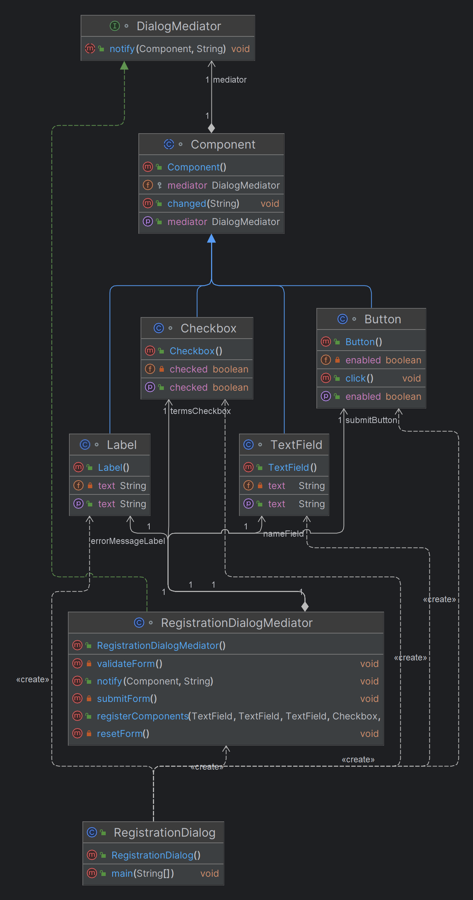

# Mediator Design Pattern

## What is the Mediator Design Pattern?

The Mediator Design Pattern is a behavioral design pattern that defines an object, called the mediator, which encapsulates the way a set of objects interact. Instead of allowing objects to communicate directly with each other, they communicate through the mediator. This approach promotes loose coupling and helps to manage complex interactions between objects.

## Why Use the Mediator Design Pattern?

The Mediator Design Pattern is beneficial because it:

- **Reduces Complexity:** By centralizing the communication between components, it simplifies the interactions and dependencies between them.
- **Improves Modularity:** Components become independent from each other, interacting only with the mediator, which makes the system easier to modify and extend.
- **Enhances Reusability:** Since components do not have direct knowledge of each other, they can be reused in different contexts without modification.
- **Simplifies Maintenance:** With the communication logic centralized in one place (the mediator), it is easier to manage, debug, and update the system.

## When to Use the Mediator Design Pattern?

Consider using the Mediator Design Pattern when:

- **Multiple Objects Communicate:** When multiple objects are tightly coupled with each other due to frequent communication.
- **Complex Communication Logic:** When the logic for communication between objects becomes too complex to manage.
- **Reusability is Desired:** When you want to make the components of a system more reusable and easier to maintain by reducing their dependencies on one another.
- **Need to Enforce a Centralized Control:** When you need a central point of control for managing interactions between various components.

## Real-Time Use Cases

### 1. User Interface Dialogs
In a complex user interface, like a form with multiple input fields, checkboxes, and buttons, the Mediator Pattern can manage interactions between components. For instance, enabling or disabling a submit button based on the state of input fields and checkboxes can be centralized in a mediator.

### 2. E-commerce Order Processing
In an e-commerce system, the Mediator Pattern can coordinate the interactions between various services like inventory management, payment processing, and shipping. The mediator ensures that these services work together seamlessly without them directly depending on each other.

### 3. Chat Room Applications
In a chat room application, the mediator (chat room) manages the communication between multiple users. Users send messages to the mediator, which then relays the messages to other users, ensuring that the users don't directly communicate with each other.

### 4. Traffic Control Systems
In a traffic control system, a central traffic controller (mediator) manages the interactions between different traffic signals, ensuring that they operate in sync without directly interacting with each other.

# Mediator Design Pattern - UI Example

## Overview

In this example, we'll demonstrate how the Mediator Design Pattern can be applied to a UI component scenario. Specifically, we'll use a **Registration Form** with various UI elements such as text fields, checkboxes, and buttons. The Mediator will manage the interaction between these components to reduce dependencies and make the system easier to maintain.

## UI Example: Registration Form

### Problem Without Mediator

Imagine a registration form where:

- **Text Fields** are used for entering the user's name, email, and password.
- A **Checkbox** is used to agree to the terms and conditions.
- A **Submit Button** is used to submit the form.
- A **Reset Button** is used to clear all the fields.

Without the Mediator pattern, these components would need to directly reference each other. For example, the **Submit Button** might need to check if all **Text Fields** are filled and if the **Checkbox** is checked before enabling itself. This leads to tightly coupled code, making it difficult to maintain or extend.

### Solution with Mediator

Using the Mediator Design Pattern, we introduce a mediator that handles the interactions between these components. Each component will communicate with the mediator, which will then decide what actions to take.

### Components and Mediator

1. **TextField Class**
```java

//The mediator interface will declare methods for handling the interactions between the components.
interface DialogMediator {
    void notify(Component component, String event);
}

//The concrete mediator implements the mediator interface and contains the logic to coordinate the components
class RegistrationDialogMediator implements DialogMediator {
    private TextField nameField;
    private TextField emailField;
    private TextField passwordField;
    private Checkbox termsCheckbox;
    private Button submitButton;
    private Button resetButton;
    private Label errorMessageLabel;

    public void registerComponents(TextField nameField, TextField emailField, TextField passwordField,
                                   Checkbox termsCheckbox, Button submitButton, Button resetButton, Label errorMessageLabel) {
        this.nameField = nameField;
        this.emailField = emailField;
        this.passwordField = passwordField;
        this.termsCheckbox = termsCheckbox;
        this.submitButton = submitButton;
        this.resetButton = resetButton;
        this.errorMessageLabel = errorMessageLabel;
    }

    @Override
    public void notify(Component component, String event) {
        if (component == nameField || component == emailField || component == passwordField || component == termsCheckbox) {
            validateForm();
        } else if (component == resetButton) {
            resetForm();
        } else if (component == submitButton) {
            submitForm();
        }
    }

    private void validateForm() {
        boolean isFormValid = !nameField.getText().isEmpty() && !emailField.getText().isEmpty()
                && !passwordField.getText().isEmpty() && termsCheckbox.isChecked();
        submitButton.setEnabled(isFormValid);
        if (!isFormValid) {
            errorMessageLabel.setText("Please fill all fields and accept terms.");
        } else {
            errorMessageLabel.setText("");
        }
    }

    private void resetForm() {
        nameField.setText("");
        emailField.setText("");
        passwordField.setText("");
        termsCheckbox.setChecked(false);
        errorMessageLabel.setText("");
        submitButton.setEnabled(false);
    }

    private void submitForm() {
        if (submitButton.isEnabled()) {
            System.out.println("Form submitted: Name = " + nameField.getText() +
                    ", Email = " + emailField.getText());
            resetForm();
        } else {
            errorMessageLabel.setText("Cannot submit the form. Please fill all fields and accept terms.");
        }
    }
}

//Create Component Classes
abstract class Component {
    protected DialogMediator mediator;

    public void setMediator(DialogMediator mediator) {
        this.mediator = mediator;
    }

    public void changed(String event) {
        if (mediator != null) {
            mediator.notify(this, event);
        }
    }
}

class TextField extends Component {
    private String text = "";

    public void setText(String text) {
        this.text = text;
        changed("textChanged");
    }

    public String getText() {
        return text.isEmpty() ? "" : text;
    }
}

class Checkbox extends Component {
    private boolean checked = false;

    public void setChecked(boolean checked) {
        this.checked = checked;
        changed("checkedChanged");
    }

    public boolean isChecked() {
        return checked;
    }
}

class Button extends Component {
    private boolean enabled = false;

    public void setEnabled(boolean enabled) {
        this.enabled = enabled;
    }

    public boolean isEnabled() {
        return enabled;
    }

    public void click() {
        changed("clicked");
    }
}

class Label extends Component {
    private String text = "";

    public void setText(String text) {
        this.text = text;
    }

    public String getText() {
        return text;
    }
}
public class RegistrationDialog {
    public static void main(String[] args) {
        TextField nameField = new TextField();
        TextField emailField = new TextField();
        TextField passwordField = new TextField();
        Checkbox termsCheckbox = new Checkbox();
        Button submitButton = new Button();
        Button resetButton = new Button();
        Label errorMessageLabel = new Label();

        RegistrationDialogMediator mediator = new RegistrationDialogMediator();
        mediator.registerComponents(nameField, emailField, passwordField, termsCheckbox, submitButton, resetButton, errorMessageLabel);

        // Set the mediator for each component
        nameField.setMediator(mediator);
        emailField.setMediator(mediator);
        passwordField.setMediator(mediator);
        termsCheckbox.setMediator(mediator);
        submitButton.setMediator(mediator);
        resetButton.setMediator(mediator);
        errorMessageLabel.setMediator(mediator);

        // Simulate user interactions
        nameField.setText("John Doe");
        emailField.setText("john@example.com");
        passwordField.setText("password123");
        termsCheckbox.setChecked(true);

        submitButton.click(); // Form submitted successfully

        resetButton.click(); // Form is reset
    }
}


```

## Class Diagram


## Mediator Design Pattern

## Keywords and Phrases to Identify the Mediator Design Pattern

When analyzing requirements, look for the following keywords and phrases that suggest the use of the Mediator Design Pattern:

### Centralized Control
- **Keywords/Phrases:**
    - Centralized coordination
    - Centralized management
    - Single point of interaction
    - Central hub
- **Example Requirement:**
    - “The system should provide a central controller that manages all interactions between the user interface components and backend services.”

### Decoupling Components
- **Keywords/Phrases:**
    - Reduce dependencies
    - Loose coupling
    - Independent components
    - Modular interactions
- **Example Requirement:**
    - “Components should interact through a mediator to ensure they are loosely coupled and can be independently maintained and updated.”

### Complex Interactions
- **Keywords/Phrases:**
    - Complex communication
    - Interconnected components
    - Multiple dependencies
    - Coordination of interactions
- **Example Requirement:**
    - “The system must handle complex interactions between various modules, ensuring that changes in one module do not directly affect others.”

### Unified Interface
- **Keywords/Phrases:**
    - Unified control
    - Centralized logic
    - Single interface for communication
    - Mediation of communication
- **Example Requirement:**
    - “Provide a unified interface to manage and mediate communication between different services and components within the application.”

### Reusability and Maintenance
- **Keywords/Phrases:**
    - Easy to extend
    - Reusable components
    - Maintainable system
    - Scalable design
    - Simplified maintenance
- **Example Requirement:**
    - “The design should ensure that components are reusable and that any changes or extensions to the system are easy to implement without disrupting existing functionality.”

## Real-Time Use Cases

### 1. E-commerce System
- **Requirement:** “The order processing system should coordinate the inventory, payment, and shipping services without them directly interacting with each other. Each service should be independently maintainable and reusable across different contexts.”
- **Keywords/Phrases:** “Coordinate,” “without directly interacting,” “independently maintainable,” “reusable”

### 2. Financial Trading Platform
- **Requirement:** “The trading engine should manage the interactions between various market data feeds, order processing modules, and risk management systems to ensure they operate in sync without depending on each other.”
- **Keywords/Phrases:** “Manage interactions,” “operate in sync,” “without depending on each other”

### 3. Air Traffic Control System
- **Requirement:** “The control tower system must coordinate all communication between aircrafts, ground vehicles, and weather monitoring systems, ensuring that no direct communication occurs between the components.”
- **Keywords/Phrases:** “Coordinate all communication,” “no direct communication,” “control tower system”

### 4. Chat Application
- **Requirement:** “The chat room should manage all messages between users. Users should not directly send messages to each other but rely on the chat room to handle communication.”
- **Keywords/Phrases:** “Manage all messages,” “should not directly send messages,” “handle communication”

### 5. Smart Home Automation
- **Requirement:** “The central controller should manage interactions between smart devices like lights, thermostats, and security cameras, ensuring that each device operates independently and does not directly communicate with other devices.”
- **Keywords/Phrases:** “Central controller,” “manage interactions,” “operate independently,” “does not directly communicate”

These keywords and phrases, along with the provided examples, can help identify when the Mediator Design Pattern might be useful for managing complex interactions and dependencies between components.


