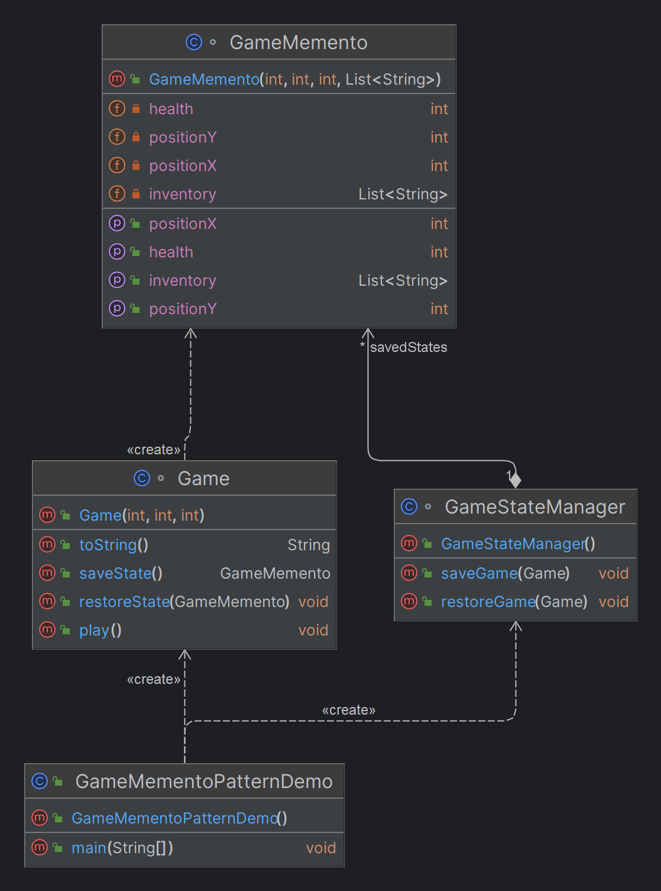

# Memento and Command Design Patterns

## Table of Contents
- [Memento Pattern](#memento-pattern)
    - [What is the Memento Pattern?](#what-is-the-memento-pattern)
    - [When to Use the Memento Pattern?](#when-to-use-the-memento-pattern)
    - [Why Use the Memento Pattern?](#why-use-the-memento-pattern)
    - [Benefits of the Memento Pattern](#benefits-of-the-memento-pattern)
- [Command Pattern](#command-pattern)
    - [What is the Command Pattern?](#what-is-the-command-pattern)
    - [When to Use the Command Pattern?](#when-to-use-the-command-pattern)
    - [Why Use the Command Pattern?](#why-use-the-command-pattern)
    - [Benefits of the Command Pattern](#benefits-of-the-command-pattern)

## Memento Pattern

### What is the Memento Pattern?

The Memento Pattern is a behavioral design pattern that allows you to capture and store the internal state of an object without violating its encapsulation. This stored state can later be restored, effectively rolling back the object to its previous state.

### When to Use the Memento Pattern?

- When you need to implement undo/redo functionality.
- When you want to restore an object's state to a previous state, such as in games with save points.
- When you need to manage state snapshots, such as in database transactions.

### Why Use the Memento Pattern?

- **Encapsulation**: The Memento Pattern preserves encapsulation boundaries by not exposing the internal state of the object directly.
- **State Management**: It simplifies the management of an object's state, allowing for easy restoration without modifying the object's interface.

### Benefits of the Memento Pattern

- **Simplifies Undo Operations**: Easily revert an object to a previous state without requiring complex code.
- **Encapsulation Preserved**: The internal state is not exposed, maintaining the object's integrity.
- **State Snapshot**: Provides a clear and organized way to manage state snapshots.

## Command Pattern

### What is the Command Pattern?

The Command Pattern is a behavioral design pattern that turns a request into a stand-alone object that contains all information about the request. This allows you to parameterize methods with different requests, queue them for later execution, or log them for rollback operations.

### When to Use the Command Pattern?

- When you want to decouple the sender of a request from the object that performs the action.
- When you need to implement transactional behavior like undo/redo.
- When you want to log operations, queue requests, or implement macro commands.

### Why Use the Command Pattern?

- **Decoupling**: The Command Pattern decouples the requester from the object performing the operation, which allows for more flexible code.
- **Reusability**: Commands can be reused across different contexts, enhancing code modularity.
- **Queueing and Logging**: It is easier to implement queuing of operations, logging, or even scheduling of operations with the Command Pattern.

### Benefits of the Command Pattern

- **Extensibility**: Easy to add new commands without changing existing code.
- **Decoupling**: Promotes separation of concerns by decoupling the invoker and receiver.
- **Supports Undo/Redo**: Enhances functionality by easily implementing undoable actions.

## Real-Time Examples

### **Memento Pattern - Real-Time Example**

#### Scenario: Undo/Redo Functionality in a Text Editor

In a text editor like Microsoft Word or Google Docs, users often perform actions such as typing, deleting, or formatting text. The editor must allow users to undo or redo these actions to revert to a previous state or move forward.

- **Originator**: The text document, which maintains its content, formatting, and other states.
- **Memento**: A snapshot of the text document at a particular point in time, storing its content, cursor position, formatting, etc.
- **Caretaker**: The undo/redo manager, which holds a stack of mementos to restore the document to a previous or next state.

When a user performs an action, the editor saves the current state of the document as a memento. If the user decides to undo the action, the editor restores the document from the most recent memento, effectively rolling back the last change. Similarly, if the user redoes an action, the editor moves forward in the memento stack.

### **Command Pattern - Real-Time Example**

#### Scenario: GUI Button Actions in a Desktop Application

In a desktop application with a graphical user interface (GUI), buttons perform various actions such as opening a file, saving a document, or printing a report. Each of these actions can be encapsulated as a command.

- **Command**: Each action (e.g., `OpenFileCommand`, `SaveDocumentCommand`, `PrintReportCommand`) is encapsulated as a command object.
- **Receiver**: The actual logic that performs the action, like opening a file dialog, saving the file to disk, or sending the document to the printer.
- **Invoker**: The button or menu item that triggers the command when clicked by the user.
- **Client**: The application that configures the commands and links them to the appropriate buttons.

When the user clicks a button, the corresponding command is executed, which performs the required action on the receiver.

## Memento Pattern - Game Example

### Scenario: Saving and Restoring Game State

In a game, you often need to save the player's state, including their health, position, and inventory, so that the game can be restored to a previous point if needed. The Memento pattern is ideal for this scenario.

### Components:
- **Originator**: The `Game` class, which holds the player's state.
- **Memento**: The `GameMemento` class, which stores the player's state.
- **Caretaker**: The `GameStateManager` class, which manages the saved states.

### Code Example:

```java
import java.util.ArrayList;
import java.util.List;

// Memento class that stores the state of the game
class GameMemento {
    private int health;
    private int positionX;
    private int positionY;
    private List<String> inventory;

    public GameMemento(int health, int positionX, int positionY, List<String> inventory) {
        this.health = health;
        this.positionX = positionX;
        this.positionY = positionY;
        this.inventory = new ArrayList<>(inventory); // Deep copy
    }

    public int getHealth() {
        return health;
    }

    public int getPositionX() {
        return positionX;
    }

    public int getPositionY() {
        return positionY;
    }

    public List<String> getInventory() {
        return new ArrayList<>(inventory); // Return a copy to prevent modification
    }
}

// Originator class
class Game {
    private int health;
    private int positionX;
    private int positionY;
    private List<String> inventory;

    public Game(int health, int positionX, int positionY) {
        this.health = health;
        this.positionX = positionX;
        this.positionY = positionY;
        this.inventory = new ArrayList<>();
    }

    // Method to play the game (just simulating some changes)
    public void play() {
        health -= 10;
        positionX += 5;
        positionY += 3;
        inventory.add("Sword");
        System.out.println("Playing... Current state: " + this);
    }

    // Save the current state in a memento
    public GameMemento saveState() {
        return new GameMemento(health, positionX, positionY, inventory);
    }

    // Restore the state from a memento
    public void restoreState(GameMemento memento) {
        this.health = memento.getHealth();
        this.positionX = memento.getPositionX();
        this.positionY = memento.getPositionY();
        this.inventory = memento.getInventory();
    }

    @Override
    public String toString() {
        return "Game{health=" + health + ", positionX=" + positionX + ", positionY=" + positionY +
                ", inventory=" + inventory + '}';
    }
}

// Caretaker class
class GameStateManager {
    private List<GameMemento> savedStates = new ArrayList<>();

    // Save the current game state
    public void saveGame(Game game) {
        savedStates.add(game.saveState());
        System.out.println("Game state saved.");
    }

    // Restore the last saved game state
    public void restoreGame(Game game) {
        if (savedStates.isEmpty()) {
            System.out.println("No saved states to restore.");
            return;
        }
        game.restoreState(savedStates.remove(savedStates.size() - 1));
        System.out.println("Game state restored: " + game);
    }
}

// Client code
public class GameMementoPatternDemo {
    public static void main(String[] args) {
        Game game = new Game(100, 0, 0);
        GameStateManager manager = new GameStateManager();

        System.out.println("Initial state: " + game);

        // Simulate playing the game
        game.play();
        manager.saveGame(game);  // Save the game state

        // Simulate more playing
        game.play();
        manager.saveGame(game);  // Save again

        // Restore the last saved state
        manager.restoreGame(game);

        // Restore the previous state
        manager.restoreGame(game);
    }
}

```

## Class Diagram
