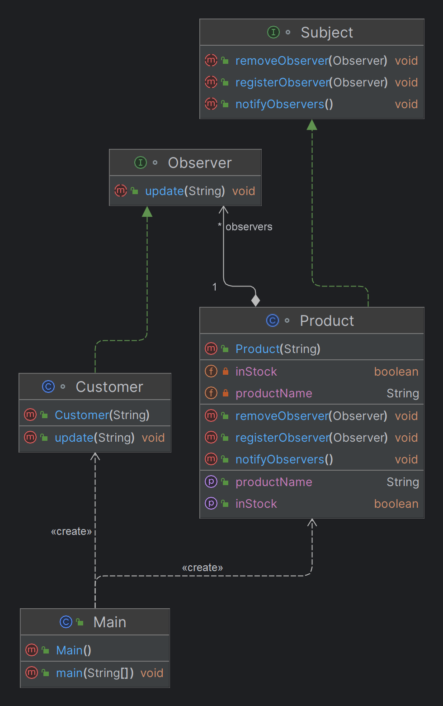

# Observer Design Pattern

## What is the Observer Pattern?

The Observer Pattern is a behavioral design pattern that establishes a one-to-many dependency between objects. When the state of one object (the Subject) changes, all dependent objects (Observers) are notified and updated automatically. This pattern is commonly used to implement distributed event handling systems.

## When to Use the Observer Pattern?

- **Event-driven systems**: When you need to react to events or changes in state across multiple components or modules.
- **Notification systems**: When multiple parts of your application need to be updated or informed about certain changes.
- **Loose coupling**: When you want to minimize dependencies between different parts of your system, allowing for more flexibility and easier maintenance.

## Why Use the Observer Pattern?

- **Decoupling**: The Observer Pattern decouples the Subject from its Observers, reducing dependencies and making the system more modular and maintainable.
- **Scalability**: Easily add, remove, or modify observers without altering the Subject or other parts of the system.
- **Reusability**: Observers and Subjects can be reused across different parts of the application, reducing code duplication.

## Benefits of the Observer Pattern

- **Flexibility**: Observers can be added or removed dynamically at runtime.
- **Consistency**: Ensures that all observers have the most up-to-date information.
- **Extensibility**: New observer types can be created and added without changing existing code.

## E-commerce Platform Example: Product Availability Notification

### Scenario

In an e-commerce platform, customers often want to be notified when an out-of-stock product becomes available again. The platform needs a way to automatically notify all interested customers when this happens.

### Implementation

- **Subject (Product)**: Represents the product being tracked. It maintains a list of customers (observers) who want to be notified when the product is back in stock.
- **Observer (Customer)**: Represents the customers who are interested in being notified. Each customer implements the observer interface, allowing them to receive notifications from the product.

### Code Example

```java
import java.util.ArrayList;
import java.util.List;

// Observer Interface
interface Observer {
    void update(String productName);
}

// ConcreteObserver
class Customer implements Observer {
    private String name;

    public Customer(String name) {
        this.name = name;
    }

    @Override
    public void update(String productName) {
        System.out.println("Hello " + name + ", " + productName + " is now back in stock!");
    }
}

// Subject Interface
interface Subject {
    void registerObserver(Observer observer);
    void removeObserver(Observer observer);
    void notifyObservers();
}

// ConcreteSubject
class Product implements Subject {
    private List<Observer> observers;
    private String productName;
    private boolean inStock;

    public Product(String productName) {
        this.productName = productName;
        this.observers = new ArrayList<>();
        this.inStock = false;
    }

    @Override
    public void registerObserver(Observer observer) {
        observers.add(observer);
    }

    @Override
    public void removeObserver(Observer observer) {
        observers.remove(observer);
    }

    @Override
    public void notifyObservers() {
        if (inStock) {
            for (Observer observer : observers) {
                observer.update(productName);
            }
        }
    }

    public void setInStock(boolean inStock) {
        this.inStock = inStock;
        notifyObservers();
    }

    public String getProductName() {
        return productName;
    }
}

// Main class to demonstrate the Observer pattern
public class Main {
    public static void main(String[] args) {
        Product product = new Product("PlayStation 5");

        Customer customer1 = new Customer("Alice");
        Customer customer2 = new Customer("Bob");

        product.registerObserver(customer1);
        product.registerObserver(customer2);

        // Product is out of stock initially
        product.setInStock(false);
        
        // After some time, the product is back in stock
        product.setInStock(true);
    }
}
```
## Class Diagram


## Use Cases from Different Domains

### 1. **E-commerce Platforms**
- **Scenario**: Product availability notification.
- **Application**: Customers can subscribe to notifications when a product is back in stock, and the system automatically notifies them when the product becomes available.

### 2. **User Interface Components**
- **Scenario**: Data-driven UI updates.
- **Application**: In a dashboard, charts and tables automatically update when the underlying data changes, ensuring the UI always reflects the current state.

### 3. **Social Media**
- **Scenario**: Follower notifications.
- **Application**: When a user posts new content, all followers are notified, keeping them engaged and informed of updates in real time.

### 4. **Financial Systems**
- **Scenario**: Stock market monitoring.
- **Application**: Investors can subscribe to alerts for specific stock price changes, receiving notifications as soon as the stock hits the desired value.

### 5. **Game Development**
- **Scenario**: In-game event notifications.
- **Application**: Players are notified of important events, such as the start of a new round or a change in game conditions, ensuring everyone is aware of the current game state.

### 6. **Logging Systems**
- **Scenario**: Distributed logging.
- **Application**: Different components of an application can send log messages to multiple logging destinations, such as files, consoles, or remote servers, automatically.

## Conclusion

The Observer Pattern is a powerful tool for managing dependencies and communications between different parts of a system. By understanding when and how to use it, you can build systems that are more flexible, scalable, and easier to maintain.
