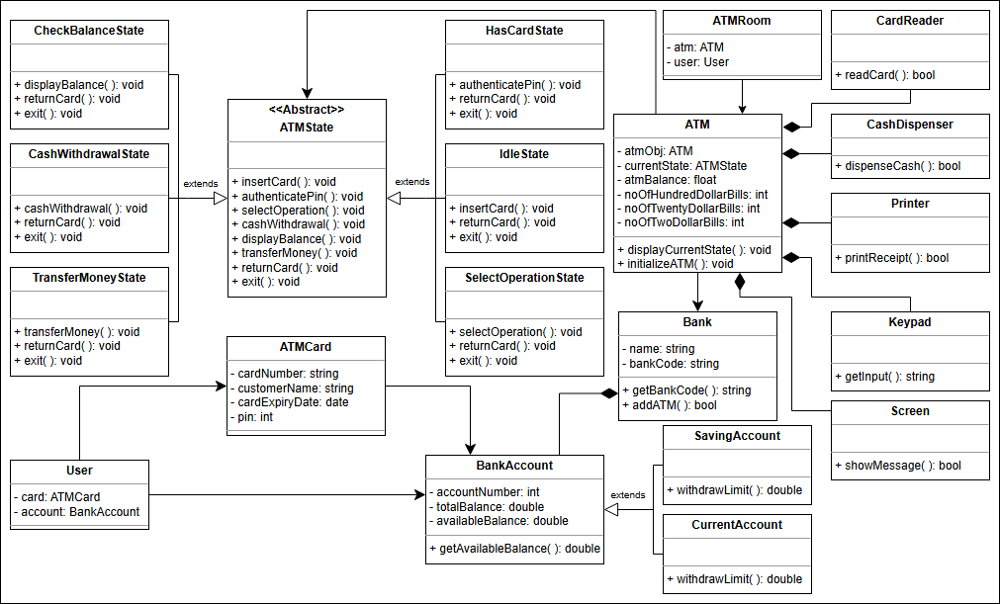

# Automated teller machine (ATM)

## 🚀 Getting Ready: The ATM System
Understand the ATM design problem and learn the questions to simplify this problem further.

### 📋 Problem Definition
An Automated Teller Machine (ATM) allows a bank customer to perform financial transactions remotely without the need for a teller or a bank branch. These transactions include:
- **Deposits**
- **Withdrawals**
- **Balance inquiries**
- **Account transfers**

ATMs are located in convenient locations such as banks, grocery stores, airports, and other public places. To use an ATM:
- Users need a bank card associated with an account at a financial institution.
- Users must also know their Personal Identification Number (**PIN**) to access their account.
- The user inserts their card into the ATM and follows on-screen prompts to complete transactions.

### 🎯 Expectations from the Interviewee
There are several components in an ATM design, each with specific constraints and requirements. The following outlines the main expectations:

#### ATM Components
- What are the components of an ATM?
- Is the ATM necessarily placed inside a room?
- Does an ATM have a fingerprint scanner?

#### ATM Features
Different ATMs may vary in features. Consider asking:
- What is the **withdrawal limit** of an ATM?
- Can we **check account balance** using an ATM?
- Can we set a **PIN** using an ATM?

#### ATM Processing
Key processing questions include:
- What happens when the **amount entered exceeds** the user’s account balance?
- What happens when the amount is greater than the ATM's **cash limit**?
- What happens if the ATM runs out of cash during a transaction?

---

## 🚀 Requirements for the ATM System
Learn about all requirements of the ATM design.

### 🔍 Requirement collection
- **R1**: Each user has a single account at the bank that they can access by inserting their card into the ATM.
- **R2**: The main components of the ATM system that facilitate interactions between the user and the machine are:
    - Card reader: To read the user's ATM card
    - Keypad: To enter information such as the user's PIN
    - Screen: To display messages to the user, such as prompts or error messages
    - Cash dispenser: **To dispense cash to the user**
    - Printer: To print receipts for the user
    - Network infrastructure: To connect with the bank's computer system **in order to access account information and complete transactions**
- **R3**: The ATM system must authenticate the user based on the PIN they enter to ensure that **only authorized users can access their accounts**.
- **R4**: All transactions are possible after the successful authentication of the ATM card.
- **R5**: The user can have two types of accounts—current and savings—and can perform the following operations on the ATM:
    - Balance inquiry
    - Cash withdrawal
    - **Funds/money transfer**
- **R6**: At the end of a transaction, the user has the option to start another transaction or end their session.

## Class Diagram

## WhiteNotes

### Classes
ATM
Bank
Customer
 - id
 - name
 - address
 - card
 - account
Account
 - Id  
 - Types
   - current
   - savings
BankCard
 - PIN
 - number
 - startDate
 - expiryDate
Transaction
 - Deposit
 - Withdraw
 - BalanceEnquiry
 - AccountTransfer
Location
ATMComponent
 - PromptScreen
 - ButtonUI
 - CardReader
 - CashDispenser
 - Printer
 - NetworkInfrastructure
Authentication
Authorization
Bank
 - id
 - customer
 - veri

### Actor - Actions
#### Primary Actors

### Questions
1. What if a user enters the wrong pin, the transaction should begin again
2. What about card reader?
3. how system calculates denominations
   1. what if enough cash is not present
4. what is withdrawal limit 
5. Can we set a PIN using an ATM
6. What happens when the amount entered by the user for withdrawal is greater than the user's account balance
7. What happens when the amount entered by the user for withdrawal is greater than the ATM's cash limit?
8. Can the ATM be used for online transactions?
