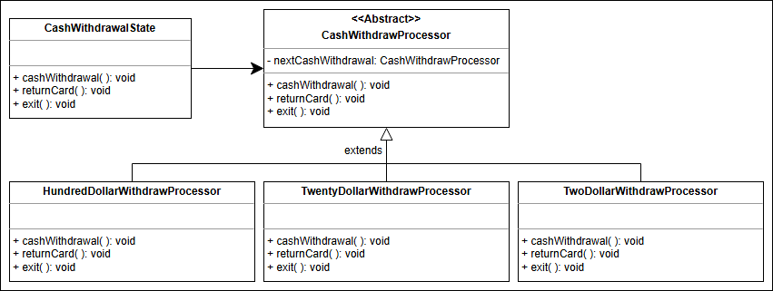

# Automated teller machine (ATM)

## 🚀 Getting Ready: The ATM System
Understand the ATM design problem and learn the questions to simplify this problem further.

### 📋 Problem Definition
An Automated Teller Machine (ATM) allows a bank customer to perform financial transactions remotely without the need for a teller or a bank branch. These transactions include:
- **Deposits**
- **Withdrawals**
- **Balance inquiries**
- **Account transfers**

ATMs are located in convenient locations such as banks, grocery stores, airports, and other public places. To use an ATM:
- Users need a bank card associated with an account at a financial institution.
- Users must also know their Personal Identification Number (**PIN**) to access their account.
- The user inserts their card into the ATM and follows on-screen prompts to complete transactions.

### 🎯 Expectations from the Interviewee
There are several components in an ATM design, each with specific constraints and requirements. The following outlines the main expectations:

#### ATM Components
- What are the components of an ATM?
- Is the ATM necessarily placed inside a room?
- Does an ATM have a fingerprint scanner?

#### ATM Features
Different ATMs may vary in features. Consider asking:
- What is the **withdrawal limit** of an ATM?
- Can we **check account balance** using an ATM?
- Can we set a **PIN** using an ATM?

#### ATM Processing
Key processing questions include:
- What happens when the **amount entered exceeds** the user’s account balance?
- What happens when the amount is greater than the ATM's **cash limit**?
- What happens if the ATM runs out of cash during a transaction?

---

## 🚀 Requirements for the ATM System
Learn about all requirements of the ATM design.

### 🔍 Requirement collection
- **R1**: Each user has a single account at the bank that they can access by inserting their card into the ATM.
- **R2**: The main components of the ATM system that facilitate interactions between the user and the machine are:
    - Card reader: To read the user's ATM card
    - Keypad: To enter information such as the user's PIN
    - Screen: To display messages to the user, such as prompts or error messages
    - Cash dispenser: **To dispense cash to the user**
    - Printer: To print receipts for the user
    - Network infrastructure: To connect with the bank's computer system **in order to access account information and complete transactions**
- **R3**: The ATM system must authenticate the user based on the PIN they enter to ensure that **only authorized users can access their accounts**.
- **R4**: All transactions are possible after the successful authentication of the ATM card.
- **R5**: The user can have two types of accounts—current and savings—and can perform the following operations on the ATM:
    - Balance inquiry
    - Cash withdrawal
    - **Funds/money transfer**
- **R6**: At the end of a transaction, the user has the option to start another transaction or end their session.

## Class Diagram

### Additional Requirements
There is a chance that the interviewer might ask about the working of the cash withdrawal process. How can it be implemented in our ATM system?

This addition is a bit challenging since we need a system that can withdraw the correct combinations of hundred, twenty, and two dollar bills, respectively, according to the amount specified by the user. The system also needs to work sequentially until the required amount is met.

We will use the Chain of Responsibility design pattern to tackle this addition to our system. This design pattern will ensure the correct division of the dollar bills in the ATM by creating a chain of handlers that forward the requests based on the situation until all the requirements are met.

We have created the following classes to implement the Chain of Responsibility design pattern:

- **CashWithdrawProcessor**: This is associated with the CashWithdrawalState class. This abstract class is extended by HundredDollarWithdrawProcessor, TwentyDollarWithdrawProcessor, and TwoDollarWithdrawProcessor.
- **HundredDollarWithdrawProcessor**: This class is derived from CashWithdrawProcessor and is responsible for withdrawing hundred-dollar bills based on the requirement.
- **TwentyDollarWithdrawProcessor**: This class is derived from CashWithdrawProcessor and is responsible for withdrawing twenty-dollar bills based on the requirement.
- **TwoDollarWithdrawProcessor**: This class is derived from CashWithdrawProcessor and is responsible for withdrawing two-dollar bills based on the requirement.

**Valid Amount**: If the amount entered by the user has a modulus equal to zero with any of the specified bills that the ATM can withdraw, then the amount is considered valid for the transaction. If the amount is invalid, then the transaction will not be processed.

For example, a user wants to withdraw $548. The HundredDollarWithdrawProcessor class will start the cash withdrawal using the `cashWithdrawal()` method by taking out five bills of hundred dollars. Now that we have $48 to withdraw for the user which is less than a hundred dollars, the TwentyDollarWithdrawProcessor class will start withdrawing dollar bills. This class will take out two bills of twenty dollars with $8 remaining. Since two dollars is less than twenty, the `cashWithdrawal()` method of the TwoDollarWithdrawProcessor will take out four bills of $2 for the user. The withdrawal, in this case, is successful.

---

## WhiteNotes

### Classes
ATM
Bank
Customer
 - id
 - name
 - address
 - card
 - account
Account
 - Id  
 - Types
   - current
   - savings
BankCard
 - PIN
 - number
 - startDate
 - expiryDate
Transaction
 - Deposit
 - Withdraw
 - BalanceEnquiry
 - AccountTransfer
Location
ATMComponent
 - PromptScreen
 - ButtonUI
 - CardReader
 - CashDispenser
 - Printer
 - NetworkInfrastructure
Authentication
Authorization
Bank
 - id
 - customer
 - veri

### Actor - Actions
#### Primary Actors

### Questions
1. What if a user enters the wrong pin, the transaction should begin again
2. What about card reader?
3. how system calculates denominations
   1. what if enough cash is not present
4. what is withdrawal limit 
5. Can we set a PIN using an ATM
6. What happens when the amount entered by the user for withdrawal is greater than the user's account balance
7. What happens when the amount entered by the user for withdrawal is greater than the ATM's cash limit?
8. Can the ATM be used for online transactions?
