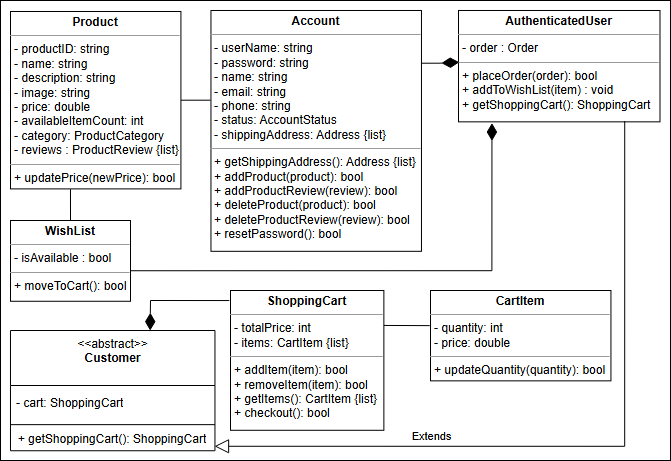
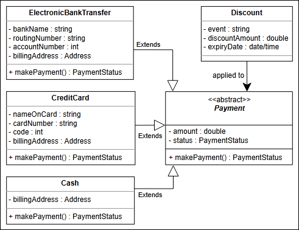

# Amazon 

## 🛒 Getting Ready: The Amazon Online Shopping System
Understand the Amazon problem and learn the questions to further simplify this problem.

### 🔍 Problem Definition
Amazon is an **online retail platform** that allows its users to **buy from and sell products** to other users in the system. There are numerous product categories that customers can search and choose from. Products have **reviews and ratings** that can help customers make a buying decision. Each customer has a **shopping cart** where they can add products they wish to order. Once customers have added their favorite products to the cart, they can check out the cart and choose a payment method to place their orders. The customers are notified about their **order and shipment statuses** until the order is delivered. The system also allows users to **add products they want to sell**.

### 🎯 Expectations from the Interviewee
Numerous components are present in the Amazon online shopping system, each with specific constraints and requirements placed on them.

### 🌟 Discoverability
For an online shopping system like Amazon, **discoverability** is one of the key features that distinguish it from others. You can ask the following questions to know more about the system:
- How will the buyer **discover a product**?
- How will the **search surface results**?

### 🛍️ Cart and Checkout
One of the most significant attributes of the online shopping system is the **cart and checkout functionality** that it provides to its customers. The interviewer expects the cart and checkout to behave in a certain way. You may ask the interviewer:
- How will the design adhere to such **known best practices** while also introducing **innovative checkout semantics** like “one-click purchase”?

### 💳 Payment Methods
The interviewer expects you to ask questions about the **payment methods** to figure out the necessary requirements. You may ask the following questions:
- How will the users **pay**? Will they use **credit cards, gift cards**, and so on?
- How will the **payment method** work with the **checkout process**?

### ⭐ Product Reviews and Ratings
Product reviews and ratings help customers make **informed decisions** regarding what to buy. It is important to know how to make this feature an **effective part of the system**. You can ask the interviewer:
- When can a user **post a review and a rating**?
- How are **useful reviews tracked** and less useful reviews deprioritized?

## 🛒 Requirements for the Amazon Online Shopping System

Learn about all the requirements of the Amazon online shopping system problem.

---

## 📋 Overview

**In this lesson, we’ll list the requirements of our Amazon online shopping system.**  
This is a very crucial step as requirements define the scope of a problem. **Getting them right from the interviewer and understanding them well will make the design of the rest of the system smooth and easy.**

---

## 🧩 Notational Convention

We’ll use the notational convention to identify each requirement with a unique label **"Rn"**, where:
- **"R"** stands for "Requirement"
- **"n"** is a natural number.

---

## 📝 Requirement Collection

The requirements for the Amazon online shopping system design problem are defined below:

- **R1**: A customer can either be an authenticated user or a guest.
    - An authenticated user is one with a registered account on the Amazon online shopping system.
    - A guest does not have a registered account.

- **R2**: An authenticated user should be able to:
    - **Buy, sell, and search** the products via the product name or category.
    - A guest is **only able to search** for products.

- **R3**: A product can have **multiple reviews and ratings** from multiple customers.

- **R4**: An authenticated user should be able to:
    - **Add, remove, or modify product items in their shopping cart.**
    - Further, they can **check out and buy the items**.

- **R5**: The authenticated user should be able to **specify a shipping address** at the time of order.

- **R6**: Payment can be made through:
    - **Credit cards**
    - **Electronic bank transfers**
    - **Cash on delivery**

- **R7**: An order can be **canceled, only if it hasn’t been shipped.**

- **R8**: **Notifications are sent** whenever there is a change in the order or shipping status.

- **R9**: **Shipment can be tracked** to see the current status and the estimated time of arrival for the order.

- **R10**: An admin should exist that can:
    - **Add, modify, or remove product categories.**
    - **Block users.**

---

## Use case diagram

## Class diagram

### Additional requirements
 - Wish list: Only users with an account (an authenticated user) can add a product to their wishlist. The WishList class can be used to move products to a cart and also check if it is currently available:
  
 - Discount: A discount will be applied to the payment depending on special events such as Christmas, Black Friday, and so on. The class diagram provided below shows the relationship of Discount with the Payment class:
   

## White Board

### Classes
Amazon

Account
user(Auth)
Guest
 - +searchForProduct()
Admin
 - add()
 - modify()
 - blockUser()

ShippingAddress

ProductCatalog
SearchInterface
 - byProductName
 - byProductCategory

products
 - buy
 - sell

review
rating

category
system
shoppingCart
- add()
- remove()

order
checkout
payment
 - types
   - credit cards
   - bank transfers
   - cash on delivery.

Notification

Status
 - Order
 - Shipment

ShipmentTracker
 - timeOfArrival
 - listOfReachedLocations :{}

System
 - sendNotification()

### Actors—Actions
System
User
Guest
Admin
CustomerSupport

### Open Questions
1. cancellation
2. paymentMethods
3. Refund
4. how to handle concurrent requests
5. how users search for a product
6. Cart and checkout
7. Product reviews and ratings
