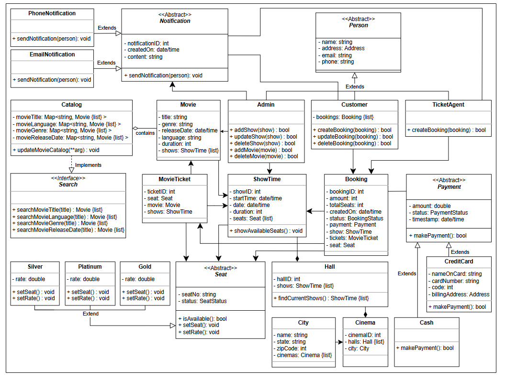

# Book My Show

## 🎟️ Getting Ready: Movie Ticket Booking System

The movie ticket booking system is a system that allows customers to book shows for their favorite movies. 
The booking system has information on all cinemas present in different cities and the hall information for each cinema. 
There are numerous movies stored in the system database. Each movie can have multiple shows playing in a particular cinema. 
The customer can search and select a movie for which they wish to book a show. 
The system displays a seating layout that identifies booked and available seats so that the customer can choose to reserve available seats. Once the customer completes the payment for the booking, the seat booking is confirmed and the customer receives an email notification

## 📝 Problem Definition
The system enables customers to:
- Book shows for their favorite movies 🎬
- Search movies 🎥 and check seating layout 🪑
- Reserve seats ✅ and complete payment 💳
- Receive email notifications 📧

## 🔍 Expectations from the Interviewee
### 🔒 Seat Selection
Questions to consider:
- How to prevent double booking of seats?
- Use of timeouts ⏲️ and transaction locks 🛠️

### 💰 Payment Handling
Key considerations:
- Supported payment methods (e.g., credit card or cash) 💵
- Process of payment (online or through ticket agent) 🌐

### 🏷️ Price Variance
Factors affecting price:
- Popularity of the show 🌟
- Seat type 🎟️
- Discount codes 📉

### 📋 Duplication
Managing instances:
- Multiple halls showing movies simultaneously 🏠
- Same movies shown at different times ⌛

## 🎬 Movie Ticket Booking System Requirements

### 🏢 Cinema Management
- **R1:** There exist multiple cinemas in the city, and each cinema has multiple halls.
- **R2:** Each movie can have multiple shows, but a single hall shows one show at a time.

### 📜 Showtimes
- **R3:** Cinema displays all available showtimes of a movie.

### 🔎 Movie Search
- **R4:** Users can search movies by:
   - Title
   - Language
   - Genre
   - Release date

### 🧾 Booking Features
- **R5:** Users can make bookings at any cinema hall for available showtimes.
- **R6:** Booking methods:
   - Online (customers)
   - Walk-in (ticket agents)

### 💳 Payment Options
- **R7:** Payment methods:
   - Online customers: Credit card only.
   - Walk-in customers: Cash or credit card via ticket agents.

### 🎟️ Seat Selection
- **R8:** Users can select multiple seats from a given seating arrangement.
- **R9:** Seat types with fixed costs:
   - Silver
   - Gold
   - Platinum
- **R10:** One ticket per seat.
- **R11:** No two customers can reserve the same seat.

### 👩‍💼 Admin Actions
- **R12:** Admin can:
   - Add a show
   - Delete a show
   - Update a show
   - Add a movie
   - Delete a movie

### 🚦 Booking Status
- **R13:** System differentiates between available and booked seats.

### 🔔 Notifications
- **R14:** System generates notifications for:
   - New movie release
   - Booking made
   - Booking canceled

## Class Diagram

## White Note

### Nouns
BookingSystem - Online, agent
Customer
Show
Movie
Cinema
City
Hall
Seat
- Booked
- Available

Payment
- Online - Card
- agent - Cash & Card
  Notification - Email
   - success Confirmation
   - cancel
   - new movie notification
### Actors - Actions

BookingSystem - allow customer to Book a show, show seating layout, checkForSeatAvailability
Customer - can search(criteria: title, language, genre, and release date.), select a movie,reserve a mulitple seat
Ticket Agent- does all like online user
Cinema - cinema displays all available showtimes of a movie.
Admin
- Add a show
- Delete a show
- Update a show
- Add a movie
- Delete a movie
