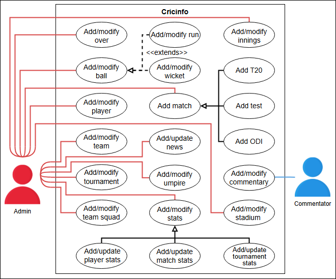
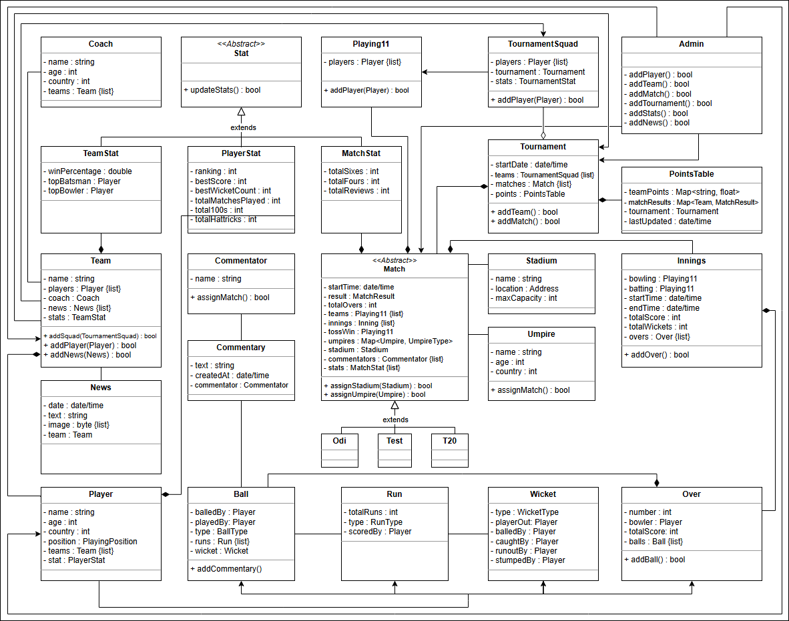

# Cricinfo 

## 🏏 Getting Ready: The Cricinfo System
Understand the Cricinfo problem and learn the questions to simplify this problem further.

### 🔍 Problem Definition
**Cricinfo**, also known as **ESPNcricinfo**, is one of the leading cricket-related websites in the world. The platform provides **live coverage of cricket matches, along with ball-by-ball commentary**. This website has a **historical database** from the **18th century till the present**, offering cricket content globally followed by millions.

Users can find **match updates, live scores, and match results** on this website. It also provides **articles and news about cricket**, as well as **search functionalities** for matches, teams, players, and tournaments. **In short, Cricinfo is a website for cricket lovers.**

### 🎯 Expectations from the Interviewee
Cricinfo provides **multiple functionalities** to its users. It is essential to **narrow down the components** included in the Cricinfo design. Below are some key **expectations** that interviewers may discuss:

### 📡 Live Matches
**Live match coverage** is one of the most important features of a cricket website. Users must be able to view **live matches** on the platform.

**Key questions to ask:**
- How is **match information** updated?
- What is the process for **adding commentary**?
- At what intervals is **commentary added**?

### 📊 Statistics
It is crucial to **store match statistics** in the Cricinfo system.

**Key questions to ask:**
- What kind of **stats does the system record**?
- Does the system record statistics for **players and teams**?

### 🏏 People
Different **people** are involved in cricket matches, and their data needs to be stored.

**Key questions to ask:**
- What kind of **people does our system store information about** (e.g., players, coaches, etc.)?
- Will the **umpire data** be stored in the system?
- Who will **input data** into the Cricinfo system?
- What are the **actors** of the Cricinfo system?

### 🏆 Tournament
A **tournament** is a series of matches played between multiple teams.

**Key questions to ask:**
- How does the system **track tournaments**?
- How are **tournament points and rankings stored** in the system?

## 📌 Requirements for Cricinfo
Learn about all requirements of Cricinfo.

### 🔍 Understanding the Importance of Requirements
In this lesson, we list the requirements of Cricinfo. This step is **crucial**, as requirements **define the scope** of the problem. **Getting them right ensures smooth system design.**

Each requirement is identified using the notation **"Rn"**, where **"R"** represents a requirement and **"n"** is a natural number.

### 📑 Requirements Collection
The requirements for Cricinfo are defined below:

- **R1: The system should track the stats** of all players, teams, and matches.
- **R2: The system should track scores and wickets** for each ball and provide **live commentary** for every ball.
- **R3: The system should track different match types**—Test, T20, and ODI.
- **R4: The system should manage tournaments** (both ongoing and previous) and provide a **points table** for participating teams.
- **R5: The system should display results** of all **previous televised matches**.
- **R6: Teams should select players** who will participate in the tournament, known as the **tournament squad**.
- **R7: For each match, teams should select 11 players** from the tournament squad to **form the playing eleven**.
- **R8: System admins should be able to manage the database** by **adding tournaments, matches, teams, players, and news**.

## 🎭 Use Case Diagram for Cricinfo
Learn how to define use cases and create the corresponding use case diagram for the Cricinfo system.

### 🏏 Overview
Let's build the **use case diagram** for Cricinfo and **understand the relationships** between different components.

### 🔹 System
Our system is **Cricinfo**.

### 👥 Actors
Defining the main **actors** in Cricinfo.

#### 🎭 Primary Actors
- **Admin**: Responsible for **managing tournaments, innings, stats, and teams**.
- **Commentator**: Adds or modifies **match commentary**.

#### 🚫 Secondary Actors
There are **no secondary actors** in the system.

### 🔄 Use Cases
The **use cases** of Cricinfo are listed below based on actor interactions.

#### 🛠 Admin Use Cases
- **Add/Modify Team** – To **add or update a team** in the system.
- **Add/Modify Player** – To **add or update a player** in the team.
- **Add/Modify Tournament** – To **add or update a tournament** in the system.
- **Add/Modify Team Squad** – To **add or update team squads**.
- **Add/Modify Innings** – To **add or update innings** in a match.
- **Add/Modify Over** – To **add or update an over** in a match.
- **Add/Modify Ball** – To **add or update a ball** in a match.
- **Add Match** – To **register a new match** in the system.
- **Add/Update News** – To **add or update match-related news**.
- **Add/Modify Stadium** – To **add or update stadium details**.
- **Add/Modify Umpire** – To **add or update umpire details**.
- **Add/Update Stats** – To **update player, match, or tournament statistics**.

#### 🎤 Commentator Use Case
- **Add/Modify Commentary** – To **add or update match commentary**.

### 🔗 Relationships
Explaining the **connections between actors and use cases**.

#### 🔄 Generalization
- **Add/Update Stats** includes **player, match, and tournament stats**.
- **Add Match** includes **T20, Test, and ODI** match types.

#### 🔗 Associations
The table below shows the **association relationships** between actors and their use cases.

| **Admin**          | **Commentator**          |
|--------------------|----------------------|
| Add/Modify Team   | Add/Modify Commentary |
| Add/Modify Player |                        |
| Add/Modify Tournament |                    |
| Add/Modify Team Squad |                     |
| Add/Modify Innings |                         |
| Add/Modify Over   |                         |
| Add/Modify Ball   |                         |
| Add Match        |                         |
| Add/Update News   |                         |
| Add/Modify Stadium |                        |
| Add/Modify Umpire |                         |
| Add/Update Stats  |                         |

#### ➕ Extend Relationships
- **Add/Modify Ball** extends **Add/Modify Run** and **Add/Modify Wicket**.

### 📊 Use Case Diagram
Here’s the **use case diagram** for Cricinfo.

## 🏏 Class Diagram for Cricinfo
Understand how to create a **class diagram** for Cricinfo using the **bottom-up approach**.

### 🏛 Components of Cricinfo
Cricinfo consists of multiple classes designed to **track matches, players, tournaments, and statistics**.

### 🔧 Admin Class
The **Admin class** manages the Cricinfo system, adding and modifying updates.

**Key Requirement:**
- **R8:** The admin should be able to **add tournaments, matches, teams, players, and news** to the system.

### ⚡ Run, Ball, and Wicket Classes
- **Run class** records the number and type of runs scored on a ball.
- **Ball class** records ball-specific details, including **runs scored and wickets taken**.
- **Wicket class** holds details of the **player out and type of dismissal**.

**Key Requirement:**
- **R2:** Cricinfo should be able to **track scores and wickets for every ball** along with **live commentary**.

### 📊 Over and Innings Classes
- **Over class** represents all **details of an over** in the innings.
- **Innings class** represents the **innings details** of a match.

### 🏆 Match Class (Abstract)
The **Match class** is abstract and has three child classes representing different match types:
- **Test class**
- **ODI class**
- **T20 class**

**Key Requirement:**
- **R3:** Cricinfo should be able to **track different match formats**—Test, T20, and ODI.

### 🏟️ Stadium Class
The **Stadium class** stores stadium-related information such as **name, address, and capacity**.

### 👥 Player, Coach, and Umpire Classes
- **Player class** contains details of a player, including **personal info and statistics**.
- **Coach class** holds **team coaching details**.
- **Umpire class** records **umpire details**.

**Key Requirement:**
- **R1:** Cricinfo should be able to **track player, team, and match statistics**.

### 🏏 Team, Tournament Squad, and Playing Eleven
- **Team class** maintains **team information, players, coach, and related news**.
- **TournamentSquad class** tracks **players participating in a tournament**.
- **Playing11 class** represents **players selected for a match**.

**Key Requirements:**
- **R6:** Teams should be able to **select players for a tournament**.
- **R7:** Teams must **select 11 players for each match**.

### 🎖️ Tournament and Points Table Classes
- **Tournament class** holds details of **cricket tournaments**.
- **PointsTable class** tracks **team rankings and results**.

**Key Requirement:**
- **R4:** The system should **track ongoing and past tournaments** and display **team standings**.

### 📊 Stats Class (Abstract)
The **Stat class** extends into:
- **PlayerStat class**
- **TeamStat class**
- **MatchStat class**

**Key Requirements:**
- **R1:** Cricinfo should **track statistics** for **players, teams, and matches**.
- **R5:** Cricinfo should **show results of previous televised matches**.

### 🎤 Commentator and Commentary Classes
- **Commentator class** stores **commentator details**.
- **Commentary class** holds **ball-by-ball match commentary**.

**Key Requirement:**
- **R2:** Cricinfo must provide **live commentary for each ball**.

### 📰 News Class
The **News class** contains news updates about **teams, matches, and tournaments**.

### 📌 Enumerations
Cricinfo requires several enumerations:
- **MatchResult:** Win, loss, canceled, or drawn.
- **UmpireType:** Field umpire, third umpire, reserve umpire.
- **WicketType:** Stumped, bowled, caught, etc.
- **BallType:** Regular, wide, no-ball, or wicket.
- **RunType:** Regular runs, fours, sixes, wide, etc.
- **PlayingPosition:** Batsman, bowler, all-rounder.

### 🏛 Custom Data Type
The **Address type** stores location details for stadiums, teams, and tournaments.

### 🔗 Relationships Between Classes
Defining **connections between components** in Cricinfo.

#### 🔄 Association Relationships
| **One-Way Associations** | **Two-Way Associations** |
|--------------------------|--------------------------|
| Admin → Player, Team, Match, Tournament | Match ↔ Umpire, Commentator, Stadium |
| Player → Run, Ball, Wicket, Over | Commentary ↔ Commentator |
| Team → TournamentSquad, Tournament | Team ↔ Coach, News |

#### 🔗 Aggregation Relationships
- **Tournament class** aggregates **TournamentSquad**.

#### 🔗 Composition Relationships
- **Player class** composes **PlayerStat**.
- **Team class** composes **Player and TeamStat**.
- **Match class** composes **Playing11, Innings, and MatchStat**.

#### 🔗 Inheritance Relationships
- **ODI, Test, and T20 classes** inherit from **Match class**.
- **TeamStat, MatchStat, and PlayerStat classes** inherit from **Stat class**.

### 🏗️ Design Pattern Used
Cricinfo follows the **Factory design pattern**, allowing dynamic creation of **matches, tournaments, and squads**.

### Class Diagram

## White Board

### Classes

match
 - isLive
 - updates
 - results
 - type
   - Test
   - T20
   - ODI

commentary
 - ballHistory
historicalInfo
User
 - players
 - coaches
 - umpire

stats
 - player
 - team
 - match

articles

news
innings
overs
wides

search 
 - matches
 - teams
 - players
 - tournaments

tournament
points table
tournament squad
playing eleven

admin 
 - add tournaments, matches, teams, players, and news to the system.

### Actor

System
Admin / ContentWriter
Commentator