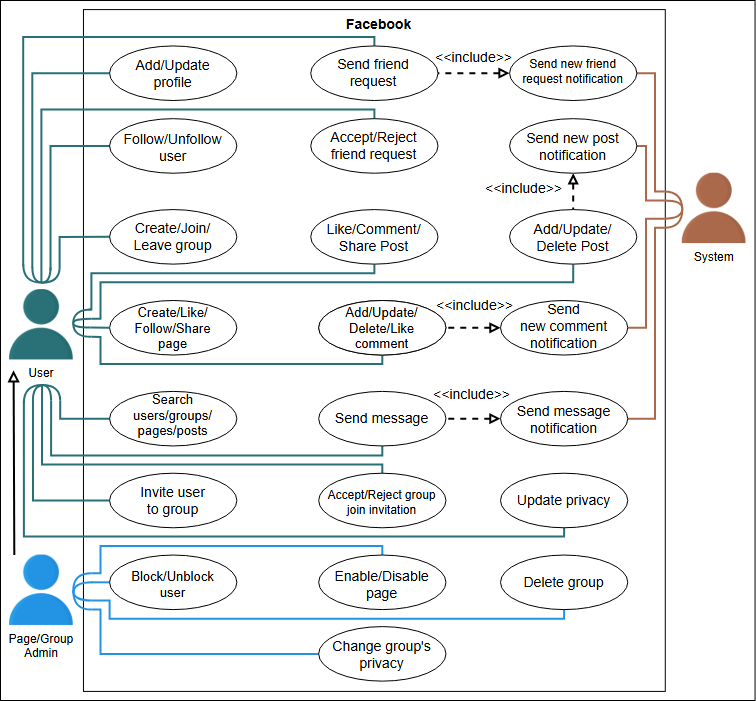
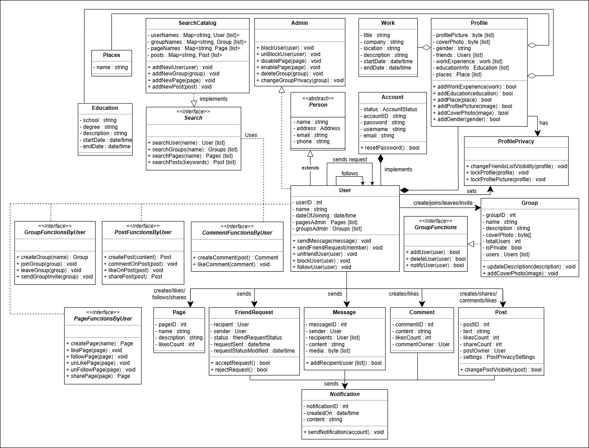
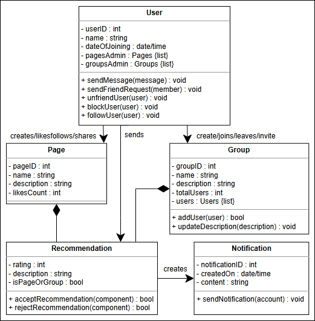

# Facebook

## 🚀 Getting Ready: The Facebook System

### 📖 Problem Definition
Facebook is a **social media platform** that allows users to:
- Connect with people via **friend requests** and **direct messaging**.
- Create a **profile** to share posts.
- Engage in **pages** and **groups** to interact with like-minded individuals.
- Experience a **personalized feed** tailored to their interests and engagements.

### 🎯 Expectations from the Interviewee
Since Facebook provides multiple functionalities, it's crucial to narrow down components for the design. Below are **key expectations** during the interview.

#### 🔍 Discoverability
Understanding how **users find each other** on Facebook is essential. Important aspects include:
- **Searching profiles** through username, phone number, and email.
- Identifying **how search mechanisms work** for better user connectivity.

#### 👥 Friends and Following
The **“Add friend”** feature is a cornerstone of Facebook's social structure. Key questions include:
- How do users **add friends**?
- How do users **follow/unfollow** other users without being direct connections?

#### 🌍 Groups and Pages
Groups and pages form communities around **shared interests**. Important considerations:
- How do users **create and manage groups/pages**?
- What **criteria exist for joining a group**?
- Can users **join groups without being friends** with the creator?

#### 🔒 Privacy
Privacy settings define the **user experience and content control**. Critical questions:
- How does the system handle **privacy lists** for controlling content visibility?
- How do users set **privacy for groups**?
- How do privacy settings impact **member/non-member interactions**?

#### 🔔 Alerts & Notifications
Notifications ensure users **stay updated** with their circle’s activities. Key factors:
- How are users notified of **important events**?
- How much **control** do users have over notifications?

## 🛠 Understanding Facebook's System Requirements

### 📌 Introduction
Defining requirements is a **crucial step** in system design as it sets the **scope** of a problem. A well-defined scope helps in building a **smooth and efficient design**. Each requirement is identified with a unique label **"Rn"**, where **"R"** represents Requirement and **"n"** is its identifier.

---

### 🔒 Profile Privacy and Customization (R1)
Users should be able to:
- **Set the privacy** of their profile page.
- Create a **profile page** and add information such as:
    - **Work experience**
    - **Education**
    - **Place of living**

---

### 🔎 Search Functionality (R2)
Users should be able to:
- **Search for groups, pages, and other users** effectively.
- **Discover new connections** based on provided search criteria.

---

### ✍️ Post Creation and Privacy (R3)
Users should be able to:
- **Write new posts** and set **privacy controls** on them.
- **Manage visibility settings** for different audiences.

---

### 🤝 Friend Management (R4, R5)
Users should be able to:
- **Send, receive, and respond** to friend requests.
- **Unfriend or block** other users for privacy.
- **Follow other users** without needing to add them as friends.

---

### ❤️ Engagement with Posts and Comments (R6)
Users should be able to:
- **Like, share, and comment** on posts.
- **Interact with existing comments** via likes or replies.

---

### 🔔 Notifications System (R7)
The system should send users **real-time notifications** for interactions such as:
- **Receiving messages**
- **Friend requests**
- **Comments on posts**

---

### ✉️ Messaging System (R8)
Users should be able to:
- **Send and receive messages** from other users.
- **Engage in direct communication** within the platform.

---

### 📌 Groups and Pages Management (R9, R10)
Users should be able to:
- **Follow pages and join groups** to engage with communities.
- **Unfollow or leave groups/pages** when necessary.
- **Create and manage their own groups/pages** with privacy settings.
- **Delete owned groups/pages** when needed.

---
## 📌 Use Case Diagram for Facebook

### 📖 Introduction
Understanding **use cases** is crucial for defining system interactions. This document outlines the **actors, use cases, and relationships** within the Facebook system.

---

### 🏛 System Overview
The primary system being analyzed is **Facebook**, a platform that enables users to connect, interact, and manage their digital presence.

---

### 🎭 Actors in the System
#### 👤 Primary Actors
- **User**: Can create profiles, posts, pages, and groups. Users interact with others via friend requests, messages, and comments.

#### 🔧 Secondary Actors
- **Page/Group Admin**: Manages pages/groups by **blocking users, changing privacy settings, deleting groups, etc.**.
- **System**: Handles notifications for friend requests, messages, and interactions.

---

### ✅ User Use Cases
#### 📝 Profile Management
Users can:
- **Add/update personal information**, including work history, education, and residence.

#### 🔍 Search Functionality
Users can:
- **Search for profiles, groups, pages, or posts** to discover connections.

#### 📩 Friend and Follow System
Users can:
- **Send friend requests, accept/reject them**.
- **Follow or unfollow other users** without direct connections.

#### 📢 Post and Comment Interactions
Users can:
- **Create, update, delete posts**.
- **Like, share, and comment** on posts.

#### 👥 Groups and Pages
Users can:
- **Create, join, leave groups**.
- **Invite members to groups**.
- **Like, follow, and share pages**.

#### 🔒 Privacy Control
Users can:
- **Adjust privacy settings** for their profile and posts.

#### 🔔 Notifications
Users receive real-time **alerts** for:
- **Friend requests, messages, post interactions**.

---

### 🔧 Admin Use Cases
Admins can:
- **Block or unblock users**.
- **Enable or disable pages**.
- **Delete or modify group settings**.

---

### 🔗 System Relationships
#### 🔄 Generalization
- **Admins inherit all user functionalities**, plus management features.

#### 🔄 Associations
- **Users interact with groups, pages, and other users** via search and messaging.

#### 🔄 Inclusion
- **Sending friend requests triggers notifications**.
- **Creating posts sends alerts to followers**.

---

## 📌 Class Diagram for Facebook

### 📖 Introduction
Understanding **class diagrams** is crucial for defining the object-oriented structure of the Facebook system. This document outlines the **main classes, their relationships, and functionalities**.

---

### 🏗 Components of Facebook
The **bottom-up approach** is used to design Facebook's architecture.

#### 👤 Account
The `Account` class **identifies** a Facebook user using:
- **Username** and **ID**.
- Users can **create groups, pages, posts, and comments**.
- Users can **like posts/comments**.

---

### 🔧 Admin
The `Admin` class **exists in groups and pages** and is responsible for:
- **Blocking or unblocking users**.
- **Enabling or disabling pages**.

---

### 🏛 Person and User Classes
#### 👥 Person
The `Person` class contains:
- **Name**
- **Address**
- **Phone number**
- **Email**

#### 📩 User
The `User` class extends the `Person` class and can:
- **Send/receive messages**.
- **Send/respond to friend requests**.
- **Join/create groups/pages**.

---

### 📄 Profile Information
The `Profile` class contains:
- **Profile and cover pictures**.
- **Work and education details**.
- **Visited places**.

#### 🏢 Work, Education, and Places
These classes **store relevant information** and are part of the `Profile` class.

---

### 📢 Pages and Groups
#### 📌 Page
The `Page` class contains:
- **Name**
- **Description**
- **Likes count**
- **Unique ID**

#### 🔗 Group
The `Group` class contains:
- **Name**
- **Description**
- **Total members**
- **Unique ID**

Users can:
- **Join/leave groups and pages**.
- **Invite members to groups**.
- **Update group descriptions**.

---

### ✍️ Posts and Comments
#### 📝 Post
The `Post` class represents:
- **Post content**.
- **Like and share counts**.
- **Owner details**.
- **Privacy settings**.

#### 💬 Comment
The `Comment` class represents:
- **Comment content**.
- **Like count**.
- **Owner details**.

Users can:
- **Like, share, and comment on posts**.
- **Like or comment on existing comments**.

---

### 🤝 Friend Requests
#### 🔗 FriendRequest
The `FriendRequest` class stores:
- **Request status** (accepted/rejected).
- **User details**.

Users can:
- **Send/respond to friend requests**.
- **Unfriend or block other users**.

---

### ✉️ Messaging System
#### 📩 Message
The `Message` class represents:
- **Text and multimedia messages**.
- **Sender and receiver details**.

Users can:
- **Send/receive messages**.

---

### 🔒 Privacy and Security
#### 🔑 Profile Privacy
The `ProfilePrivacy` class **controls who can view profile information**.

#### 🛡️ Post Privacy
The `PostPrivacy` class **defines post visibility settings**.

---

### 🔔 Notifications
The `Notification` class **sends alerts** when:
- **A friend request is received**.
- **A new message is received**.
- **A user interacts with a post**.

---

### 🔍 Search Functionality
#### 🔗 SearchCatalog
The `SearchCatalog` class allows users to:
- **Search for users, pages, groups, and posts**.

#### 🧩 Interfaces Implemented by User
- **PageFunctionsByUser**
- **GroupFunctionsByUser**
- **PostFunctionsByUser**
- **CommentFunctionsByUser**
- **Search**

These interfaces ensure modular **functionalities** in the system.

---

### 🎭 Relationships Between Classes
#### 🔄 Association
The `User` class **associates** with:
- **Page, Group, FriendRequest, Message, Comment, and Post classes**.
- **Privacy classes (ProfilePrivacy, PostPrivacy)**.

#### 🔄 Composition
The `Account` class **composes** the `User` class, which **composes** the `Profile` class.

#### 🔄 Aggregation
The `Profile` class **aggregates** `Work`, `Education`, and `Places`.

#### 🔄 Inheritance
- **User extends Person**.
- **EmailNotification and PhoneNotification extend Notification**.

---

### 🏛 Design Patterns
The **Observer pattern** is used for group notifications:
- **Members are subscribers**.
- **They receive automatic updates for new posts**.
- **Users can opt out of notifications**.

---

## Additional requirements
 - Recommendations: Users can send recommendations of pages and groups to other users. 
 - The class diagram provided below shows the relationship of Recommendation with the other classes
 - 

---

## White Board

### Possible Classes
Facebook
users/people 
 - blockList
 - unFriendList
 - followerList
 - followingList
 - likedPost
 - commentedPost
 - listPagesFollowed
 - listOfGroups
 - commentedComment
 - + sendMessage
 - + receiveMessage
 - + joinGroup
 + + joinPages
 + + Exit Page/Group
 + + like a Post
 + comment a post
 + create a page/group
 + delete a page/group
Comment
 - postId
 - listOfCommment
types of media and content
request 
 - accept
 - reject

notification
 - such as receiving a message, a friend request, or a comment on their post.
message
profile 
 - id
 - name 
 - address
 - education
 - privacy

posts 
share 
pages 
topic 
groups/community
feed 
liked 
Follow

SearchCatalog
 - for groups, pages, and other users