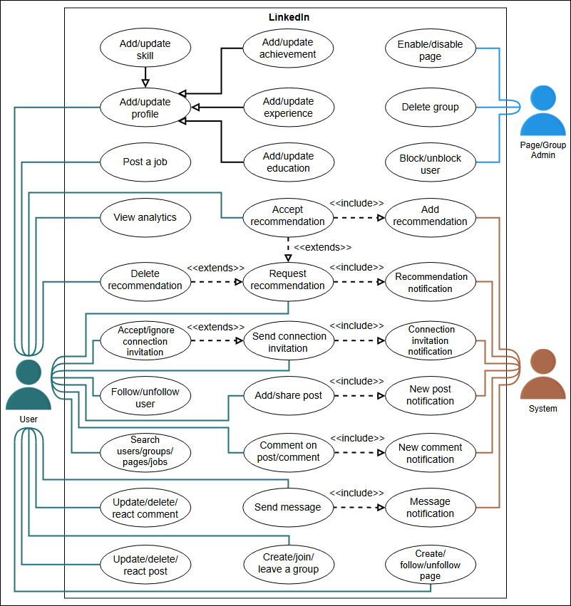
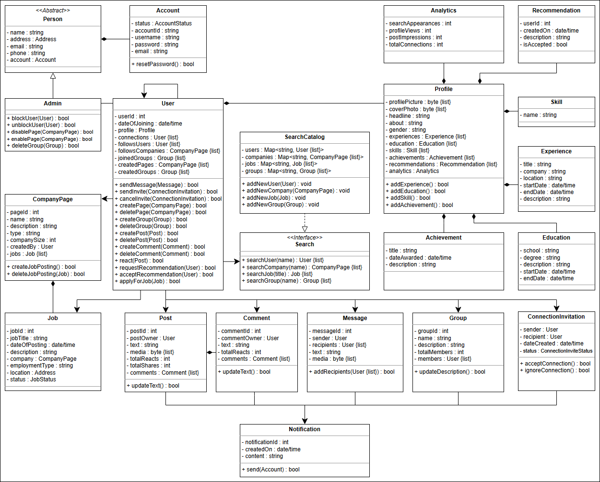

# LinkedIn 

## 📌 Problem Definition
LinkedIn is an **employment-focused social network** that helps users manage their professional identity. It enables job seekers to **find new opportunities**, grow their careers, and connect with trusted professionals. Employers can **post jobs**, while job seekers can **upload resumes** to find the best match.

## 🏗 LinkedIn Features
LinkedIn allows:
- Workers and companies to create **profiles and pages**.
- Users to showcase **education, experience, skills, achievements, and recommendations**.
- **Post creation**, commenting, and messaging other users.
- Forming **groups** to connect with like-minded professionals.
- A **personalized feed** based on activity, connections, and interests.

## 🔍 Discoverability
### **Key questions to consider:**
- **How do users search for job opportunities?**
- **How do companies find the right candidates?**
- **How can users search for other profiles using company or job type?**

## 🔗 Connections and Following
### **Important considerations:**
- **How do users connect with others?**
- **Can a page connect with another page?**
- **How can users follow/unfollow pages without a direct connection?**

## 🏢 Groups, Pages, and Jobs
Groups and pages create spaces for professionals looking for similar job opportunities.
### **Key questions to ask:**
- **Can users create both groups and pages?**
- **Can both individuals and companies create them?**
- **Can individual users post job listings?**
- **Are there criteria for joining a group?**

## 🔔 Alerts and Notifications
Alerts ensure users stay updated with their professional circles.
### **Important queries:**
- **How are users notified of key events?**
- **How much control do users have over notifications?**

## 📝 Introduction
Understanding the **requirements** for LinkedIn is crucial to designing a robust system. This lesson focuses on defining the necessary features and functionalities.

## 📌 Importance of Requirements
Clearly defining requirements helps in setting the **scope** of the problem. This ensures a **smooth** and **efficient** design process.

## 🔍 Requirements Collection
Each requirement is identified using a label "Rn," where **"R" stands for Requirement** and **"n" is a natural number**.

## 👤 User Profile Management
- **R1**: Users should be able to add information to their profile, including **education, experiences, achievements, and skills**.

## 🛠 Search and Discovery
- **R2**: Users should be able to **search for** and **view** pages, groups, and other users.

## 🔗 Connections and Networking
- **R3**: Users should be able to **send and cancel connection requests**.
- **R4**: Users should be able to **follow other users** without adding them as a connection.

## 📊 Profile Analytics
- **R5**: Users should be able to view:
    - **Number of connections**.
    - **Profile views**.
    - **Post impressions**.
    - **Search appearances**.

## 🌟 Recommendations
- **R6**: Users should be able to **request and give recommendations** to other users.

## ✏️ Content Creation & Interaction
- **R7**: Users should be able to **write new posts**.
- **R8**: Users should be able to **react, share, and comment** on posts, including existing comments.

## 💬 Messaging
- **R9**: Users should be able to **send and receive messages** from other users.

## 🔔 Notifications
- **R10**: The system should notify users about:
    - **Messages**.
    - **Connection requests**.
    - **Comments on their posts**.

## 🏢 Company Pages & Jobs
- **R11**: Users should be able to **create company pages** and **follow other company pages**.
- **R12**: Company pages should have a **list of job openings** for users to apply.

## 👥 Groups & Community Engagement
- **R13**: Users should be able to **create and join groups**.

## 🏗 Use Case Diagram for LinkedIn
Learn how to **define use cases** and create the corresponding **use case diagram** for LinkedIn.

## 📌 System Definition
### **LinkedIn as a System**
Our system is **LinkedIn**, a platform for professional networking.

## 👥 Actors in LinkedIn
### **Primary Actors**
- **User**: Can create a profile, post updates, apply for jobs, follow pages, and join groups. They can also **send connection invitations**, **messages**, and **comments**.
- **Admin**: Manages users, pages, and groups by **blocking/unblocking**, **enabling/disabling**, and **deleting content**.

### **Secondary Actor**
- **System**: Responsible for sending **notifications** for new connections, messages, posts, and recommendations.

## 🔍 Use Cases for LinkedIn
### **User Actions**
- **Add/update profile**: Includes **education, experience, skills, and achievements**.
- **Follow/unfollow user**: Ability to follow or remove connections.
- **Send message**: Message other users privately.
- **Send connection invitation**: Connect with other professionals.
- **Accept/ignore connection invitation**: Control who joins your network.
- **Create/follow/unfollow page**: Manage professional pages.
- **Create/join/leave a group**: Engage in community discussions.
- **Add/share post**: Publish content on LinkedIn.
- **Update/delete/react post**: Edit or delete posts, or react to them.
- **Comment on post/comment**: Engage in discussions.
- **Update/delete/react comment**: Modify or interact with comments.
- **Search users/groups/pages/jobs**: Find relevant professional connections and opportunities.
- **Post a job**: Companies can list job openings.
- **View analytics**: Metrics such as **connections, post impressions, profile views, and search appearances**.
- **Request recommendation**: Ask peers for professional endorsements.
- **Accept recommendation**: Approve incoming recommendations.
- **Delete recommendation**: Remove an existing recommendation.

### **Admin Actions**
- **Block/unblock user**: Manage user accessibility.
- **Enable/disable page**: Control page visibility.
- **Delete group**: Remove an existing group.

### **System Actions**
- **New post notification**: Alert users about new content.
- **New comment notification**: Notify users of comments on posts.
- **Connection invitation notification**: Inform users of requests.
- **Message notification**: Notify users of new messages.
- **Recommendation notification**: Inform users about recommendation requests.

## 🔗 Relationships Between Use Cases
### **Generalization**
- **Profile updates** are generalized into categories like **education, experience, skills, and achievements**.

### **Associations**
| **User** | **Admin** | **System** |
|---------|---------|---------|
| Add/update profile | Block/unblock user | New post notification |
| Follow/unfollow user | Enable/disable page | New comment notification |
| Send message | Delete group | Connection invitation notification |
| Send connection invitation | - | Message notification |
| Accept/ignore connection invitation | - | Recommendation notification |

### **Include Relationships**
- **"Send message"** includes **"Message notification"**.
- **"Send connection invitation"** includes **"Connection invitation notification"**.
- **"Request recommendation"** includes **"Recommendation notification"**.

### **Extend Relationships**
- **"Request recommendation"** extends to **"Accept recommendation"** and **"Delete recommendation"**.
- **"Send connection invitation"** extends to **"Accept/ignore connection invitation"**.

## 🎭 Use Case Diagram for LinkedIn
A diagram representing the **user interactions** and **system functions**.

## 📌 Class Diagram for LinkedIn
Learn to create a **class diagram** for LinkedIn using the **bottom-up approach**.

## 🏗 Components of LinkedIn
The LinkedIn system is designed using a **bottom-up approach**, starting from **small components** and building into **larger structures**.

## 👤 Account Class
The **Account class** identifies a LinkedIn user through a **username and ID**. Users can:
- Create **groups, pages, posts, and comments**.
- **Like posts and comments**.

## 🎓 Profile Details
The **Education**, **Experience**, and **Skill** classes provide information to form the **Profile class**.
- **R1**: Users should be able to add details such as **education, experiences, achievements, and skills**.

## 🌟 Recommendation, Achievement, and Analytics
These classes enrich the **Profile** by providing:
- **Recommendations** given by other professionals.
- **Achievements** that showcase key milestones.
- **Analytics**, including **profile views, post impressions, and search appearances**.
- **R5**: Users should be able to view their **number of connections, profile views, post impressions, and search appearances**.
- **R6**: Users should be able to **request and give recommendations**.

## 🏢 Company Page, Jobs, and Groups
These classes define the company and networking aspects of LinkedIn:
- **CompanyPage**: Represents company information (name, size, description).
- **Job**: Contains details about a company's **job openings**.
- **Group**: Represents networking groups users can **create and join**.
- **R11**: Users should be able to **create and follow company pages**.
- **R12**: Company pages should list **job openings** for applicants.
- **R13**: Users should be able to **create and join groups**.

## ✏️ Posts, Comments, and Messages
These classes enable content sharing:
- **Post**: Represents user-generated content, including **reactions and shares**.
- **Comment**: User engagement through **commenting and reacting**.
- **Message**: Private **direct messaging**.
- **R7**: Users should be able to **write posts**.
- **R8**: Users should be able to **react, share, and comment**.
- **R9**: Users should be able to **send and receive messages**.

## 🔗 Connection Invitation
The **ConnectionInvitation** class defines the process of sending connection requests:
- **Tracks request status** (pending, accepted, ignored).
- **R3**: Users should be able to **send, cancel, and respond to connection requests**.

## 🛡 Admin and User Classes
- **Admin**: Manages users by **blocking or unblocking** them.
- **User**: Represents LinkedIn members who engage with the platform.

## 🔔 Notifications System
The **Notification** class ensures users are updated about their interactions:
- **Connection requests, messages, comments, posts**.
- **R10**: Users receive **system notifications** for key interactions.

## 🔍 Search Functionality
The **SearchCatalog** and **Search Interface** allow users to:
- Find **profiles, company pages, groups, and jobs**.
- **R2**: Users should be able to **search for and view LinkedIn entities**.

## 📊 Enumerations and Custom Data Types
- **AccountStatus**: Indicates account state (**active, deactivated, blocked**).
- **JobStatus**: Defines a job's availability (**open, on hold, closed**).
- **ConnectionInviteStatus**: Tracks connection request states (**pending, accepted, ignored**).

## 🎭 Design Patterns in LinkedIn
LinkedIn uses the **Observer design pattern** to:
- Notify **subscribers of new posts** in **groups and company pages**.
- Allow users to **opt out of notifications**.

### Class Diagram

## WhiteBoard

### Classes

User
 - listOfConnection
 - listOfFollowers
 - listOfFollowee()
 - Connection
 - postResume()
 - commentPost()
 - acceptInvite()
 - sendMessage()
 - createGroup()
 - likeAPost()
 - followPage()
 - cancel connection requests()
 - viewProfile()

SearchCatalog
 -  for view, pages, groups, and other users.

UserProfile
 -  education
 - experience
 - skills
 - achievements
 - recommendations

topic

Request
 - accept
 - reject
 - sender
 - receiver

Message
groups
Post
Feed

Job
Career

Employers
 - postJobs()

resume

CompanyPage

Company
Page

Notification
