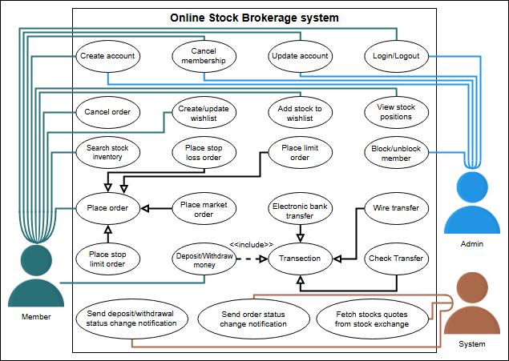
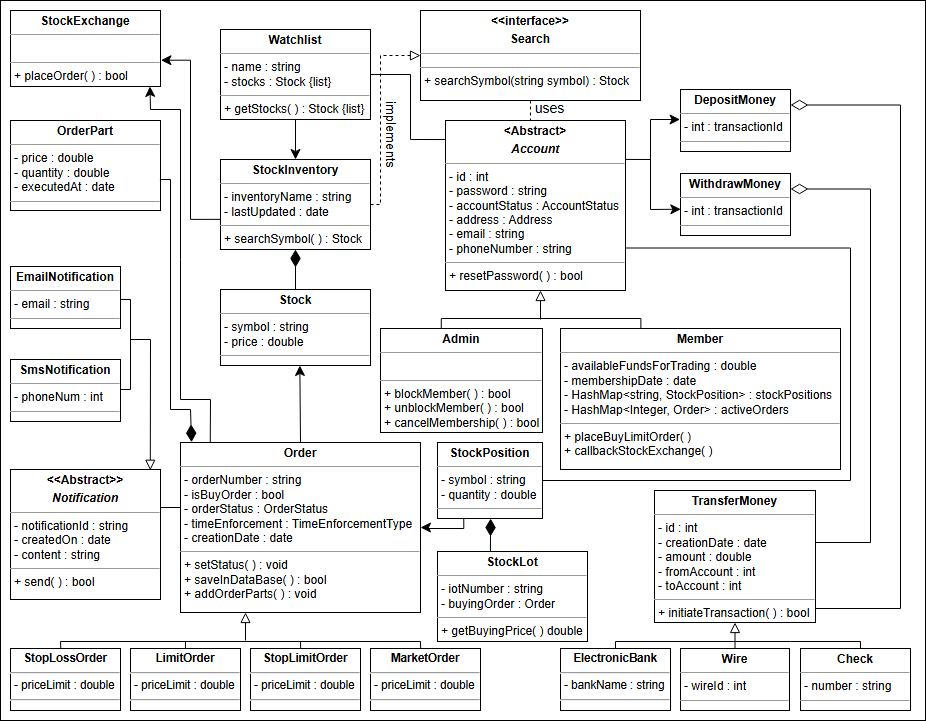

# Online Stock Brokerage System

## 📈 Getting Ready: An Online Stock Brokerage System
Understand the online stock brokerage system problem and learn the questions to further simplify this problem.

### 🏛️ Problem Definition
An **online stock brokerage system** acts as an intermediary between the buyer and seller during stock trading.
- The system facilitates users in **buying and selling stocks online**.
- Users can **monitor their transactions** and view **performance graphs** for their stock portfolios.
- **Security features** protect client transactions and notify them of stock changes reaching certain levels.
- The system **automates stock trading**, leveraging computers and the internet for **speed and cost efficiency**.
- Users gain **quicker access to stock information**, market trends, and current stock prices.

### 🎯 Expectations from the Interviewee
An online stock brokerage system consists of multiple components, each with its functionality and constraints.  
The following sections outline key expectations an interviewer may want to discuss:

#### 🔎 Discoverability
One of the **key features** of an online stock brokerage system is how users **search for stocks**.  
Questions to consider:
- **How do members search the stock inventory?**
- **How are search results displayed?**

#### 👁️ Visibility
Understanding how **data is visible to different users** is critical.  
Possible queries include:
- **Can all members see stock positions at any time?**

#### 📑 Order Type
Different stock **trade orders** should be supported.  
Example question:
- **How many types of stock trade orders can users place?** _(e.g., market order, loss order, etc.)_

#### 🔄 Multiplicity
Interview questions related to **multiple transactions** include:
- **Can users have multiple watchlists containing different stock quotes?**
- **Can a user buy multiple lots of the same stock at different times?**

---

## 📌 Requirements for the Online Stock Brokerage System
Learn about all the **requirements** for an online stock brokerage system.

### 📝 Importance of Defining Requirements
Defining **clear requirements** is a **crucial step** in system design.
- Requirements **define the scope** of the problem.
- Understanding requirements from the **interviewer** ensures a **smooth design process**.
- We'll label each requirement using **“Rn”**, where **"R"** stands for **Requirement**, and **"n"** is a natural number.

### 🏛️ Requirement Collection
Here are the **key requirements** for the online stock brokerage system:

#### 🔄 R1: Stock Trading
The system should allow users to **easily trade stocks** _(buy or sell)_.

#### 👁️ R2: Watchlists
Users can maintain **multiple watchlists** containing different **stock quotes**.

#### 📈 R3: Managing Stock Lots
Users may **own multiple lots** of the same stock.
- The system must **distinguish between different lots** if a user purchases the same stock more than once.

#### 📢 R4: Trade Notifications
Every time a trade order is executed, the system must **notify users**.

#### 📑 R5: Supported Trade Order Types
The system should support the following **types of stock trade orders**:
- **Market Order**: Buy or sell stocks at the **current market price**.
- **Limit Order**: Buy or sell stocks at a **user-defined price**.
- **Stop-Loss Order**: Buy or sell stocks when they **reach a certain price**.
- **Stop-Limit Order**: Buy or sell stocks with a **price restriction** _(minimum price to receive, maximum price to pay)_.

#### 💳 R6: Deposits & Withdrawals
Users should be able to **deposit and withdraw funds** using:
- **Checks**
- **Wire Transfers**
- **Electronic Bank Transfers**

---

## 📌 Use Case Diagram for the Online Stock Brokerage System
Learn how to define **use cases** and create the corresponding **use case diagram** for the online stock brokerage system.

### 🏗️ Building the Use Case Diagram
Let's build the **use case diagram** of the online stock brokerage system and understand the **relationship** between its different components.
- First, we’ll define the **different elements** of our online stock brokerage system.
- Then, we’ll create the **complete use case diagram** of the system.

### 🏛️ System Definition
Our system is a **stock brokerage** platform that facilitates **buying and selling stocks** online.

### 🎭 Actors in the System
Now, we’ll define the **main actors** of our online stock brokerage system.

#### 👤 Primary Actors
- **Member**:
    - Can **search for stocks**, **place orders**, **create an account**, and **start a membership**.
    - Can **add stocks to a wishlist**, **set buying and selling limits**, and **perform transactions** in three ways.
    - Can **log in, log out, update accounts**, and **cancel membership**.

#### 🛠️ Secondary Actors
- **Admin**:
    - Can **create and update accounts**, **log in and log out**, **cancel membership**, and **block/unblock members**.
- **System**:
    - Responsible for **notifying members** about **order status and transactions**.
    - Can **fetch stock quotes** from the stock exchange.

### 📑 Use Cases
In this section, we define the **use cases** for the online stock brokerage system.  
We have listed the use cases according to their respective **interactions** with a particular actor.

#### 👤 Member Use Cases
- **Create Account**: To create a new account in the online stock brokerage system.
- **Cancel Membership**: To cancel an existing membership.
- **Update Account**: To modify account details.
- **Login/Logout**: To access or exit the system.
- **Cancel Order**: To cancel a stock order.
- **View Stock Positions**: To check live stock prices and positions.
- **Add Stock to Wishlist**: To track preferred stocks.
- **Create/Update Wishlist**: To manage stock lists.
- **Search Stock Inventory**: To find stocks in the system.
- **Place Order**: To buy or sell stocks.
- **Deposit/Withdraw Money**: To manage funds.

#### 🛠️ Admin Use Cases
- **Create Account**
- **Cancel Membership**
- **Update Account**
- **Login/Logout**
- **Block/Unblock Member**

#### 🔄 System Use Cases
- **Fetch Stock Quotes from Stock Exchange**
- **Send Order Status Change Notification**
- **Send Deposit/Withdrawal Status Change Notification**

### 🔗 Relationships Between Use Cases
This section describes the **relationships** between actors and their use cases.

#### 🔄 Generalization
- **Transaction Methods**:
    - **Electronic Bank Transfer**, **Wire Transfer**, and **Check Transfer** are generalized under **Transaction**.
- **Order Types**:
    - **Market Order**, **Limit Order**, **Stop-Loss Order**, and **Stop-Limit Order** are generalized under **Place Order**.

#### 🔗 Associations
The table below shows the **association relationship** between actors and their use cases:

| **Member** | **Admin** | **System** |  
|------------|----------|------------|  
| Create Account | Create Account | Fetch Stock Quotes |  
| Cancel Membership | Cancel Membership | Send Order Status Notification |  
| Update Account | Update Account | Send Deposit/Withdrawal Notification |  
| Login/Logout | Login/Logout | - |  
| Cancel Order | Block/Unblock Member | - |  
| View Stock Positions | - | - |  
| Add Stock to Wishlist | - | - |  
| Create/Update Wishlist | - | - |  
| Search Stock Inventory | - | - |  
| Place Order | - | - |  
| Deposit/Withdraw Money | - | - |  

#### 🔄 Inclusion
- **Deposit/Withdraw Money** has an **include relationship** with **Transaction**, since a **money transaction** occurs when funds are deposited or withdrawn.

### 📌 Use Case Diagram
Below is the **use case diagram** of the online stock brokerage system:

---

## 📌 Class Diagram for the Online Stock Brokerage System
Learn to create a **class diagram** for a stock brokerage system using the **bottom-up approach**.

### 🏗️ Components of a Stock Brokerage System
We will design the **online stock brokerage system** using a **bottom-up approach**.

### 🏛️ Account
The **Account** class is an **abstract class** used to store **account information**.
- **Members**: Account ID, password, account status, address, email, and phone number.
- **Types of Accounts**:
    - **Admin**: Can **block/unblock members** and **cancel memberships**.
    - **Member**: Can **search stocks**, **place orders**, **create accounts**, **start memberships**, **add stocks to watchlists**, and **set buying/selling limits**.

### 👁️ Watchlist
A **watchlist** is a list of stocks that an investor monitors to **profit from price changes**.
- **Users can maintain multiple watchlists** containing different stock quotes.

### 📈 Stock
A **stock** (also known as **equity**) represents **ownership in a company**.
- **Attributes**: Symbol, price, etc.
- **Users can trade stocks easily** _(buy or sell)_.

### 🔎 Search & Stock Inventory
The **StockInventory** class retrieves and maintains **stock values** from the **StockExchange** class.
- Implements the **Search** interface.

### 📑 Stock Position
The **StockPosition** class tracks **stocks owned by a user**.

### 🔄 Stock Lot
Users may **own multiple lots** of the same stock, purchased at different times.
- The system must **distinguish between different lots**.

### 📢 Order
Users can **place stock trading orders** to **buy or sell stocks**.
- **Types of Orders**:
    - **Market Order**: Buy/sell at the **current market price**.
    - **Limit Order**: Buy/sell at a **user-defined price**.
    - **Stop-Loss Order**: Buy/sell when the stock **reaches a certain price**.
    - **Stop-Limit Order**: Buy/sell with a **price restriction**.

### 🔗 Order Part
Orders may consist of **multiple parts**, each containing **price, quantity, and execution date**.

### 💳 Deposit & Withdraw Money
Users can **deposit and withdraw funds** using:
- **Checks**
- **Wire Transfers**
- **Electronic Bank Transfers**

### 🔔 Notification
The **Notification** class sends **alerts** when trade orders are executed.
- **Types of Notifications**:
    - **SMS Notification** _(requires phone number)_.
    - **Email Notification** _(requires email address)_.

### 📊 Stock Exchange
The **StockExchange** class provides **stock data** and **executes trading orders**.

### 🏠 Design Patterns
The system uses the **Singleton** pattern to ensure **only one instance** of the **StockExchange** exists.
- The **Observer** pattern is used to **monitor stock prices** and **automate trades**.

### 🔗 Relationships Between Classes
#### 🔄 Association
- **One-way association**:
    - **StockInventory** → **Watchlist**, **StockExchange**
    - **Order** → **Stock**, **StockExchange**, **StockLot**
    - **Account** → **Order**, **DepositMoney**, **WithdrawMoney**
    - **StockPosition** → **Order**

- **Two-way association**:
    - **Notification** ↔ **Order**
    - **Watchlist** ↔ **Account**
    - **StockPosition** ↔ **Account**

#### 🔗 Composition
- **Order** → **OrderPart**
- **StockInventory** → **Stock**
- **StockPosition** → **StockLot**

#### 🏗️ Inheritance
- **Admin, Member** → **Account**
- **MarketOrder, LimitOrder, StopLimitOrder, StopLossOrder** → **Order**
- **ElectronicBank, Wire, Check** → **TransferMoney**
- **SmsNotification, EmailNotification** → **Notification**
- **StockInventory** → Implements **Search**

### Class Diagram

---
## Design Patterns

The **online stock brokerage system** incorporates two key **design patterns**:

1. **Singleton Pattern** 🏛️
    - The system ensures that **only one instance** of the **StockExchange** class exists.
    - This instance acts as a **centralized hub** for stock-related operations.
    - The Singleton pattern provides a **global point of access** to stock exchange data.

2. **Observer Pattern** 👀
    - The system **monitors stock prices** and **automates trades** when predefined conditions are met.
    - Users set **buying and selling limits**, and the system **observes stock movements**.
    - When a stock reaches the specified price, the system **automatically executes trades**.

---

## White Board

### Classes
buyer
seller
trade
stocks
 - price
 - level
 - lot

order
 - Market order
 - Limit order
 - Stop-loss order
 - Stop-limit order

users/client
watchlists

transactions
 - checks
 - wire transfers
 - electronic bank transfers

graphs(for stocks)
portfolios
Notification
trends

### Actors

system(online)
user
broker

