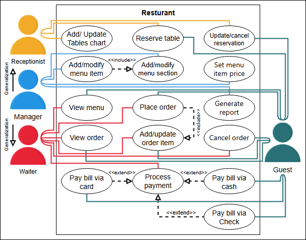
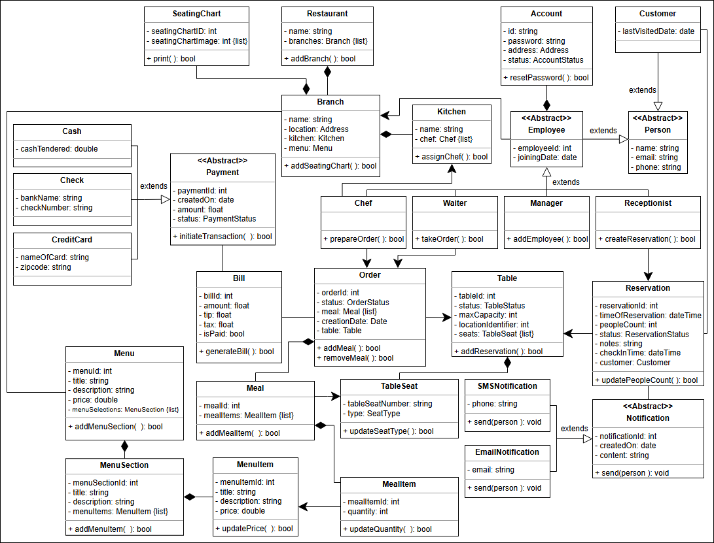
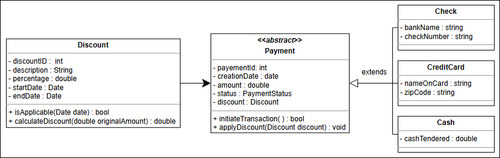

# The Restaurant Management System

## 📚 Getting Ready: The Restaurant Management System
Understand the restaurant management system problem and learn the questions to simplify this problem further.

### 🍴 Overview
**A restaurant management system (RMS)** is a software program that helps restaurant owners and managers handle and organize various aspects of their businesses, including:
- Food and beverage sales
- Employee schedules
- Customer reservations

**Key settings for RMS** include quick-service and fine-dining restaurants, and cafeterias. The system streamlines operations, improves efficiency, and enhances customer service.

### 🎯 Goals
The **primary goal of a restaurant management system** is to help restaurant owners and managers streamline and automate tasks, allowing them to focus on providing a high-quality dining experience.

### 🛠 Functionality
An RMS provides restaurant management with control and flexibility over operations from a single location. Key features include:
- Monitoring table availability
- Making reservations
- Generating bills

### 🗂 Expectations from the Interviewee
Several components in a restaurant management system come with specific constraints and requirements. **During interviews**, focus on the following areas:
1. **Restaurant Services**:
    - Does the restaurant provide delivery services?
    - Can customers place online orders?
    - Does the restaurant accept online/card payments?

2. **Restaurant Management**:
    - Can branches vary in terms of services offered?
    - Is inventory management a necessary consideration?

## 📋 Requirements for the Restaurant Management System
Learn about all the requirements essential for designing a restaurant management system.

### 🌟 Importance of Requirement Collection
**Requirement collection is a crucial step** in the restaurant management system design process. It defines the scope of the problem, and getting the requirements right from the interviewer helps ensure a smooth and efficient design process.

### 📝 Requirements List
Below are the identified requirements, labeled as **"Rn"**, where "R" stands for Requirement and "n" is a natural number:
- **R1**: The restaurant can have **multiple branches**.
- **R2**: Each branch will offer a **menu with various sections and items**.
- **R3**: The waiter should be able to **create an order for a table** and add items for each person seated.
- **R4**: Each person’s order can consist of **multiple items**, each corresponding to a menu item.
- **R5**: The system should be able to provide **information about tables currently available** for walk-in customers.
- **R6**: The system should allow for the **reservation of tables**.
- **R7**: The receptionist should be able to **search for available tables by date and time** and make a reservation.
- **R8**: The system should allow customers to **make and cancel reservations**.
- **R9**: The system should send **notifications** as the reservation time approaches.
- **R10**: Customers should be able to **pay their bills** using credit cards, checks, or cash.
- **R11**: Each branch may have **different configurations of tables**.

## Use Case Diagram

## Class diagram

## 🧩 Design Patterns in the Restaurant Management System
Explore the design patterns used in the restaurant management system and their applications.

### 🔒 Singleton Pattern
The **Singleton pattern ensures that a class has only one instance** and provides a global point of access to that instance.
- **Application**: In the RMS, this pattern can be used for the **database connection**, ensuring there is only one connection to the database and making it accessible to other parts of the system.

### 🛠 Command Pattern
The **Command pattern encapsulates a request as an object**, allowing the request to be parameterized with different data.
- **Application**: In the RMS, this pattern can be used to encapsulate **requests to the database**, such as adding, deleting, or modifying entries. This ensures that views or other components only need to know how to execute the request, not handle it.

### 👀 Observer Pattern
The **Observer pattern allows objects to be notified of changes to other objects**.
- **Application**: In the RMS, this pattern can be used to notify **viewers of changes to the model**, enabling them to update themselves accordingly.

### 🏭 Factory Pattern
The **Factory pattern provides a way to create objects without specifying the exact class** of the object being created.
- **Application**: In the RMS, this pattern can be used to create **different types of menu items**, without needing to specify the exact class of each item.
## 🛠 Additional Requirements for the Restaurant Management System
Explore the additional requirements that can enhance the functionality of the RMS.

### 🎉 Discounts
A **discount** will be applied to the payment depending on special events such as:
- **New Year celebrations**
- **Anniversaries**
- **Branch openings**

The **Payment class** includes a method `applyDiscount()` that:
- Checks if a discount is applicable based on the creation date.
- Applies the discount to the payment amount if eligible.

## White Notes
Food
Beverage
Schedule
Customer
Reservation
Location/branches
Table
TableSeat
Bill
menu  - sections - items
waiter
order
person
configurations
Kitchen

### Actors
System
 - available

Owner
Manager
Employee/waiter
Customer

### Questions

1. About Menu
2. how reservations are done
   1. can they move the reservation?
3. if advance is paid
4. various payment methods
5. Notifications
6. Does the restaurant provide a delivery service?
7. Can a customer place an online order?
8. Does the restaurant accept online/card payments?
9. Can branches vary in terms of the services of a restaurant?
10. Do we need to consider the inventory management of the restaurant for this problem?