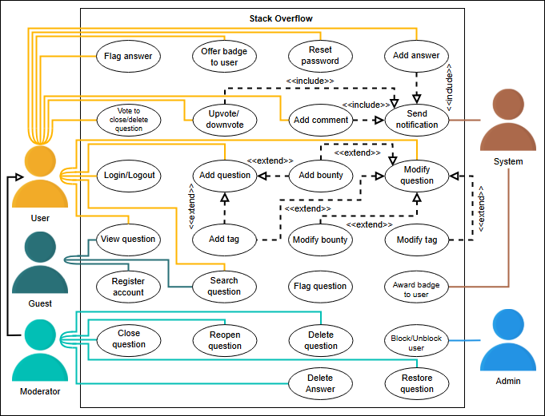
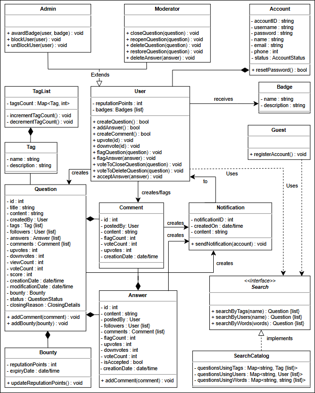
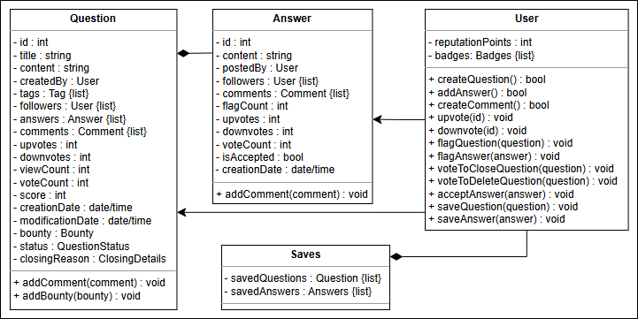

# Stack Overflow

## 📘 Problem Definition

Stack Overflow is a Q&A website for programmers and developers, irrespective of their expertise level in the domain. **Registered users can post new questions and answer questions from other users.** Each user can collect reputation points. These points are affected by the upvotes or down votes received by the user on their questions or answers. **More reputation points allow users to perform additional functions like voting to close or delete a question.** On achieving reputation milestones, users are awarded badges to highlight their credibility.

---

## 🎯 Expectations from the Interviewee

It is important to narrow down the components to be included in your Stack Overflow design. Below are **key aspects** that the interviewer will want to hear in detail:

### 🔍 Discoverability
**Ask the interviewer the following questions to understand discoverability:**
- How are users able to search for questions?
- Is there a way to filter questions using tags or users?

### ⭐ Reputation
**Reputation points impact user privileges. Explore the following:**
- How are reputation points calculated?
- Do users get points for asking or answering questions?
- How many points are required for users to get moderator access?

### 🗳️ Voting
Voting indicates which questions or answers are more popular among users. **Important considerations include:**
- What are the different types of voting allowed?
- Are you allowed to upvote and downvote?
- How does voting work for closing and deleting questions?
- Which user can vote in such circumstances?

### 🎁 Bounty
Bounty allows users to highlight unanswered questions. Clarify bounty-related aspects with the interviewer:
- How are reputation points awarded on bounty questions?
- When do users start a bounty?
- How long does a bounty last before expiring?

---

## 📚 Requirements for Stack Overflow

In this lesson, we’ll list the requirements of Stack Overflow. This is a very crucial step as **requirements define the scope of a problem**, so getting them right from the interviewer and understanding them well will make the design of the rest of the system **smooth and easy**.

We’ll use the notational convention to identify each requirement with a unique label "Rn", where "R" is short for Requirement and "n" is a natural number.

---

## 📝 Requirement Collection

The requirements for Stack Overflow are defined below:

- **R1**: Any guest can view questions and **search questions by tag, username, or words**.
- **R2**: Users should be able to post new questions and **add answers to an open question**.
- **R3**: Users can flag a question, answer, or comment if **anything goes against the community guidelines**.
- **R4**: A user can upvote, downvote, and add comments to a question or answer, while they can **only upvote a comment**.
- **R5**: Users can vote to delete or vote to close off questions for **community-specific reasons**. However, they can **only vote to delete an answer**.
- **R6**: Any user can add a **bounty to their question to attract more answers**.
- **R7**: Moderators can close a question or **restore an already deleted question**. Moderators can also delete answers.
- **R8**: The system should send the user a **notification whenever there has been an interaction with them**, such as the user’s question receiving an answer, earning a badge, or someone upvoting or downvoting their post.
- **R9**: Users can earn **badges for their helpful answers or comments**.
- **R10**: The system should also be able to determine the **most popular tags used in questions**.
- **R11**: Users can add **tags to their questions**. A tag is a word or phrase that describes the topic of the question.

---

## Use Case

## Class Diagram
## 🛠️ Class Diagram for Stack Overflow

In this lesson, we’ll identify and design the classes, abstract classes, and interfaces based on the requirements we have previously gathered from the interviewer in our Stack Overflow system.

---

## 🔗 Components of Stack Overflow

### 🧑‍💻 Account
The Account class identifies a Stack Overflow user using their **username**, **email**, and **ID**. Users with an account can create questions and add answers or comments to questions.

### 👀 Guest
The Guest class represents users who can only **search and view questions and their answers**. Guests need to register an account to ask or answer questions.

---

## ❓ Question Class
The Question class is used to define details of a question such as **title**, **content**, and **tags**, and allows users to add **comments** and **bounties**.

---

## 💬 Answer Class
The Answer class represents an answer provided by a user to a question, including **content**, **upvotes**, and **downvotes**.

---

## 🗨️ Comment Class
The Comment class is for opinions or remarks provided by users on questions or answers. **Comments can only be upvoted and flagged but not downvoted.**

---

## 🎁 Bounty Class
The Bounty class is for granting **reputation points** to attract more attention to a question. A bounty lasts for **seven days** and must stay active for **at least one day**.

---

## 🏅 Badge Class
The Badge class highlights a user's **credibility** by awarding badges for helpful contributions.

---

## 🏷️ Tag and TagList Classes
The Tag and TagList classes are used to categorize questions with keywords or labels. The TagList class tracks **tag usage counts** using a key-value pair.

---

## 📧 Notification Class
The Notification class sends notifications to users within the platform regarding **new answers**, **badge achievements**, or interactions like **upvotes/downvotes**.

---

## 🔎 Search Interface
The Search interface enables users to search for questions using **tags**, **usernames**, or keywords.

---

## 📂 SearchCatalog Class
The SearchCatalog class implements search functionality, storing a list of questions accessible by tags, usernames, or keywords.

---

## 🧭 Enumerations
The following enumerations are included in the design:
- **AccountStatus**: Represents the status of a user’s account (e.g., active, disabled, or blocked).
- **QuestionStatus**: Tracks the status of a question (e.g., active, closed, flagged, or bountied).
- **ClosingDetails**: Provides reasons for a question being closed.

---

## 🔁 Relationships Between Classes

### 🔗 Association
- The User class has a one-way association with the **Question**, **Comment**, **Badge**, **Notification**, and **Search** classes.
- The Guest class associates with the **Search** class.
- The Question, Comment, and Answer classes associate with the **Notification** class.

### ⚙️ Composition
- **Account** class is composed of the User class.
- **Question** class is composed of **Bounty**, **Comment**, and **Answer** classes.
- **TagList** class is composed of the **Tag** class.

### 🧬 Generalization
- The **SearchCatalog** class implements the **Search interface**.

### 🧳 Inheritance
- **Admin** and **Moderator** classes extend the **User** class.

---

## 🎨 Design Pattern
The **Observer design pattern** is used for notification functionality. Users posting questions or answers, and those following them, are set as subscribers. Any activity triggers notifications for all subscribers.

---

## ✨ Additional Requirements
The interviewer may request additional functionalities, such as allowing users to **save questions or answers** for later viewing within their profiles.

---

## White Board
Topic
ComputerScience
Programming
Question
 -  bounty
Answer
Comment
 - id
 - date
Flag
 - id
 - date

User
 - Guest
 - RegisteredUser
 - + postQuestion()
 - answerQuestion()
 - hasGoodReputation()
 - canCloseQuestion()
 - canDeleteQuestion()

ReputationPoint 
Milestone
Badge

Vote
 - up
 - down

Search

Bounty
Tag

SearchInteface
 - byTag
 - byUsername
 - byWords

SearchCatalog
- mapsOfTags
- mapsOfTagsUsername
- mapsOfTagsWords

Guideline

Notification

### Actors
Moderators
 - delete()
 - restore()
 - close()
User
Admin
System
 - sendNotification()

