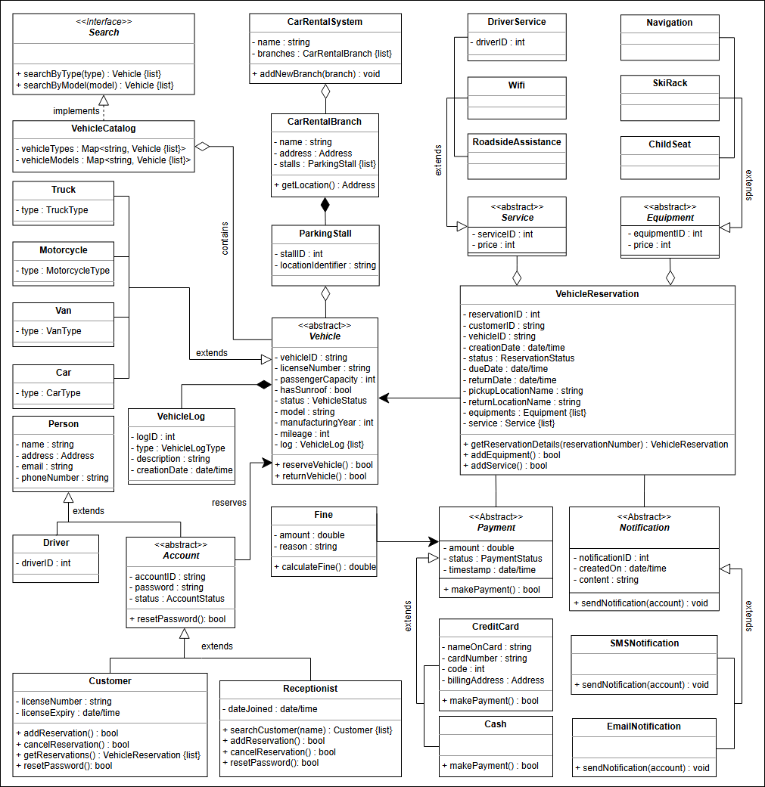

# The Car Rental System

## 🚗 Getting Ready: The Car Rental System

Understand the car rental system problem and learn the questions to further simplify this problem.

---

## 🌟 Expectations from the Interviewee

The car rental system consists of multiple components, each with its own **functionality and constraints**. This section outlines the main expectations an interviewer will discuss in detail:

### 🚘 Vehicle Types
- **Key Questions:**
    - What types of vehicles will the system support?
    - How can we identify specific vehicles?

### 🔍 Search Interface
- **Key Questions:**
    - Is it possible to search for a vehicle using its **name or type**?
    - Can we search by a vehicle's **model number**?

### 🛠️ Services
- **Key Questions:**
    - Does the car rental system assign a **driver** to customers?
    - Does it provide **roadside assistance**?

### ❌ Reservation Cancellation
- **Key Questions:**
    - Can a member **cancel a reservation**?
    - Which members are allowed to cancel and **when**?

### 💳 Payment Flexibility
- **Key Highlights:**
    - Payment depends on **vehicle type** and **time stamp**.
- **Key Questions:**
    - How can customers **pay at different locations** using various methods (cash, credit, cheque)?
    - How will the system track if the customer has already **paid at another branch**?

---

## 🚗 Requirements for the Car Rental System

Let's have a look at the requirements for our car rental system. **We'll cover the following:**

---

## 📄 Requirement Collection

In this lesson, we’ll determine the requirements of our car rental system. **This is a very crucial step as requirements define the scope of a problem, so getting them right from the interviewer and understanding them well will make the design of the rest of the system smooth and easy.**

We’ll use the notational convention to identify each requirement with a unique label **"Rn", where "R" is short for Requirement and "n" is a natural number.**

---

## 📝 List of Requirements

### **R1**:
There can be two types of users in the car rental system, i.e., customers and receptionists.

### **R2**:
The system should handle multiple types of vehicles. **Initially, the system should cater to the following vehicles: cars, trucks, vans, and motorcycles.**

### **R3**:
There can be multiple subtypes for vehicles. **The car type can be economy, luxury, standard, and compact. The van type can be passenger or cargo. Moreover, the motorcycle type can be cruiser, touring, or sports.** The truck type can be light, medium, or high-duty.

### **R4**:
The system should be able to keep a record of who reserved a particular vehicle and on which date the vehicle was issued.

### **R5**:
The system should be able to find out **how many vehicles have been rented out by the specific customer.**

### **R6**:
The customers should be able to cancel their reservations.

### **R7**:
To keep track of all events related to the vehicle, the system should maintain a vehicle log.

### **R8**:
The system should allow the users to add equipment to the reservations like a ski rack, child seat, and navigation.

### **R9**:
The system should allow the users to add services to the reservations **like a driver, Wi-Fi, and roadside assistance.**

### **R10**:
The system should send a notification to the customer and generate a fine **if the vehicle is not returned within the due date.**

### **R11**:
The system should allow the user to search the vehicles by type or model.

### **R12**:
A system should be able to **manage the multiple branches** of the car rental system.

### **R13**:
Every branch of the car rental system should have parking stalls **to park the vehicles.**

---

## Class Diagram

### Design Pattern

We can utilize the **Decorator Design Pattern** for the car rental system. Here's how it can be designed:

- **Discount Decorator**: Applies discounts to all types of vehicles in the system.
- **Peak Season Decorator**: Increases the fare for vehicles during peak seasons.
- **Damage Fine Decorator**: Calculates the fine for vehicle damage upon return.
- **Partially Filled Fuel Tank Fine Decorator**: Calculates the fine for returning the vehicle with a partially filled fuel tank.

These decorators fulfill the **Single Responsibility Principle (SRP)** and the **Open-Closed Principle (OCP)** of design.

---

## White Board

### Nouns

Office/Branch
ParkingStall
Location 
City
Vehicle - differentTypes
 -listOfReservation

Address-ParkinglOT-OFFICE-ReservationSystem

Receptionist
Address
Client/User
 - name
 - contactNo
 - email
 - listOfReservation
Account
Driver
Reservation/ Record
 - pickup
 - drop
 - vehicleType
 - dateTimeOfBook
 - dueDate
 - listOfEquipment
 - listOfServices
 - +cancelReservation()
 - +addEquipment()
 - +addServices() 

Equipment
 - Types
   - ChildSeat
   - Navigation
   - SkiRack
Service
 - Types
   - DriverService
   - RoadsideAssistance
   - WiFi
Notification
  -Types
   - SmsNotifcation
   - EmailNotification
     FineStrategy
SearchInterface
 - byType
 - model
Payment
 - Types
   - CreditCard
   - Cash

VehicleLog
 - 

### Users/Actor - Behaviour

1. System
 - renting of automobiles for a short period of time(a few hours to a few weeks),  It allows the users to reserve and return a vehicle from different locations and is primarily located near airports or city areas.
 - The system should be able to find out how many vehicles have been rented out by the specific customer.
1. Receptionists
2. User
3. Worker

#### Question
1. is cars only rentable or any other vehicle,
2. how do you search for a vehicle
3. Does a car rental system assign a driver to its customer?
4. how the price of reservation is calculated
5. does user gets realtime notification about the ride?
6. can user cancel the ride
7. how the system decides the route
8. does a system notify the rent time approach? 
9. Payment Flexibility

#### Relations
1. Inheritance 
 - There can be two types of users in the car rental system, i.e., customers and receptionists
 - The system should handle multiple types of vehicles. Initially, the system should cater to the following vehicles: cars, trucks, vans, and motorcycles.
1. Enumerations
   1. There can be multiple subtypes for vehicles. The car type can be economy, luxury, standard, and compact. The van type can be passenger or cargo. Moreover, the motorcycle type can be cruiser, touring, or sports.The truck type can be light, medium, or high-duty.
2. Associations
   1. The system should be able to find out how many vehicles have been rented out by the specific customer.