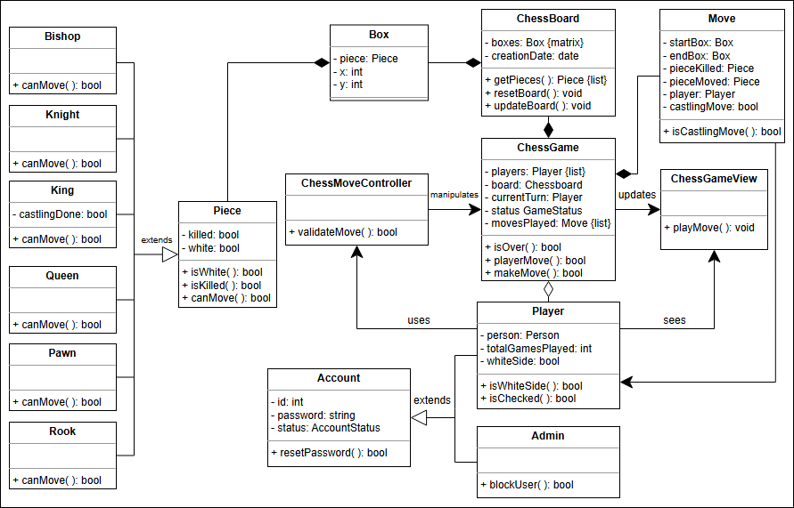

# Chess

## ♟️ Problem Definition
Chess is a **board game for two players** involving strategy, played on a **checkered board of 64 squares** in an 8x8 grid. Each player starts with **16 pieces**, including a **king, queen, two rooks, two knights, two bishops, and eight pawns**. The goal is to **checkmate the opponent's king**, which occurs when the king is in a position to be captured and cannot escape.
**Key rules include:**
- Each piece has its unique movements:
    - The **rook** moves horizontally or vertically.
    - The **knight** moves in an L-shape.
    - The **bishop** moves diagonally.
    - The **queen** moves in any direction.
    - The **king** moves one square in any direction.
    - **Pawns** move forward but capture diagonally.
- The game can also end in a **draw** under specific conditions such as insufficient pieces, repeated positions, or mutual agreement.

**Note**: We'll design a **digital, two-player version** of chess for online play.

---

## 🎯 Expectations from the Interviewee
### Chess Pieces
Chess pieces follow specific game rules. The following **clarifying questions** may help:
- **How many chess pieces** are there?
- What are their **respective moves**?
- Which piece is the **weakest**?
- Which piece is the **strongest**?

### Gameplay
Gameplay involves achieving **checkmate** or resolving special conditions like **stalemate**. Consider asking:
- Which player takes the **first turn**?
- What are the **game rules**?
- What is **checkmate**, and how does a **stalemate** occur?
- Can a player **forfeit or resign**?

---

## 📝 Requirement Collection
**The purpose of this system is to enable multiplayer in a game of chess via an online platform.**  
Below are the detailed requirements:
- **R1:** The purpose of this system is to enable multiplayer in a game of chess via an online platform.
- **R2:** The game will be played according to the official rules of international chess.
- **R3:** Each player is randomly assigned the color—either black or white.
- **R4:** At the start of the game, each player will have eight pawns, two rooks, two bishops, two knights, one queen, and one king on the board.
- **R5:** The player with the white pieces will make the first move.
- **R6:** Players cannot retract or undo a move once it has been made.
- **R7:** The system will keep a record of all moves made by both players.
- **R8:** The game may end in a **checkmate**, **forfeiture**, **stalemate (a draw)**, or **resignation**.

---

## 🌍 International Chess Rules
### ♔ King
- It can move **one step in any direction**.
- It cannot move to a box that might cause a check.

### ♕ Queen
- It can move **horizontally, vertically, or diagonally**, unless blocked by another piece.
- It cannot jump over the opponent's pieces.

### ♙ Pawn
- Moves one box forward (or **two boxes forward if it is the first move**).
- Can move one box diagonally to **capture an opponent's pawn**.

### ♗ Bishop
- Moves **diagonally in any direction**, unless blocked by a piece.
- Cannot jump over other pieces.

### ♖ Rook
- Moves **horizontally or vertically**, unless blocked.
- Cannot jump over pieces.

### ♘ Knight
- Moves in an **L-shape** by jumping two boxes horizontally or one box vertically.
- Can jump over other pieces.

---

## 🔄 Rules for Situations
### Checkmate
Occurs when a player's king is in **check** and there is no way to escape. This determines the game's **winner**.

### Stalemate
Occurs when the **king is not in check**, but no other moves are possible. This results in a **draw**.

### Forfeiture
If a player does not show up for the game, they are considered to have forfeited.

### Resignation
A player may **resign** if they believe the opponent's victory is inevitable.

### Castling
A strategic move where:
1. The **king moves two boxes toward a rook** on the same row.
2. The **rook moves to the box the king passed over**, next to the new position of the king.
- Both pieces must be in their **original positions** and must not have moved earlier.
- No other piece should be between the king and the rook.

---

## Class Diagram

## 🎨 Design Patterns

The following design patterns have been utilized in the chess game design:

1. **Singleton Design Pattern**
    - Ensures the existence of a **single instance of the chessboard** at any given moment.
    - This is crucial because the chessboard is a shared resource, and multiple instances could lead to an inconsistent game state.

2. **Command Design Pattern**
    - Encapsulates the **move logic** for each chess piece.
    - Each piece has its own implementation of the move command, allowing it to move according to the rules defined for it (e.g., the knight moves in an L-shape, the rook moves horizontally or vertically).

3. **Iterator Design Pattern**
    - Enables the game to move sequentially by allowing the pieces to behave in a uniform manner.
    - This abstracts the underlying logic behind the moves of the pieces from the user.

4. **State Design Pattern**
    - Encapsulates the **state logic** of each piece.
    - Each chess piece has its own implementation of checkmate states, allowing them to behave differently depending on the situation.

5. **Observer Design Pattern**
    - Treats the chessboard as the **subject** and the chess pieces as **observers**.
    - When the state of the board changes, the pieces are notified and adapt accordingly.
    - This decouples the chess pieces from the chessboard.

---

## White Board
### Classes
Board (grid(8x8))
Player
Piece
 - king
 - queen
 - rooks
 - knights
 - bishops
 - pawns

DigitalVersion
MoveRecord
### Actor—Actions
checkmate - This occurs when the king is in a position to be captured (check), and there is no way to move the king out of capture (checkmate).
rook - The rook can move horizontally or vertically
Knight -  the knight can move in an L-shape position
bishop  - can move diagonally
queen - can move in any direction
king -  king can move one square in any direction.
Pawns - Pawns have the most complex movement rules and can move forward one square but capture diagonally.

 - Each player is randomly assigned the color—either black or white
 - The player with the white pieces will make the first move.
 - It is not possible for a player to retract or undo their move once it has been made.
 - The system will keep a record of all moves made by both players.
### Questions
1. how players take turns
