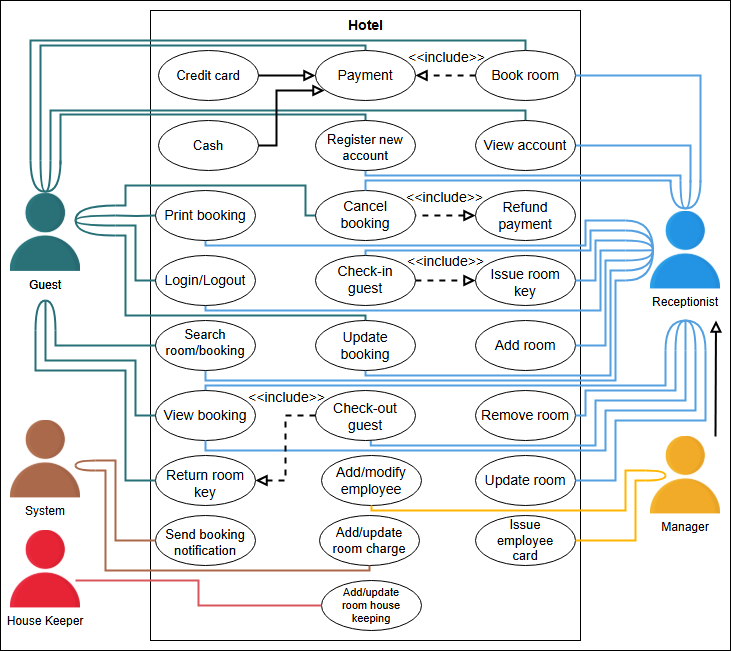
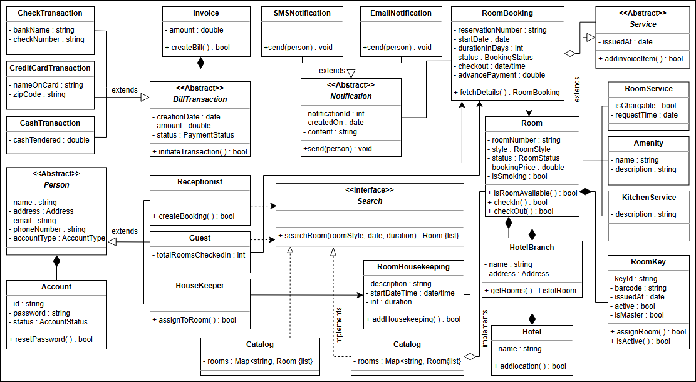
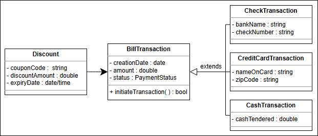

#  Hotel management system 

## ✨ Problem Definition
The hotel management system is a software used to manage all hotel activities efficiently and smoothly. Almost all popular hotels have an online management system to digitize the process of **booking rooms, managing staff, and performing other necessary hotel management features**. Through this system, the **notification and payment process is made flexible and automated**.

In the hotel, there is usually a fixed number of rooms, and the booking system has **information about all rooms present and their availability**. For the hotel manager, controlling all the hotel activities manually is a difficult task. **With the help of an online hotel management system, the manager can keep track of rooms, customers, and workers through a single portal**. The manager can also **post available rooms to the system and generate bills**.

The system also allows customers to **search for and book a room of their choice and cost range**. The system provides complete information about rooms to the customers so they can view the available rooms and **book them online**. The guest is charged based on the **time duration the hotel room is booked**. **In this way, the system facilitates both customers and the manager of the hotel**.

---

## 🔍 Expectations from the Interviewee
Numerous components are present in the hotel management system, each with specific constraints and requirements placed on them. **The interviewer will expect you to discuss several components in detail**, such as:

### 🌟 Room Booking
- **Booking a room is an essential part of the hotel management system**.
- Ensure that **no two people can book the same room**.
- **Identify how the system will work in such situations**, e.g.:
   - How will the system ensure that multiple users do not book the same room?
   - What type of users are allowed to book a room in the hotel?
   - Can users book a room in advance?

### 💰 Payment Handling
- **Payment structure is significant for the hotel management system**.
- Ask questions such as:
   - **What payment methods can the customer use** (e.g., credit card or cash)?
   - How is the payment performed? **Is it online or at the hotel receptionist?**
   - **Will advance payment or JIT payment system be available**?

### 📈 Price Variance
- Clarify the **pricing model** by asking:
   - How will the **booking price be calculated**?
   - **What factors affect the price**, such as location, room size, and booking duration?

### ❌ Booking Cancelation
- **Cancellation processes and duplicate instances**:
   - Can the user **cancel a room booking**?
   - **Which types of users are allowed to request booking cancellations**?

---

## ✨ Requirements for the Hotel Management System

Learn about all the requirements of the hotel management system problem.

### 📋 Overview
In this lesson, we’ll list the requirements of the hotel management system. **This step is crucial** since requirements define the scope of the problem. Getting them right from the interviewer and understanding them well will make the design of the rest of the system smooth and easy.

We’ll use the notational convention to identify each requirement with a unique label "Rn", where "R" is short for Requirement and "n" is a natural number.

---

### 🔍 Requirement Collection
The requirements for the hotel management system are defined below:

- **R1:** There can be four types of accounts in the system such as **housekeeper, receptionist, guest, or server**.
- **R2:** The rooms can be of different styles like **standard, deluxe, family suite, or business suite**.
- **R3:** The system should allow the guests to **search for any room and book any of the available rooms**.
- **R4:** During room booking, the user will enter the **check-in date and the duration of the stay**. The user would also have to give some **advance payment**.
- **R5:** The customer can cancel the booking and a **full refund** will be provided if the booking is canceled **before 24 hours of the check-in time**.
- **R6:** The system should send a **notification** to the customers about the booking status or other information.
- **R7:** All the housekeeping tasks should be **logged in and managed by the system**.
- **R8:** The system should allow the customer to add services of their own choice like **room service, food or kitchen service, or amenity**.
- **R9:** Every room should have its **own specific key**, and there can be a **master key** that opens a specific set of rooms.
- **R10:** A hotel can have **multiple branches**.

---

### 🔮 What's Next?
We've identified our requirements for the problem, and in the next lesson, we will define different **use cases** for the hotel management system.

## Use case diagram

## Class Diagram

### Design pattern
 - The Strategy design pattern is applied here, which will design a separate strategy or algorithm to calculate the rate of each room.
 - The Hotel class follows the Singleton design pattern, because there will only be a single instance of the Hotel class
 - Inside the hotel management system, there can be multiple rooms in a hotel, and each room has its own formula for calculating the booking cost. Therefore, Room and related classes incorporate the properties of the Factory design pattern.

### Additional requirements
 - Discount: A discount will be applied to the payment depending on special events such as the new year, branch opening, and so on. The class diagram provided below shows the relationship of Discount with the BillTransaction class:

## White Board

### Classes
HMSystem

Address

Hotel
 - branchLocations

Key
 - isMaster
 - listOfRooms

Room
 - availability
 - range
 - type
 - styles
   - standard
   - deluxe
   - family suite
   - business suite

Reservation
 - checkInDate
 - duration
 - advanceAmount
 - notPaid
 - cancel()
 - refund()

    

Notification
 - id
 - Reservation
 - +sendConfirmation()
 - +sendCancellation()
 - +sendPaymentNotification()

housekeepingLog
 - mapOfUserServices

Services
 - room service
 - food service
 - kitchen service
 - amenity

payment

InvoiceBill
SearchCatalog
book

customers/guest
workers/housekeeper
staff/receptionist/server

### Actors - Actions
System
 - The system also allows customers to search for and book a room of their choice and cost range.
manager 
 - The manager can also post available rooms to the system and generate bills.

### Open Questions
1. are there any keyword user can use to search for a room
2. can user cancel a reservation
3. payment
   1. allowed payment types
4. Notification
5. PriceCalculation
6. currentBookRequests