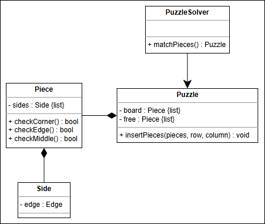

# JigSaw Puzzle

## 🧩 Jigsaw Puzzle Design

### Problem Definition

A jigsaw puzzle is a picture divided into irregularly shaped pieces that fit together to form a complete image. Key aspects of the jigsaw puzzle problem include:

*   🧩 **Unique Pieces:** Each piece is unique and only fits in one specific location.
*   🖼️ **Complete Picture:** The goal is to assemble all pieces correctly to recreate the original picture.
*   📏 **Fixed Size:** The puzzle has a predetermined number of pieces.

### 🤔 Interview Questions for Clarification

To understand the problem better, you might want to ask:

#### The Puzzle Board:

*   🖼️ **Picture/Pattern:** Is there a specific image or pattern on the puzzle?
*   📐 **Board Shape:** Is the board rectangular, circular, or another shape?

#### The Puzzle Pieces:

*   🔄 **Piece Shape:** What kind of shapes are the pieces? How many sides does each piece have?
*   🤝 **Fitting Mechanism:** How exactly do the pieces connect to each other?
*   🤹 **Uniqueness:** Are all the pieces of the jigsaw puzzle unique?

## 🧩 Jigsaw Puzzle Requirements

### 📝 Requirement Collection

*   **R1:** 🔲 Our board will be in the shape of a rectangle.
*   **R2:** 🔄 All pieces will have four sides that can either have an indentation, an extrusion, or a flat edge.
*   **R3:** 🧱 There are four corner pieces, some edge pieces, and the remaining ones are the middle pieces. A corner piece has two flat sides, an edge piece only has one flat side, and a middle piece doesn’t have any flat edge.
    *   Corner Piece
    *   Middle Piece
    *   Edge Piece
    *   Flat Edge
    *   Extrusion
    *   Indentation
*   **R4:** 🤹 All pieces will be unique, so only one piece will fit with one other piece.
*   **R5:** 🤝 Two pieces fit together by the curvature of the indentation on one piece matching up to the curvature of the extrusion on another.

## Class Diagram

## White Board

Board
 - hasShape(rectangle)
 + doesTwoPiecesMatch
 

picture
 - noOfPieces

Shape

Piece
 - typesOfPieces
 - unique

