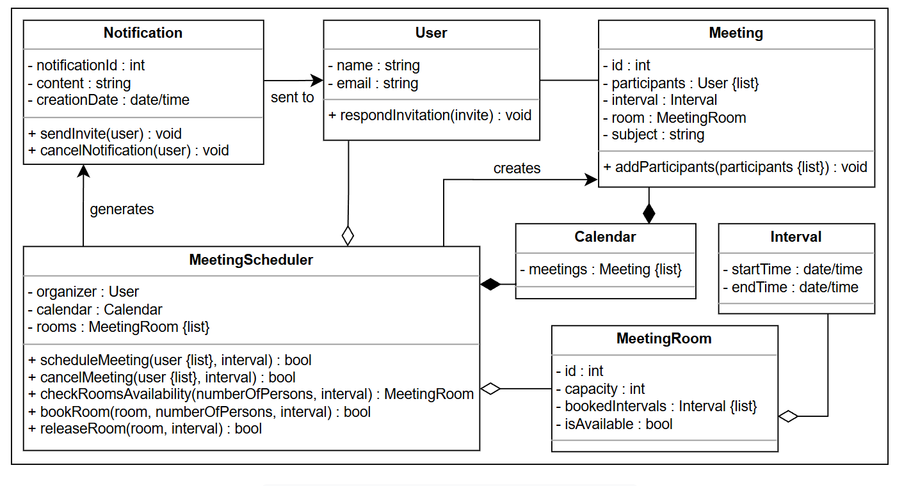

# Meeting Scheduler

## Overview
The Meeting Scheduler is a software designed to assist organizations in scheduling and booking meetings for a group of participants. It determines a suitable meeting time and location based on participants' availability, ensuring that the majority can meet effectively during the specified date and interval.

### Features
- Book and cancel meetings.
- Notify participants promptly about meeting changes.
- Add new participants after meetings are scheduled.
- Assign meeting rooms based on availability and capacity.

### Key Components
1. **Room Assignment**:
    - Determines available rooms for meetings.
    - Takes room capacity into account during assignment.

2. **Availability of Attendees**:
    - Checks participants' availability.
    - Accesses meeting information of attendees.

## Requirements

1. **Meeting Rooms**:
   - R1: There should be a specified number of meeting rooms available.
   - R2: Each room should have a predefined capacity to accommodate the required number of participants.

2. **Booking System**:
   - R3: Rooms should be bookable if not already reserved. This includes specifying:
      - Start time
      - End time
      - Meeting interval

3. **Participant Notifications**:
   - R4: Notifications should be sent to all invited participants.
   - R5: Invitations should be sent to users regardless of their availability. Users can:
      - Accept the invitation
      - Reject the invitation

4. **Calendar Management**:
   - R6: Each user should have access to a personal calendar, enabling them to:
      - Track dates and times
      - Schedule new meetings
      - Cancel existing meetings

## Class Diagram

