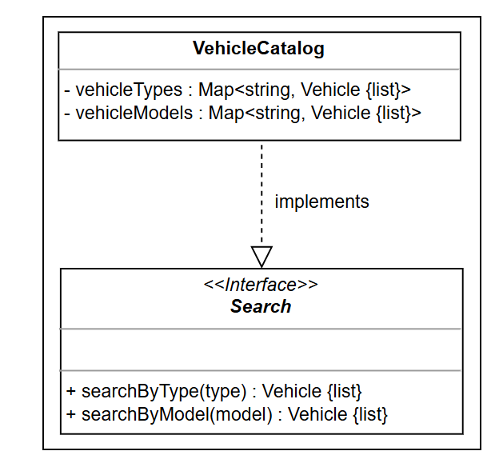

# Index

1. [Meeting Scheduler](meetingSchedular/requeriments.md)
2. [BookMyShow](BookMyShow/readme.md)
3. [CarRentalSystem](carRentalSystem/readme.md)
4. [ATM](ATM/readme.md)
5. [Chess](chess/readme.md)
6. [Hotel management system](hotelManagementSystem/readme.md)
7. [Amazon](Amazon/readme.md )
8. [Stack Overflow](StackOverflow/readme.md)

## Tips

### Clarification of Requirements
1. Ask how system determines something
2. Ask what are conditions does system needs to fulfill certain goal
3. Ask what system does for negative use cases 
4. What different ways user can do something
5. Will something vary based on something else
6. Ask for possible concurrent requests
7. How user search for a product

### Scope the Requirements
1. scope the requirements by gathering from interviewer

### Use case Patterns
1. If different users - add common functions such as creation, update, delete or common functionality in base class.
2. Have sending of notification at system level 
3. If there is search functionality, first create catalog of search Objects and extend that catalog to provide methods to each object 
   
4. PossibleEnumerations: having Status(ReservationStatus), different Types(MotorCycle(Roadster, cruiser, touring, sport))

### Class Diagrams
1. Group related requirements and identify the class(nouns), possible variable names, methods(action verbs) 

### Relations
1. Identify the one, two associations based on variables, method inputs and outputs
2. Identify the Composition and aggregation relations
3. classes: Identify the potential classes by listing all noun phrases in the requirements. These typically become classes or attributes in the UML model
4. Relationship : Examine verbs and prepositions connecting the nouns to identify potential relationships. For example, "consists of," "has," or "uses" suggest different types of relationships

### Semantic Clues in Requirements Text
 - Requirements often contain specific verbs and phrases that indicate particular relationships:
   - Association indicators: "works with," "is linked to," "interacts with," "uses," "refers to"
   - Aggregation indicators: "has," "contains," "consists of" (but parts can exist independently), "maintains a collection of
   - Composition indicators: "owns," "is made up of," "comprises," along with indications that the part cannot exist without the whole