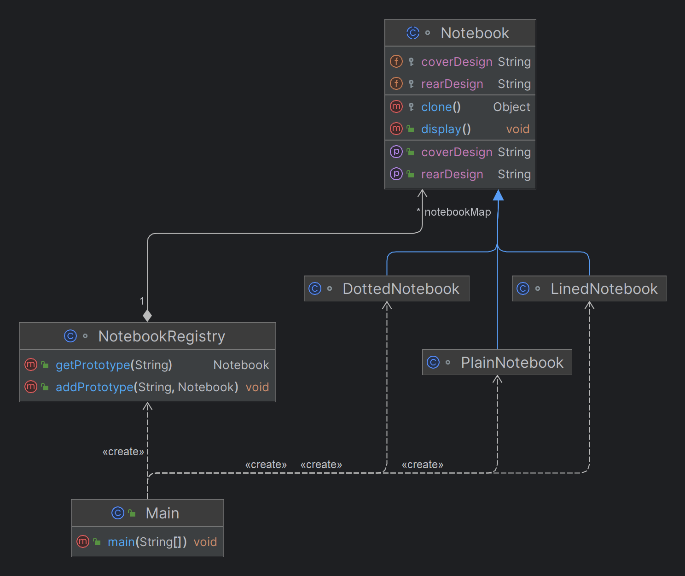

# Prototype Design Pattern

## Overview

The Prototype Design Pattern is a creational design pattern that enables the creation of new objects by copying an existing object, known as the prototype. This approach is useful when object creation is resource-intensive or when duplicating an object with its current state is necessary.

## Key Concepts

- **Prototype**: An existing object used as a template for creating new instances.
- **Cloning**: The process of creating a new object by copying the state of the prototype. Cloning can be shallow (copying the object structure) or deep (copying the object structure and all objects it references).

## Benefits

In object-oriented programming, creating new objects is a common operation. However, there are scenarios where cloning an existing object is more advantageous than creating a new one using the `new` keyword. This document outlines the key advantages of cloning objects, providing insights into when and why it can be a preferable approach.

### 1. Performance Efficiency

- **Avoids Expensive Initialization**: Creating a new object can involve costly initialization processes, such as database connections, file I/O operations, or complex computations. Cloning an already initialized object bypasses these operations, saving both time and resources.

- **Faster Object Creation**: Cloning can be faster than instantiating a new object from scratch, especially for objects that have already been configured and initialized. This is because cloning typically involves memory copying rather than executing a constructor and initialization code.

### 2. Simplified Object Duplication

- **Easier Replication of State**: Cloning allows for the duplication of an existing object's state without manually copying each field. This is particularly useful for objects with many fields or when exact copies of objects are required.

- **Reduces Boilerplate Code**: Instead of writing repetitive code to set up new objects that resemble existing ones, cloning provides a straightforward way to duplicate objects with minimal code.

### 3. Memory Efficiency

- **Avoids Redundant Object Creation**: In scenarios where similar objects are needed frequently, cloning can be more memory-efficient than creating multiple instances of similar objects from scratch. This reduces the overhead of allocating and initializing memory repeatedly.

### 4. Enhanced Flexibility

- **Supports Prototype Design Pattern**: Cloning is integral to the Prototype Design Pattern, which allows for flexible object creation. This pattern is useful when the specific type of object to create is determined at runtime, or when creating objects is complex and expensive.

- **Dynamic Object Modification**: After cloning, objects can be customized or modified independently from the original, providing flexibility in how objects are used and adapted in different contexts.

### 5. Handling Complex and Immutable Objects

- **Deep Copying Complex Structures**: Cloning can be particularly useful for creating deep copies of objects that contain references to other objects, ensuring that the entire object graph is duplicated rather than just the top-level object.

- **Maintaining Immutable Base Objects**: Cloning allows for the creation of variations based on an immutable prototype, ensuring the original object remains unchanged while new customized versions are generated.

## Notebook Prototype Design Pattern Example


This project demonstrates the use of the Prototype Design Pattern in a notebook management system. The pattern allows for creating new notebook instances by cloning existing prototypes. This approach is particularly useful when the core content of the notebooks remains the same, but different designs are required for the cover and rear pages.

## Project Structure

1. **Notebook Class**: An abstract base class representing a notebook with common attributes and methods.
2. **Concrete Notebook Classes**: Specific types of notebooks (e.g., Lined, Dotted, Plain) that extend the base class.
3. **Prototype Registry**: Manages and stores notebook prototypes, allowing for easy retrieval and cloning.
4. **Client Code**: Demonstrates how to use the prototype registry to clone and customize different notebook types.

## Code
```java
//`Notebook` Class
abstract class Notebook implements Cloneable {
    protected String coverDesign;
    protected String rearDesign;
    protected String contentType;

    // Method to set the cover design
    public void setCoverDesign(String coverDesign) {
        this.coverDesign = coverDesign;
    }

    // Method to set the rear design
    public void setRearDesign(String rearDesign) {
        this.rearDesign = rearDesign;
    }

    // Clone method for Prototype Pattern
    @Override
    protected Object clone() throws CloneNotSupportedException {
        return super.clone();
    }

    // Method to display notebook details
    public void display() {
        System.out.println("Cover Design: " + coverDesign);
        System.out.println("Rear Design: " + rearDesign);
        System.out.println("Content Type: " + contentType);
    }
}

//NotebookRegistry Class
import java.util.HashMap;
import java.util.Map;

class NotebookRegistry {
    private Map<String, Notebook> notebookMap = new HashMap<>();

    // Add a notebook prototype to the registry
    public void addPrototype(String key, Notebook notebook) {
        notebookMap.put(key, notebook);
    }

    // Get a cloned notebook from the registry
    public Notebook getPrototype(String key) throws CloneNotSupportedException {
        Notebook notebook = notebookMap.get(key);
        return (Notebook) notebook.clone();
    }
}

//Concrete Notebook Classes
class LinedNotebook extends Notebook {
    public LinedNotebook() {
        contentType = "Lined Pages";
        coverDesign = "Default Lined Cover";
        rearDesign = "Default Lined Rear";
    }
}
class DottedNotebook extends Notebook {
    public DottedNotebook() {
        contentType = "Dotted Pages";
        coverDesign = "Default Dotted Cover";
        rearDesign = "Default Dotted Rear";
    }
}

class PlainNotebook extends Notebook {
    public PlainNotebook() {
        contentType = "Plain Pages";
        coverDesign = "Default Plain Cover";
        rearDesign = "Default Plain Rear";
    }
}

//Client Code
public class Main {
    public static void main(String[] args) {
        // Create a registry and add notebook prototypes
        NotebookRegistry registry = new NotebookRegistry();
        registry.addPrototype("Lined", new LinedNotebook());
        registry.addPrototype("Dotted", new DottedNotebook());
        registry.addPrototype("Plain", new PlainNotebook());

        try {
            // Clone and customize Lined Notebook
            Notebook travelNotebook = registry.getPrototype("Lined");
            travelNotebook.setCoverDesign("Travel Cover");
            travelNotebook.setRearDesign("Travel Rear");

            // Clone and customize Dotted Notebook
            Notebook artNotebook = registry.getPrototype("Dotted");
            artNotebook.setCoverDesign("Artistic Cover");
            artNotebook.setRearDesign("Artistic Rear");

            // Clone and customize Plain Notebook
            Notebook sketchNotebook = registry.getPrototype("Plain");
            sketchNotebook.setCoverDesign("Sketch Cover");
            sketchNotebook.setRearDesign("Sketch Rear");

            // Display notebooks
            System.out.println("Travel Notebook:");
            travelNotebook.display();

            System.out.println("\nArt Notebook:");
            artNotebook.display();

            System.out.println("\nSketch Notebook:");
            sketchNotebook.display();

        } catch (CloneNotSupportedException e) {
            e.printStackTrace();
        }
    }
}

```
## Class Diagram


## Use Cases

- **Game Development**: Where multiple objects share common properties but need slight variations. For example, characters or game assets that are cloned and customized.
- **Prototyping in Software Design**: Creating initial versions of objects that can be cloned and then modified for testing or further development.
- **Object Pooling**: Reusing existing objects by cloning them instead of creating new ones, which is especially useful in resource-constrained environments.
- **Caching Mechanisms**: Storing prototypes of objects that can be quickly cloned and used as needed, improving performance in applications where object creation is costly.

## Keywords and Phrases

Here are key terms and examples of requirements from different domains that suggest the use of the Prototype Design Pattern:

### 1. Object Cloning

**Keyword/Phrase**: "Object Cloning"

**Example Requirement**:
- "The application must support object cloning to create new instances based on existing objects."

**Domain**: Software Development

**Explanation**: This indicates the need for creating new objects by copying an existing instance, which is a classic use case for the Prototype Pattern.

### 2. Duplicate Objects

**Keyword/Phrase**: "Duplicate Objects"

**Example Requirement**:
- "The system should be able to duplicate objects with the same attributes and configurations."

**Domain**: Game Development

**Explanation**: Duplicating game entities (e.g., characters, items) with similar attributes can be efficiently handled using the Prototype Pattern.

### 3. Copying State

**Keyword/Phrase**: "Copying State"

**Example Requirement**:
- "Users must be able to copy the state of one document to create new documents with the same content."

**Domain**: Document Management Systems

**Explanation**: Copying the state of a document to create new ones with the same content while allowing for customization fits the Prototype Pattern.

### 4. Prototype

**Keyword/Phrase**: "Prototype"

**Example Requirement**:
- "The design should allow creating new objects based on a prototype instance."

**Domain**: Product Design

**Explanation**: Using a prototype as a base for creating new product instances with slight modifications is a direct application of the Prototype Pattern.

### 5. Creating Variations

**Keyword/Phrase**: "Creating Variations"

**Example Requirement**:
- "The system needs to generate different variations of a report template with varying formats."

**Domain**: Reporting Systems

**Explanation**: Generating different versions of a report template using a prototype helps maintain consistency while allowing for customization.

### 6. Pre-configured Objects

**Keyword/Phrase**: "Pre-configured Objects"

**Example Requirement**:
- "The application should use pre-configured object instances to create new objects with similar settings."

**Domain**: Configuration Management

**Explanation**: Using pre-configured objects as prototypes for creating new instances simplifies the setup process.

### 7. Efficient Object Creation

**Keyword/Phrase**: "Efficient Object Creation"

**Example Requirement**:
- "To optimize performance, the system should efficiently create new objects by cloning existing ones rather than reinitializing from scratch."

**Domain**: Performance Optimization

**Explanation**: Cloning objects to avoid expensive initialization processes is a key benefit of the Prototype Pattern.

### 8. Object Customization

**Keyword/Phrase**: "Object Customization"

**Example Requirement**:
- "Allow users to customize objects by cloning a base prototype and modifying specific attributes."

**Domain**: E-commerce Platforms

**Explanation**: Customizing product variations based on a base prototype helps streamline the product configuration process.

### 9. Complex Initialization

**Keyword/Phrase**: "Complex Initialization"

**Example Requirement**:
- "The system should handle complex object initialization by using prototypes to simplify object creation."

**Domain**: Software Engineering

**Explanation**: Using prototypes to manage complex initialization processes reduces development effort and complexity.

### 10. Immutable Objects with Variations

**Keyword/Phrase**: "Immutable Objects with Variations"

**Example Requirement**:
- "Create multiple variations of immutable configuration objects based on a prototype instance."

**Domain**: Configuration Systems

**Explanation**: Cloning immutable objects to create variations while preserving their core attributes aligns with the Prototype Pattern.

## Considerations

- **Shallow vs. Deep Cloning**: Understand the difference between shallow and deep cloning and implement the appropriate strategy depending on your application's needs.
- **Cloneable Interface**: In languages like Java, ensuring that your prototype objects are cloneable may require implementing specific interfaces or methods.
- **Object Identity**: Cloning results in a new object instance with the same data as the original, but it is a distinct object. This can affect equality checks and object identity management.
- **Prototype Registry**: Maintain a registry of prototypes to simplify access and cloning, allowing for easy retrieval and modification of prototypes.

## Conclusion

The Prototype Design Pattern is a powerful tool in software development for creating new objects based on existing instances. By utilizing this pattern, developers can improve performance, simplify object creation, and handle complex configurations more effectively.

