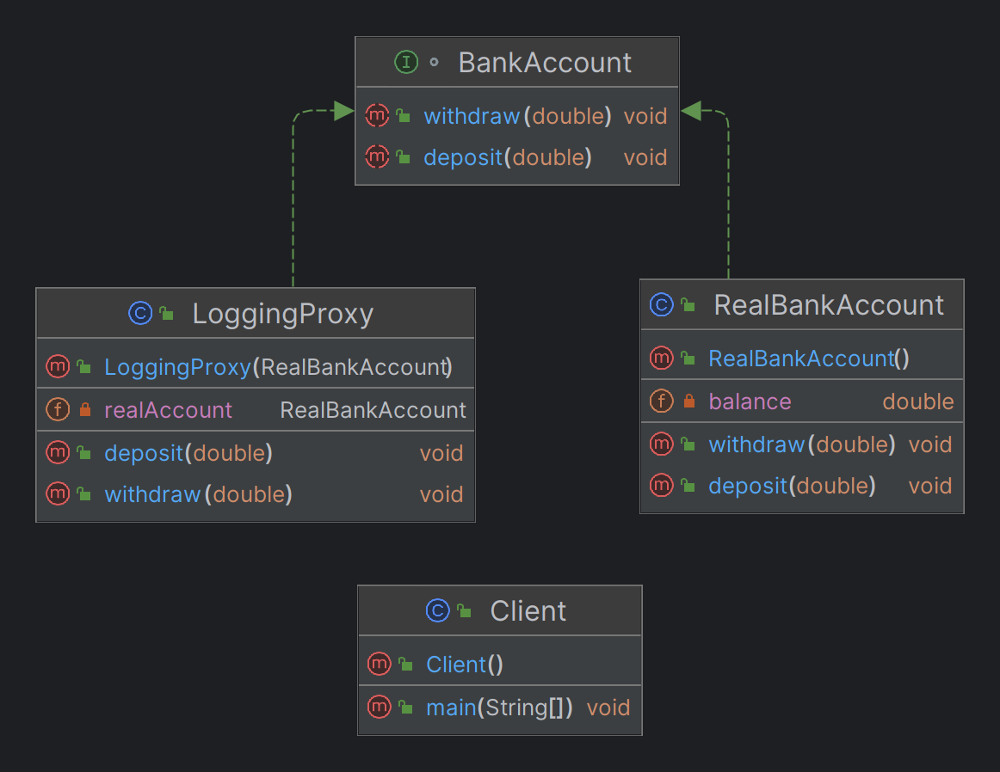

# Proxy Design Pattern

## Overview

The Proxy Design Pattern is a structural design pattern that provides an object representing another object. This proxy object controls access to the original object, which can help in implementing additional functionalities such as lazy initialization, access control, logging, or caching.

## When to Use

- When you need to control access to an object, adding functionality such as lazy initialization, access control, or logging.
- When working with remote objects that require communication across address spaces.
- When managing expensive resources that should be loaded or created only when necessary. 


## Intent

- To provide a surrogate or placeholder for another object.
- To control access to the original object and add additional behavior without modifying the original object's code.

## Example

The Logging Proxy Design Pattern is a variant of the Proxy Design Pattern where the proxy object logs interactions with the real subject. This pattern is useful for monitoring and debugging by capturing method calls and their results, without modifying the original object's code.

## Intent

- To log method calls and their parameters.
- To capture the results or side effects of method calls for debugging or monitoring purposes.
- To provide an additional layer of abstraction for logging without altering the real object’s code.

## Example

### Scenario

Consider a banking application where transactions are performed on a bank account. By using a Logging Proxy, you can intercept and log each transaction operation, such as deposits and withdrawals, without changing the logic of the `BankAccount` class.

### Components

1. **Real Object**: Represents the actual subject with the core functionality.
2. **Proxy**: Implements the same interface as the real object and adds logging behavior.

### Example Structure

1. **RealBankAccount**: The real object that performs transactions.
2. **LoggingProxy**: The proxy that logs method calls and delegates to the real object.

## Implementation

### RealBankAccount

The `RealBankAccount` class includes methods for depositing and withdrawing funds.

### LoggingProxy

The `LoggingProxy` class implements the same interface as `RealBankAccount`, logs the method calls and their parameters, and then forwards the calls to the real object.

## Code Example

```java
// Interface
public interface BankAccount {
    void deposit(double amount);
    void withdraw(double amount);
}

// Real Object
public class RealBankAccount implements BankAccount {
    private double balance;

    @Override
    public void deposit(double amount) {
        balance += amount;
        System.out.println("Deposited " + amount);
    }

    @Override
    public void withdraw(double amount) {
        balance -= amount;
        System.out.println("Withdrew " + amount);
    }
}

// Proxy
public class LoggingProxy implements BankAccount {
    private RealBankAccount realAccount;

    public LoggingProxy(RealBankAccount realAccount) {
        this.realAccount = realAccount;
    }

    @Override
    public void deposit(double amount) {
        System.out.println("Logging: Depositing " + amount);
        realAccount.deposit(amount);
    }

    @Override
    public void withdraw(double amount) {
        System.out.println("Logging: Withdrawing " + amount);
        realAccount.withdraw(amount);
    }
}

public class Client {
    public static void main(String[] args) {
        // Create the real bank account
        RealBankAccount realAccount = new RealBankAccount();

        // Create a logging proxy for the real bank account
        BankAccount proxyAccount = new LoggingProxy(realAccount);

        // Perform operations through the proxy
        proxyAccount.deposit(100.0);
        proxyAccount.withdraw(50.0);
    }
}
```

## class Diagram



## Use Cases

The Proxy Design Pattern is useful in various scenarios, including:

1. **Lazy Initialization**: Defers the creation of expensive objects until they are needed.
2. **Access Control**: Adds a layer of control to ensure that only authorized users can access the original object.
3. **Logging**: Intercepts method calls to log actions before forwarding them to the real object.
4. **Caching**: Stores the results of expensive operations to improve performance for future requests.
5. **Remote Access**: Represents an object located on a different server or address space, making remote calls look like local calls.

## Types of Proxy

1. **Virtual Proxy**: Controls access to an object that is resource-intensive to create, by creating it only when needed.
2. **Protection Proxy**: Manages access rights to an object based on user permissions.
3. **Remote Proxy**: Represents an object that is located on a different server or address space.
4. **Caching Proxy**: Stores results of operations to avoid redundant processing.
5. **Logging Proxy**: Logs interactions with an object for monitoring or debugging purposes.

## Advantages

- **Additional Functionality**: Allows for additional behavior such as logging, caching, and access control without changing the original object.
- **Reduced Complexity**: Simplifies interactions with complex objects by managing access through a proxy.
- **Enhanced Security**: Adds a layer of protection by controlling access and permissions.

## Disadvantages

- **Increased Complexity**: Introduces additional layers of indirection, which can complicate the design.
- **Performance Overhead**: Can introduce overhead due to the extra proxy layer, which may impact performance in some cases.

## Identifying Keywords for Proxy Design Pattern Keywords and Phrases to Look For

### 1. Resource Management

**Keywords/Phrases:**
- "expensive to create"
- "resource-intensive"
- "delay creation"
- "lazy loading"

**Example Domain:** Finance

**Example Requirement:**
"The system should only load transaction history data from the database when the user requests it to avoid heavy database loads during startup."

**Use Case:** Implement a proxy to delay the loading of transaction data until the user accesses it, optimizing resource usage.

### 2. Access Control

**Keywords/Phrases:**
- "access control"
- "permissions"
- "authentication"
- "authorization"

**Example Domain:** Healthcare

**Example Requirement:**
"Only authorized medical personnel should be able to view patient records, and different roles should have different access levels."

**Use Case:** Use a proxy to manage access to patient records based on user roles, ensuring proper authorization.

### 3. Remote Communication

**Keywords/Phrases:**
- "remote server"
- "network communication"
- "distributed system"
- "proxy object"

**Example Domain:** E-commerce

**Example Requirement:**
"The system must interact with a remote payment gateway to process transactions securely."

**Use Case:** Employ a remote proxy to represent the payment gateway, managing network communication and simplifying interaction.

### 4. Logging and Monitoring

**Keywords/Phrases:**
- "logging"
- "audit trail"
- "monitoring"
- "track operations"

**Example Domain:** Telecommunications

**Example Requirement:**
"All interactions with the call management system must be logged for auditing and troubleshooting purposes."

**Use Case:** Implement a logging proxy to capture and log method calls, providing an audit trail for system operations.

### 5. Caching

**Keywords/Phrases:**
- "cache results"
- "store data"
- "avoid redundant processing"
- "performance optimization"

**Example Domain:** Web Application

**Example Requirement:**
"Frequently accessed user profile data should be cached to improve response times and reduce server load."

**Use Case:** Utilize a caching proxy to store and serve user profile data, enhancing performance and reducing server load.

### 6. Synchronization

**Keywords/Phrases:**
- "thread-safe"
- "synchronize access"
- "concurrent access"
- "manage multiple threads"

**Example Domain:** Financial Trading

**Example Requirement:**
"Access to real-time stock prices must be synchronized to prevent race conditions during high-frequency trading."

**Use Case:** Apply a synchronization proxy to manage concurrent access to stock price data, ensuring thread safety.

### 7. Virtualization

**Keywords/Phrases:**
- "virtual representation"
- "simulate complex objects"
- "manage complexity"
- "simplify interaction"

**Example Domain:** Gaming

**Example Requirement:**
"Heavily used game assets like textures and models should be loaded on-demand to optimize memory usage and startup time."

**Use Case:** Implement a virtual proxy to represent complex game assets, loading them only when needed to manage memory usage.


## Conclusion

The Proxy Design Pattern is a powerful tool for managing access and adding functionality to objects. By using a proxy, you can handle complex tasks such as lazy initialization, access control, and caching in a clean and maintainable way.

