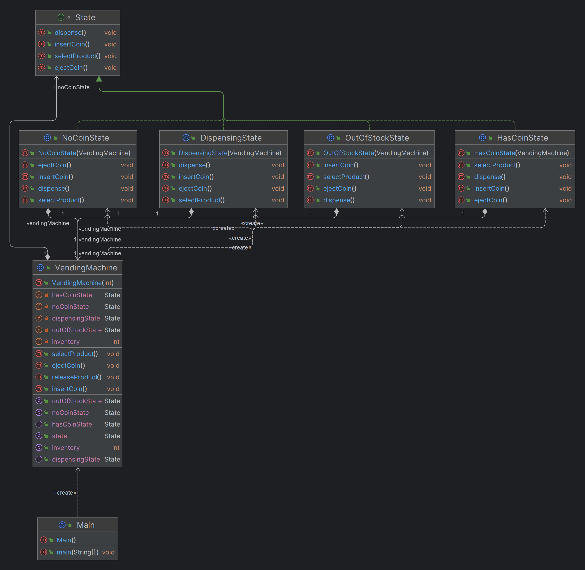

# State Design Pattern

## What is the State Design Pattern?

The State Design Pattern is a behavioral design pattern that allows an object to change its behavior when its internal state changes. The pattern encapsulates state-specific behavior within separate classes and makes the object’s behavior dependent on its current state, rather than relying on large conditional statements.

## Why Use the State Design Pattern?

- **Encapsulation of States:** The State pattern encapsulates state-specific behaviors, making the code easier to understand, maintain, and extend.
- **Simplification of Complex State Transitions:** The pattern simplifies the management of complex state transitions, making the codebase cleaner and more modular.
- **Reduction of Conditional Logic:** By delegating state-specific behavior to different classes, the State pattern reduces the need for complex conditional logic scattered throughout the code.
- **Improved Flexibility:** The State pattern allows new states to be added or existing ones to be modified without altering the core logic of the object, enhancing flexibility and scalability.

## When to Use the State Design Pattern?

- **Object Behavior Varies by State:** When an object’s behavior changes depending on its internal state, and managing this behavior through conditional logic would result in complex and unmanageable code.
- **Complex State Machines:** When an object needs to manage a complex state machine with multiple states and transitions, the State pattern helps organize the behavior and transitions in a clean and modular way.
- **Refactoring Conditional Logic:** When an existing codebase relies heavily on conditional logic (like `if-else` or `switch` statements) to handle different states, refactoring using the State pattern can make the code more maintainable.

## Benefits of the State Design Pattern

- **Cleaner Code Structure:** The State pattern separates concerns by organizing state-specific behavior into distinct classes, leading to a cleaner and more understandable code structure.
- **Easy Maintenance and Extension:** Adding or modifying states is straightforward, as the pattern localizes state-specific behavior within individual classes.
- **Reusability:** State classes can often be reused across different contexts or applications where similar state-based behavior is needed.
- **Encourages Single Responsibility Principle (SRP):** Each state class has a single responsibility, focusing solely on the behavior related to that particular state.

## Real-Time Use Cases of the State Design Pattern

- **Vending Machines:** A vending machine can be in different states like NoCoin, HasCoin, DispensingProduct, or OutOfStock, and each state dictates how the machine should behave in response to user actions.

- **Traffic Light Systems:** Traffic lights transition between states like Red, Yellow, and Green, with each state representing different behaviors for vehicles and pedestrians.

- **Media Players:** A media player can have states such as Playing, Paused, and Stopped, where the actions available to the user depend on the current state.

- **Document Workflow Systems:** A document may go through states like Draft, Review, Published, and Archived, with each state defining different actions that can be performed on the document.

- **ATMs:** An ATM can be in states like Idle, CardInserted, PINEntered, and DispensingCash, with each state dictating the machine's behavior in response to user interactions.

## Vending Machine Example Using the State Design Pattern

## Overview

This example demonstrates the use of the State Design Pattern to model a vending machine. The vending machine can be in different states: `NoCoinState`, `HasCoinState`, `DispensingState`, and `OutOfStockState`. Each state encapsulates the behavior associated with that particular state, making the system easier to maintain and extend.

## State Design Pattern Components

- **State Interface:** Defines the common interface for all concrete state classes.
- **Concrete State Classes:** Implement the behavior specific to each state of the vending machine.
- **Context Class (VendingMachine):** Maintains an instance of a concrete state and delegates state-specific behavior to the current state object.

## Vending Machine States

### 1. NoCoinState

It Represents the state when the vending machine is waiting for a coin to be inserted.

```java

interface State {
    void insertCoin();
    void ejectCoin();
    void selectProduct();
    void dispense();
}
public class HasCoinState implements State {
    private VendingMachine vendingMachine;

    public HasCoinState(VendingMachine vendingMachine) {
        this.vendingMachine = vendingMachine;
    }

    @Override
    public void insertCoin() {
        System.out.println("Coin already inserted.");
    }

    @Override
    public void ejectCoin() {
        System.out.println("Coin ejected.");
        vendingMachine.setState(vendingMachine.getNoCoinState());
    }

    @Override
    public void selectProduct() {
        System.out.println("Product selected.");
        if (vendingMachine.getInventory() > 0) {
            vendingMachine.setState(vendingMachine.getDispensingState());
        } else {
            vendingMachine.setState(vendingMachine.getOutOfStockState());
        }
    }

    @Override
    public void dispense() {
        System.out.println("No product selected.");
    }
}
public class DispensingState implements State {
    private VendingMachine vendingMachine;

    public DispensingState(VendingMachine vendingMachine) {
        this.vendingMachine = vendingMachine;
    }

    @Override
    public void insertCoin() {
        System.out.println("Please wait, dispensing in progress.");
    }

    @Override
    public void ejectCoin() {
        System.out.println("Cannot eject coin, dispensing in progress.");
    }

    @Override
    public void selectProduct() {
        System.out.println("Please wait, already dispensing.");
    }

    @Override
    public void dispense() {
        System.out.println("Dispensing product.");
        vendingMachine.releaseProduct();
        if (vendingMachine.getInventory() > 0) {
            vendingMachine.setState(vendingMachine.getNoCoinState());
        } else {
            vendingMachine.setState(vendingMachine.getOutOfStockState());
        }
    }
}

public class OutOfStockState implements State {
    private VendingMachine vendingMachine;

    public OutOfStockState(VendingMachine vendingMachine) {
        this.vendingMachine = vendingMachine;
    }

    @Override
    public void insertCoin() {
        System.out.println("Machine is out of stock.");
    }

    @Override
    public void ejectCoin() {
        System.out.println("No coin to eject.");
    }

    @Override
    public void selectProduct() {
        System.out.println("Machine is out of stock.");
    }

    @Override
    public void dispense() {
        System.out.println("Machine is out of stock.");
    }
}

public class NoCoinState implements State {
    private VendingMachine vendingMachine;

    public NoCoinState(VendingMachine vendingMachine) {
        this.vendingMachine = vendingMachine;
    }

    @Override
    public void insertCoin() {
        System.out.println("Coin inserted.");
        vendingMachine.setState(vendingMachine.getHasCoinState());
    }

    @Override
    public void ejectCoin() {
        System.out.println("No coin to eject.");
    }

    @Override
    public void selectProduct() {
        System.out.println("Please insert coin first.");
    }

    @Override
    public void dispense() {
        System.out.println("Please insert coin and select product first.");
    }
}
public class VendingMachine {
    private State noCoinState;
    private State hasCoinState;
    private State dispensingState;
    private State outOfStockState;

    private State currentState;
    private int inventory;

    public VendingMachine(int inventory) {
        noCoinState = new NoCoinState(this);
        hasCoinState = new HasCoinState(this);
        dispensingState = new DispensingState(this);
        outOfStockState = new OutOfStockState(this);

        this.inventory = inventory;
        if (inventory > 0) {
            currentState = noCoinState;
        } else {
            currentState = outOfStockState;
        }
    }

    public void insertCoin() {
        currentState.insertCoin();
    }

    public void ejectCoin() {
        currentState.ejectCoin();
    }

    public void selectProduct() {
        currentState.selectProduct();
        currentState.dispense();
    }

    public void releaseProduct() {
        if (inventory > 0) {
            inventory--;
            System.out.println("Product released. Remaining inventory: " + inventory);
        }
    }

    public int getInventory() {
        return inventory;
    }

    public void setState(State state) {
        this.currentState = state;
    }

    public State getNoCoinState() {
        return noCoinState;
    }

    public State getHasCoinState() {
        return hasCoinState;
    }

    public State getDispensingState() {
        return dispensingState;
    }

    public State getOutOfStockState() {
        return outOfStockState;
    }
}

public class Main {
    public static void main(String[] args) {
        VendingMachine vendingMachine = new VendingMachine(2);

        vendingMachine.insertCoin();  // Output: Coin inserted.
        vendingMachine.selectProduct();  // Output: Product selected. Dispensing product. Product released.

        vendingMachine.insertCoin();  // Output: Coin inserted.
        vendingMachine.ejectCoin();  // Output: Coin ejected.

        vendingMachine.insertCoin();  // Output: Coin inserted.
        vendingMachine.selectProduct();  // Output: Product selected. Dispensing product. Product released. Machine is out of stock.

        vendingMachine.insertCoin();  // Output: Machine is out of stock.
    }
}

```

## class diagram


## Keywords and Phrases for Identifying the State Design Pattern

To determine if the State Design Pattern is suitable for your application, look for the following keywords and phrases in the requirements:

- **"Different behaviors depending on state"**: Indicates that the object's behavior varies based on its current state.
- **"State-specific actions"**: Suggests that different actions are performed based on the object's state.
- **"State transitions"**: Refers to changes in the object's state, implying the need to manage different states and their transitions.
- **"State-dependent behavior"**: Points to the need for behavior that changes in response to different states.
- **"Complex state machine"**: Implies the presence of multiple states with intricate transitions.
- **"Behavior varies with internal status"**: Indicates that the object’s behavior is influenced by its internal status or condition.
- **"Conditional logic for different states"**: Suggests extensive conditional logic used to handle various states, which could be simplified by the State pattern.
- **"Different actions for each state"**: Means that different states require distinct actions or responses.
- **"Encapsulation of state-specific behavior"**: Indicates the need to encapsulate state-specific behavior in separate classes.
- **"State-based operations"**: Refers to operations dependent on the object’s current state.
- **"Handling multiple states"**: Implies the need to manage and respond to multiple states within the object.

Identifying these keywords and phrases can help determine if the State Design Pattern is appropriate for managing state-dependent behavior and transitions in your system.

## Conclusion

The State Design Pattern is a powerful tool for managing objects that need to exhibit different behaviors depending on their internal state. By encapsulating state-specific behavior and managing state transitions cleanly, it helps create modular, maintainable, and extendable code.
