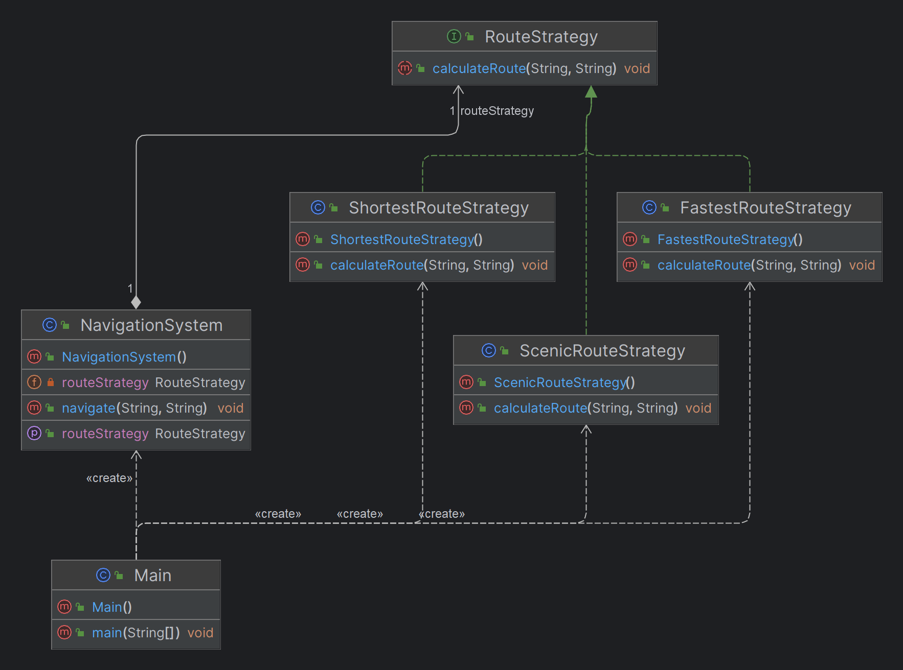

# Strategy Design Pattern

## What is the Strategy Pattern?

The **Strategy Design Pattern** is a behavioral design pattern that allows you to define a family of algorithms, encapsulate each one, and make them interchangeable. This pattern lets the algorithm vary independently from the clients that use it. Essentially, it enables selecting an algorithm's behavior at runtime.

## When to Use the Strategy Pattern

- **Multiple Algorithms**: When there are several ways to achieve an operation, and the client should be able to choose the most appropriate one dynamically.
- **Avoid Conditional Logic**: When you have complex conditional statements that switch between different behaviors, and you want to replace these with a more maintainable structure.
- **Runtime Flexibility**: When you need to change the behavior of an object during runtime, based on user input, configuration, or other factors.
- **Encapsulate Behaviors**: When you want to encapsulate related algorithms or behaviors in their own classes to promote separation of concerns.

## Why Use the Strategy Pattern?

- **Open/Closed Principle**: The Strategy Pattern adheres to the Open/Closed Principle, allowing you to add new algorithms without altering existing code.
- **Single Responsibility Principle**: Each strategy encapsulates a specific algorithm or behavior, promoting the Single Responsibility Principle.
- **Eliminate Conditional Logic**: Replaces complex conditional logic with a more elegant and flexible design structure.
- **Easily Extendable**: New strategies can be added without impacting the context or existing strategies.
- **Reusability**: Strategies can be reused across different parts of an application or in different projects.

## Benefits of the Strategy Pattern

- **Modular Design**: Each strategy is encapsulated in its own class, making the system easier to understand, maintain, and extend.
- **Dynamic Behavior**: You can switch between different strategies at runtime, providing flexibility to the application.
- **Simplified Code**: Reduces the complexity of code by avoiding multiple conditional statements, which can make the code cleaner and more readable.
- **Improved Testability**: Since each strategy is encapsulated in its own class, it can be independently tested, leading to more reliable code.

## Use Cases

- **Payment Processing Systems**: Selecting different payment methods (e.g., credit card, PayPal, cryptocurrency) based on user preference.
- **Sorting Algorithms**: Choosing between different sorting strategies (e.g., QuickSort, MergeSort, BubbleSort) depending on data size or type.
- **Travel Route Planning**: Selecting different route strategies (e.g., fastest route, shortest route, scenic route) in a navigation system.
- **Compression Algorithms**: Switching between different data compression algorithms (e.g., ZIP, RAR, TAR) based on file type or size.
- **File Conversion**: Applying different file conversion strategies (e.g., XML to JSON, JSON to CSV) depending on the required output format.

## Strategy Design Pattern - Google Maps Example


## When to Use the Strategy Pattern

- **Multiple Algorithms**: When there are several ways to achieve an operation, and the client should be able to choose the most appropriate one dynamically.
- **Avoid Conditional Logic**: When you have complex conditional statements that switch between different behaviors, and you want to replace these with a more maintainable structure.
- **Runtime Flexibility**: When you need to change the behavior of an object during runtime, based on user input, configuration, or other factors.

## Google Maps Example

### Scenario

In a navigation system similar to Google Maps, users might want to select different route strategies, such as the fastest route, the shortest route, or the most scenic route. The Strategy Pattern can be used to implement these varying algorithms, allowing the system to switch between them based on user preferences.

### Strategy Interface

```java
public interface RouteStrategy {
    void calculateRoute(String startLocation, String endLocation);
}

public class FastestRouteStrategy implements RouteStrategy {
    @Override
    public void calculateRoute(String startLocation, String endLocation) {
        System.out.println("Calculating the fastest route from " + startLocation + " to " + endLocation);
        // Implementation for the fastest route
    }
}

public class ShortestRouteStrategy implements RouteStrategy {
    @Override
    public void calculateRoute(String startLocation, String endLocation) {
        System.out.println("Calculating the shortest route from " + startLocation + " to " + endLocation);
        // Implementation for the shortest route
    }
}

public class ScenicRouteStrategy implements RouteStrategy {
    @Override
    public void calculateRoute(String startLocation, String endLocation) {
        System.out.println("Calculating the most scenic route from " + startLocation + " to " + endLocation);
        // Implementation for the most scenic route
    }
}

public class NavigationSystem {
    private RouteStrategy routeStrategy;

    // Method to set the strategy at runtime
    public void setRouteStrategy(RouteStrategy routeStrategy) {
        this.routeStrategy = routeStrategy;
    }

    // Method to calculate the route
    public void navigate(String startLocation, String endLocation) {
        routeStrategy.calculateRoute(startLocation, endLocation);
    }
}
public class Main {
    public static void main(String[] args) {
        NavigationSystem navigationSystem = new NavigationSystem();

        // Set the strategy to the fastest route
        navigationSystem.setRouteStrategy(new FastestRouteStrategy());
        navigationSystem.navigate("New York", "Los Angeles"); 
        // Output: Calculating the fastest route from New York to Los Angeles

        // Set the strategy to the shortest route
        navigationSystem.setRouteStrategy(new ShortestRouteStrategy());
        navigationSystem.navigate("New York", "Los Angeles");
        // Output: Calculating the shortest route from New York to Los Angeles

        // Set the strategy to the scenic route
        navigationSystem.setRouteStrategy(new ScenicRouteStrategy());
        navigationSystem.navigate("New York", "Los Angeles");
        // Output: Calculating the most scenic route from New York to Los Angeles
    }
}
```

## Class Diagram



## Identifying the Strategy Design Pattern

## Keywords and Phrases

When analyzing requirements, look for the following keywords and phrases that indicate the Strategy Design Pattern may be applicable:

- **"Different ways to..."**
- **"Select from various options"**
- **"Varying based on..."**
- **"Interchangeable algorithms"**
- **"Dynamically choose"**
- **"Alternative approaches"**
- **"Configurable behavior"**

## Real-Time Use Cases

### 1. E-Commerce: Payment Processing
**Requirement:** "The system should allow users to select from various payment methods during checkout."  
**Key Phrase:** "Select from various options"

### 2. Navigation System: Route Planning
**Requirement:** "The system should calculate the best route based on different user preferences."  
**Key Phrase:** "Different ways to calculate the best route"

### 3. Game Development: Enemy AI Behavior
**Requirement:** "The game should allow enemies to change their attack behavior based on the player's actions."  
**Key Phrase:** "Varying based on the player's actions"

### 4. Data Compression: File Compression
**Requirement:** "The system should support various compression algorithms and allow the user to choose."  
**Key Phrase:** "Interchangeable algorithms"

### 5. Healthcare: Treatment Planning
**Requirement:** "The system should allow doctors to choose different treatment plans based on the patient's condition."  
**Key Phrase:** "Dynamically choose treatment plans"

### 6. Marketing: Campaign Strategies
**Requirement:** "The platform should allow businesses to select different campaign strategies depending on the primary audience."  
**Key Phrase:** "Alternative approaches"

## Conclusion

Look for these key phrases in your requirements to identify when the Strategy Design Pattern is appropriate. This pattern is ideal for situations where behavior needs to change dynamically, multiple approaches are viable, or different algorithms need to be easily interchangeable.
