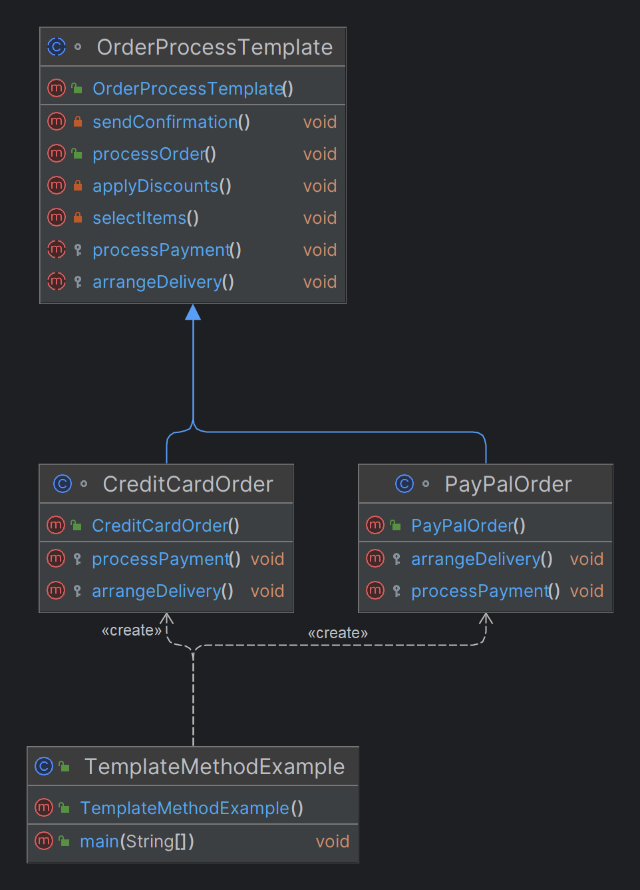

# Template Method Design Pattern

## What is the Template Method Design Pattern?

The Template Method Design Pattern is a behavioral design pattern that defines the skeleton of an algorithm in a base class. It allows subclasses to redefine specific steps of the algorithm without changing its overall structure. This pattern is used to create a template method that outlines the process, while the steps within that process can be customized by subclasses.

## When to Use the Template Method Design Pattern

- **Common Workflow with Variations:** When you have a process that follows a standard sequence of steps, but certain steps need to be customized depending on the context or subclass.

- **Code Reuse:** When you want to encapsulate common behavior in a base class to avoid code duplication and allow subclasses to extend or modify specific steps.

- **Invariance of Sequence:** When it is crucial that a sequence of operations occurs in a specific order, but some steps need to be overridden or customized.

- **Frameworks and Libraries:** When developing a framework or library that provides a skeleton for an algorithm or workflow that users can extend.

- **Refactoring to Eliminate Code Duplication:** When multiple classes share similar algorithms with minor differences, and you want to refactor common logic into a base class.

- **Preventing Override of Algorithm Structure:** When you want to ensure that the structure of an algorithm remains consistent across all implementations, preventing subclasses from altering the sequence.

## Why Use the Template Method Design Pattern?

- **Consistency in Workflow:** Ensures that the core structure of an algorithm remains consistent across different implementations, maintaining the integrity of the process.

- **Flexibility and Customization:** Provides a way to customize specific steps within a workflow while keeping the overall sequence intact.

- **Code Maintenance and Reuse:** Centralizes common logic in a base class, reducing code duplication and making the system easier to maintain and extend.

- **Separation of Concerns:** Promotes a clear separation between the invariant parts of an algorithm and the variant parts that subclasses can override.

## Benefits of the Template Method Design Pattern

- **Encapsulation of Common Behavior:** Reduces code duplication by encapsulating shared behavior in a single location, making it easier to maintain and update.

- **Controlled Extension:** Subclasses can extend or modify specific steps of an algorithm without altering its overall structure, ensuring that the sequence of operations remains intact.

- **Enforced Order of Execution:** Guarantees that certain steps are executed in a specific order, which is important in processes that must follow a strict sequence.

- **Ease of Framework Development:** Facilitates the development of frameworks where the skeleton of an algorithm is provided, and the specifics can be filled in by users of the framework.

## Real-Time Examples

- **Content Management Systems:** Generating different types of documents (e.g., HTML, PDF, Word) where the structure is consistent, but the content writing and formatting differ.

- **Banking Loan Approval:** A standardized loan approval process with different criteria and risk assessments for various loan types, such as home loans and personal loans.

- **Data Analysis Workflows:** A common sequence for data loading, cleaning, analysis, and report generation, with specific variations depending on the type of analysis being performed.

- **Ride-Sharing Applications:** The ride booking process, where the steps remain the same, but the fare calculation and driver assignment vary based on the ride type.

- **Software Deployment Pipelines:** A deployment process that follows a strict sequence, with customization in steps like building or deploying depending on the environment.

## Template Method Design Pattern - Order Processing Example

## Overview

This example demonstrates the Template Method Design Pattern in the context of an order processing system. The `OrderProcessTemplate` abstract class defines a sequence of steps to process an order. Different types of orders, such as `CreditCardOrder` and `PayPalOrder`, implement specific steps like payment processing and delivery arrangement.

## Code Implementation

### Abstract Class: `OrderProcessTemplate`

The `OrderProcessTemplate` class provides the skeleton of an order processing algorithm. The `processOrder()` method is a final method that outlines the sequence of operations:

1. **`selectItems()`**: Items are selected and added to the cart.
2. **`applyDiscounts()`**: Discounts and coupons are applied.
3. **`processPayment()`**: Abstract method to be implemented by subclasses to process payment.
4. **`arrangeDelivery()`**: Abstract method to be implemented by subclasses to arrange delivery.
5. **`sendConfirmation()`**: An order confirmation is sent to the customer.

#### Code:
```java
abstract class OrderProcessTemplate {

    public final void processOrder() {
        selectItems();
        applyDiscounts();
        processPayment();
        arrangeDelivery();
        sendConfirmation();
    }

    protected abstract void processPayment();
    protected abstract void arrangeDelivery();

    private void selectItems() {
        System.out.println("Items have been selected and added to the cart.");
    }

    private void applyDiscounts() {
        System.out.println("Discounts and coupons have been applied.");
    }

    private void sendConfirmation() {
        System.out.println("Order confirmation has been sent to the customer.");
    }
}

//The CreditCardOrder class extends OrderProcessTemplate and provides specific implementations for processing payment and arranging delivery using a credit card.
class CreditCardOrder extends OrderProcessTemplate {
    @Override
    protected void processPayment() {
        System.out.println("Processing payment using Credit Card.");
    }

    @Override
    protected void arrangeDelivery() {
        System.out.println("Arranging standard delivery.");
    }
}

//The PayPalOrder class extends OrderProcessTemplate and provides specific implementations for processing payment and arranging delivery using PayPal.

class PayPalOrder extends OrderProcessTemplate {
    @Override
    protected void processPayment() {
        System.out.println("Processing payment using PayPal.");
    }

    @Override
    protected void arrangeDelivery() {
        System.out.println("Arranging express delivery.");
    }
}

//The TemplateMethodExample class demonstrates the usage of the OrderProcessTemplate. Two types of orders are processed: one using a credit card and the other using PayPal.

public class TemplateMethodExample {
    public static void main(String[] args) {
        OrderProcessTemplate order1 = new CreditCardOrder();
        order1.processOrder();

        OrderProcessTemplate order2 = new PayPalOrder();
        order2.processOrder();
    }
}

```
## Class Diagram


## Identifying the Need for the Template Method Pattern

When reviewing requirements, the following **keywords and phrases** can help determine if the Template Method Design Pattern is appropriate:

### Keywords and Phrases:
- **Standard Process**: Indicates the need for a consistent workflow or procedure.
    - Example: "The order processing workflow must follow a standard procedure."

- **Common Sequence**: Suggests operations must occur in a specific order across different scenarios.
    - Example: "All orders must go through the same sequence of steps."

- **Core steps are the same, but details vary**: Implies that while the main process is uniform, certain steps require customization.
    - Example: "The order process is similar, but the payment method and delivery method can differ."

- **Different implementations for specific steps**: Indicates a need for different behaviors in particular steps of the process.
    - Example: "Different types of transactions will require different validation logic."

- **Algorithm with fixed steps**: Points to a situation where the overall algorithm is consistent, but certain steps may need to be overridden.
    - Example: "The process includes fixed steps for data processing, with the option to customize specific actions."

- **Customizable operations within a fixed framework**: Suggests a need for customization within a predetermined structure.
    - Example: "The approval process is fixed, but the review steps can vary based on department."

- **Consistent workflow with optional variations**: Implies that there is a need for a consistent flow with variations in specific steps.
    - Example: "The report generation follows a consistent flow, but the format can be different based on client preferences."

- **Template for multiple similar processes**: Indicates that the same basic process is repeated with slight variations.
    - Example: "Use a template that can handle multiple similar order processing tasks."

### Summary:
Use the Template Method Pattern when you need to enforce a consistent sequence of operations, while allowing specific steps to be customized by subclasses. The pattern is particularly useful in scenarios where the core process is standardized, but certain steps require different implementations depending on the context.

