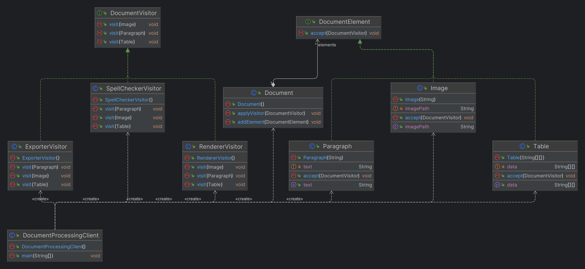

# Visitor Design Pattern

## What is the Visitor Design Pattern?

The Visitor Design Pattern is a behavioral design pattern that allows you to add new operations to existing object structures without modifying their classes. It separates the algorithm (operation) from the object structure on which it operates, allowing for the addition of new behaviors without altering the existing codebase.

### Key Components:
- **Visitor Interface**: Declares visit methods for each type of element in the object structure.
- **Concrete Visitor**: Implements operations to be performed on elements.
- **Element Interface**: Declares an `accept` method that takes a visitor.
- **Concrete Element**: Implements the `accept` method and typically calls the visitor's visit method.
- **Object Structure**: A collection of elements that can be visited by the visitor.

## When to Use the Visitor Pattern?

- **Complex Object Structures**: When dealing with complex structures that contain many elements of different types.
- **Multiple Operations**: When you need to perform different operations on these objects without cluttering the classes with multiple methods.
- **Stable Object Structures**: When the object structure is stable, but new operations are frequently added.
- **Separation of Concerns**: When you want to keep operations separate from the object structure to enhance modularity and maintainability.

## Why Use the Visitor Pattern?

- **Separation of Concerns**: It separates the operations from the object structure, leading to cleaner and more maintainable code.
- **Open/Closed Principle**: The pattern adheres to the Open/Closed Principle, allowing the system to be extended with new operations without modifying existing code.
- **Centralized Operations**: Centralizes operations in visitor classes, making it easier to manage and extend functionality.
- **Flexibility**: Enables you to add new operations to existing object structures without altering the classes themselves.

# Visitor Design Pattern Example: Document Processing System

## Problem Statement

In a document processing system, a document is composed of different elements such as `Paragraphs`, `Images`, and `Tables`. We need to perform multiple operations on these elements like rendering, spell-checking, and exporting. Using the Visitor Design Pattern, we can separate these operations into different classes, making the system more maintainable and extendable.

## Document Elements

### 1. `DocumentElement` Interface

This interface represents any element in the document. Each element must implement the `accept` method, which allows a `Visitor` to perform operations on it.

```java
public interface DocumentElement {
    void accept(DocumentVisitor visitor);
}

public class Paragraph implements DocumentElement {
    private String text;

    public Paragraph(String text) {
        this.text = text;
    }

    public String getText() {
        return text;
    }

    @Override
    public void accept(DocumentVisitor visitor) {
        visitor.visit(this);
    }
}

public class Image implements DocumentElement {
    private String imagePath;

    public Image(String imagePath) {
        this.imagePath = imagePath;
    }

    public String getImagePath() {
        return imagePath;
    }

    @Override
    public void accept(DocumentVisitor visitor) {
        visitor.visit(this);
    }
}
public class Table implements DocumentElement {
    private String[][] data;

    public Table(String[][] data) {
        this.data = data;
    }

    public String[][] getData() {
        return data;
    }

    @Override
    public void accept(DocumentVisitor visitor) {
        visitor.visit(this);
    }
}

//This interface defines the visitor with methods for each type of document element.
public interface DocumentVisitor {
    void visit(Paragraph paragraph);
    void visit(Image image);
    void visit(Table table);
}
public class RendererVisitor implements DocumentVisitor {
    @Override
    public void visit(Paragraph paragraph) {
        System.out.println("Rendering paragraph: " + paragraph.getText());
    }

    @Override
    public void visit(Image image) {
        System.out.println("Rendering image from path: " + image.getImagePath());
    }

    @Override
    public void visit(Table table) {
        System.out.println("Rendering table:");
        for (String[] row : table.getData()) {
            for (String cell : row) {
                System.out.print(cell + "\t");
            }
            System.out.println();
        }
    }
}
public class SpellCheckerVisitor implements DocumentVisitor {
    @Override
    public void visit(Paragraph paragraph) {
        System.out.println("Checking spelling in paragraph: " + paragraph.getText());
        // Spell-check logic here
    }

    @Override
    public void visit(Image image) {
        // No spell-checking for images
    }

    @Override
    public void visit(Table table) {
        System.out.println("Checking spelling in table:");
        for (String[] row : table.getData()) {
            for (String cell : row) {
                System.out.println("Checking cell: " + cell);
                // Spell-check logic here
            }
        }
    }
}
//The Document class contains a list of DocumentElement objects and applies visitors to them.
import java.util.ArrayList;
import java.util.List;

public class Document {
    private List<DocumentElement> elements = new ArrayList<>();

    public void addElement(DocumentElement element) {
        elements.add(element);
    }

    public void applyVisitor(DocumentVisitor visitor) {
        for (DocumentElement element : elements) {
            element.accept(visitor);
        }
    }
}
public class DocumentProcessingClient {
    public static void main(String[] args) {
        Document document = new Document();

        document.addElement(new Paragraph("This is a paragraph."));
        document.addElement(new Image("image.png"));
        document.addElement(new Table(new String[][]{
                {"Header1", "Header2"},
                {"Data1", "Data2"}
        }));

        // Apply Renderer Visitor
        RendererVisitor renderer = new RendererVisitor();
        document.applyVisitor(renderer);

        // Apply Spell Checker Visitor
        SpellCheckerVisitor spellChecker = new SpellCheckerVisitor();
        document.applyVisitor(spellChecker);

        // Apply Exporter Visitor
        ExporterVisitor exporter = new ExporterVisitor();
        document.applyVisitor(exporter);
    }
}

```
## Class Diagram


## Benefits of the Visitor Pattern

- **Single Responsibility Principle**: By centralizing operations in visitor classes, each class has a single responsibility, making the system easier to maintain.
- **Clean Code**: Reduces clutter in classes by moving operations to visitors.
- **Extensibility**: New operations can be added easily by creating new visitor classes without altering existing classes.
- **Flexible and Scalable**: Supports adding as many new operations as needed without changing the object structure.
- **Improved Code Navigation**: Operations related to a specific task are centralized in one visitor class, making the code easier to navigate.

## Real-Time Examples of the Visitor Pattern

1. **Compilers (Abstract Syntax Tree Traversal)**
    - Used in compilers to perform operations like type checking, optimization, and code generation on different types of nodes in an Abstract Syntax Tree (AST).

2. **Document Processing Systems**
    - Applied in systems to perform operations like rendering, exporting, or spell-checking on different document elements such as paragraphs, tables, and images.

3. **Graphic Rendering Libraries**
    - Utilized in rendering engines to perform operations like rendering, bounding box calculation, or exporting on various shapes like circles, rectangles, and lines.

4. **File System Operations**
    - Useful in file systems for operations like calculating the total size, searching for files, or generating reports on files and directories.

5. **Game Development**
    - Implemented in game development for operations like updating states, rendering graphics, or detecting collisions on various game objects such as players, enemies, and power-ups.

6. **Network Protocols**
    - Employed in network protocols for processing different types of packets or messages based on their type.

7. **E-commerce Systems**
    - Applied in e-commerce systems for calculating discounts, checking inventory, or generating reports for different types of products and orders.

8. **Software Testing Frameworks**
    - Used in testing frameworks to run, log, or evaluate different types of test cases.


## Potential Drawbacks

- **Rigid Object Structure**: The pattern works best with a stable object structure. Frequent changes to the structure may require updates to all visitor implementations.
- **Increased Complexity**: Introducing the pattern can add complexity, especially in simpler systems.
- **Dependency on Concrete Classes**: The visitor needs to know about concrete classes, which can introduce dependencies that might reduce flexibility.

# Identifying the Use of the Visitor Design Pattern

## Overview

The Visitor Design Pattern is a behavioral pattern that allows you to add new operations to existing object structures without modifying their classes. It is particularly useful when you need to perform multiple, varied operations on a collection of objects and expect these operations to change frequently.

This guide will help you identify keywords and phrases in requirements that suggest the use of the Visitor Design Pattern, along with real-time examples from different domains.

## Keywords and Phrases to Look For

When analyzing requirements, the following keywords and phrases can indicate the need for the Visitor Design Pattern:

- **"Need to perform different operations on objects"**: Indicates that various operations are required on a set of objects.
- **"Variety of actions required on the same set of elements"**: Suggests multiple operations on the same elements.
- **"Operations vary depending on the object type"**: Implies different operations are required for different types of objects.
- **"Need to add new operations without altering existing code"**: Highlights the need for extensibility without modifying the object structure.
- **"Separation of operations from object structure"**: Indicates a requirement for maintaining a clean separation between operations and data structures.
- **"Need for extensibility in operations"**: Suggests that new operations will be added over time.
- **"Different processing logic for different types"**: Implies that the system must handle different logic depending on the object type.
- **"Multiple operations that are unrelated or loosely related"**: Suggests varied operations that should be separated for maintainability.
- **"Operations that need to be easily extendable"**: Points to the need for future-proofing operations on objects.

## Real-Time Requirements from Different Domains

### 1. **Document Processing System (Publishing)**
- **Requirement**: "The system should support multiple operations such as rendering, exporting to different formats, and spell-checking on various document elements like paragraphs, images, and tables."
- **Key Indicators**: Multiple operations on the same elements, need for extensibility in adding new operations (e.g., future-proofing for adding new formats or checks).

### 2. **E-commerce Platform (Retail)**
- **Requirement**: "The platform must be able to apply different promotional discounts, calculate taxes, and generate reports on a variety of products, including electronics, clothing, and groceries."
- **Key Indicators**: Different operations (discounts, taxes, reports) applied to the same product structure; need for flexibility in adding new operations like dynamic pricing or regional tax laws.

### 3. **Game Development (Entertainment)**
- **Requirement**: "The game engine should be capable of updating, rendering, and detecting collisions for various game objects like players, enemies, and obstacles."
- **Key Indicators**: Multiple operations on diverse game objects, frequent addition of new operations like AI behavior or new rendering techniques.

### 4. **Banking System (Finance)**
- **Requirement**: "The application must support multiple operations on financial transactions such as logging, fraud detection, and reporting for different transaction types like deposits, withdrawals, and transfers."
- **Key Indicators**: Different operations (logging, fraud detection, reporting) on the same types of transactions; potential for adding new operations like compliance checks.

### 5. **Graphic Design Software (Creative Tools)**
- **Requirement**: "The software should allow users to apply various effects, export in multiple formats, and validate design rules on different graphic elements like shapes, text, and images."
- **Key Indicators**: Different operations (effects, export, validation) applied to the same elements, need for adding new effects or export formats over time.

### 6. **Healthcare Management System (Healthcare)**
- **Requirement**: "The system should support different types of processing such as billing, patient history analysis, and generating reports across different patient records like appointments, prescriptions, and lab results."
- **Key Indicators**: Multiple operations on patient records, potential for adding new types of processing like insurance claim generation or compliance reporting.

## Conclusion

The Visitor Design Pattern is well-suited for scenarios where a system needs to perform multiple, varied operations on a set of objects, particularly when these operations may change or grow over time. By looking for specific keywords and phrases in requirements, you can identify situations where this pattern would be beneficial, ensuring that your codebase remains clean, maintainable, and extensible.

---

This README provides guidance on identifying the need for the Visitor Design Pattern in software design, offering practical examples across different domains to illustrate its application.


